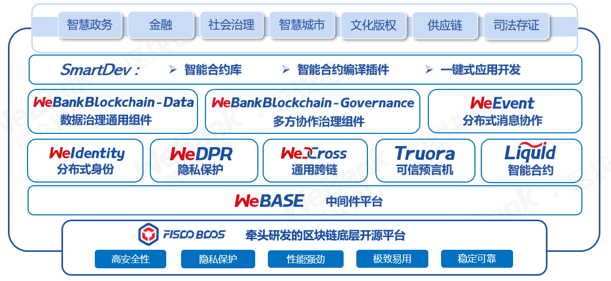

# 更多开源项目 
All the project addresses participated and established by WeBank Blockchain are collected.

汇集了微众银行参与和建立的所有区块链项目地址。

### FISCO-BCOS 适用于金融行业的区块链底层平台

git地址：[https://github.com/FISCO-BCOS](https://github.com/FISCO-BCOS)

gitee地址：[https://gitee.com/FISCO-BCOS](https://gitee.com/FISCO-BCOS)

文档地址： https://fisco-bcos-documentation.readthedocs.io/ 

### WeIdentity 基于区块链的实体身份标识及可信数据交换解决方案

git地址：[https://github.com/WeBankFinTech/WeIdentity](https://github.com/WeBankFinTech/WeIdentity)

gitee地址：[https://gitee.com/WeBank/WeIdentity](https://gitee.com/WeBank/WeIdentity)

文档地址：https://weidentity.readthedocs.io/

### WeEvent 基于区块链的分布式事件驱动架构

git地址：[https://github.com/WeBankFinTech/WeEvent](https://github.com/WeBankFinTech/WeEvent)

gitee地址：[https://gitee.com/WeBank/WeEvent](https://gitee.com/WeBank/WeEvent)

文档地址：https://weevent.readthedocs.io/

### WeBASE 区块链中间件平台

git地址：[https://github.com/WeBankFinTech/WeBASE](https://github.com/WeBankFinTech/WeBASE)

gitee地址：[https://gitee.com/WeBank/WeBASE](https://gitee.com/WeBank/WeBASE)

文档地址：https://webasedoc.readthedocs.io/ 

### WeCross 区块链跨链协作平台

git地址：[https://github.com/WeBankBlockchain/WeCross](https://github.com/WeBankBlockchain/WeCross)

gitee地址：[https://gitee.com/WeBank/WeCross](https://gitee.com/WeBank/WeCross)

文档地址：https://wecross.readthedocs.io/ 

### WeDPR 即时可用，场景式隐私保护高效解决方案套件和服务

git地址：[https://github.com/WeBankBlockchain/WeDPR-Lab-Core](https://github.com/WeBankBlockchain/WeDPR-Lab-Core)

文档地址：https://wedpr-lab.readthedocs.io/ 

### Data-Stash 数据仓库组件

git地址：[https://github.com/WeBankBlockchain/Data-Stash](https://github.com/WeBankBlockchain/Data-Stash)

gitee地址：[https://gitee.com/WeBankBlockchain/Data-Stash](https://gitee.com/WeBankBlockchain/Data-Stash)

文档地址：https://data-doc.readthedocs.io/zh_CN/stable/docs/WeBankBlockchain-Data-Stash/index.html

### Data-Export 数据导出组件

git地址：[https://github.com/WeBankBlockchain/Data-Export](https://github.com/WeBankBlockchain/Data-Export)

gitee地址：[https://gitee.com/WeBankBlockchain/Data-Export](https://gitee.com/WeBankBlockchain/Data-Export)

文档地址：https://data-doc.readthedocs.io/zh_CN/stable/docs/WeBankBlockchain-Data-Export/index.html

### Data-Reconcile 数据对账组件

git地址：[https://github.com/WeBankBlockchain/Data-Reconcile](https://github.com/WeBankBlockchain/Data-Reconcile)

gitee地址：[https://gitee.com/WeBankBlockchain/Data-Reconcile](https://gitee.com/WeBankBlockchain/Data-Reconcile)

文档地址：https://data-doc.readthedocs.io/zh_CN/stable/docs/WeBankBlockchain-Data-Reconcile/index.html

### Liquid 智能合约编程语言软件

git地址：[https://github.com/WeBankBlockchain/liquid](https://github.com/WeBankBlockchain/liquid)

gitee地址：[https://gitee.com/WeBankBlockchain/liquid](https://gitee.com/WeBankBlockchain/liquid)

文档地址： https://liquid-doc.readthedocs.io/

### cargo-liquid Liquid智能合约辅助开发工具

[https://github.com/WeBankBlockchain/liquid](https://github.com/WeBankBlockchain/liquid)

[https://gitee.com/WeBankBlockchain/cargo-liquid](https://gitee.com/WeBankBlockchain/cargo-liquid)

### Governance-Account 账户治理组件

git地址：https://github.com/WeBankBlockchain/Governance-Account

gitee地址：https://gitee.com/WeBankBlockchain/Governance-Account

文档地址：https://governance-doc.readthedocs.io/zh_CN/latest/docs/WeBankBlockchain-Governance-Acct/index.html

### Governance-Authority 权限治理组件

git地址：https://github.com/WeBankBlockchain/Governance-Authority

gitee地址：https://gitee.com/WeBankBlockchain/Governance-Authority

文档地址：https://governance-doc.readthedocs.io/zh_CN/latest/docs/WeBankBlockchain-Governance-Auth/index.html

### Governance-Key 私钥管理组件

git地址：https://github.com/WeBankBlockchain/Governance-Key

gitee地址：https://gitee.com/WeBankBlockchain/Governance-Key

文档地址：https://governance-doc.readthedocs.io/zh_CN/latest/docs/WeBankBlockchain-Governance-Key/index.html

### Governance-Cert 证书管理组件

git地址：https://github.com/WeBankBlockchain/Governance-Cert

gitee地址：https://gitee.com/WeBankBlockchain/Governance-Cert

文档地址：https://governance-doc.readthedocs.io/zh_CN/latest/docs/WeBankBlockchain-Governance-Cert/index.html

### Truora 可信预言机服务

git地址：[https://github.com/WeBankBlockchain/Truora](https://github.com/WeBankBlockchain/Truora)

gitee地址：[https://gitee.com/WeBankBlockchain/Truora](https://gitee.com/WeBankBlockchain/Truora)

文档地址：https://truora.readthedocs.io/

### SmartDev-Contract  智能合约库组件
git地址：[https://github.com/WeBankBlockchain/SmartDev-Contract](https://github.com/WeBankBlockchain/SmartDev-Contract)

gitee地址：[https://gitee.com/WeBankBlockchain/SmartDev-Contract](https://gitee.com/WeBankBlockchain/SmartDev-Contract)

文档地址：https://smartdev-doc.readthedocs.io/zh_CN/latest/docs/WeBankBlockchain-SmartDev-Contract/index.html

### SmartDev-SCGP  合约编译插件
git地址：[https://github.com/WeBankBlockchain/SmartDev-SCGP](https://github.com/WeBankBlockchain/SmartDev-SCGP)

gitee地址：[https://gitee.com/WeBankBlockchain/SmartDev-SCGP](https://gitee.com/WeBankBlockchain/SmartDev-SCGP)

文档地址：https://smartdev-doc.readthedocs.io/zh_CN/latest/docs/WeBankBlockchain-SmartDev-SCGP/index.html

### SmartDev-Scaffold  应用开发脚手架
git地址：[https://github.com/WeBankBlockchain/SmartDev-Scaffold](https://github.com/WeBankBlockchain/SmartDev-Scaffold)

gitee地址：[https://gitee.com/WeBankBlockchain/SmartDev-Scaffold](https://gitee.com/WeBankBlockchain/SmartDev-Scaffold)

文档地址：https://smartdev-doc.readthedocs.io/zh_CN/latest/docs/WeBankBlockchain-SmartDev-Scaffold/index.html

