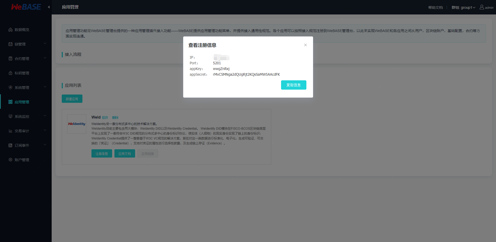
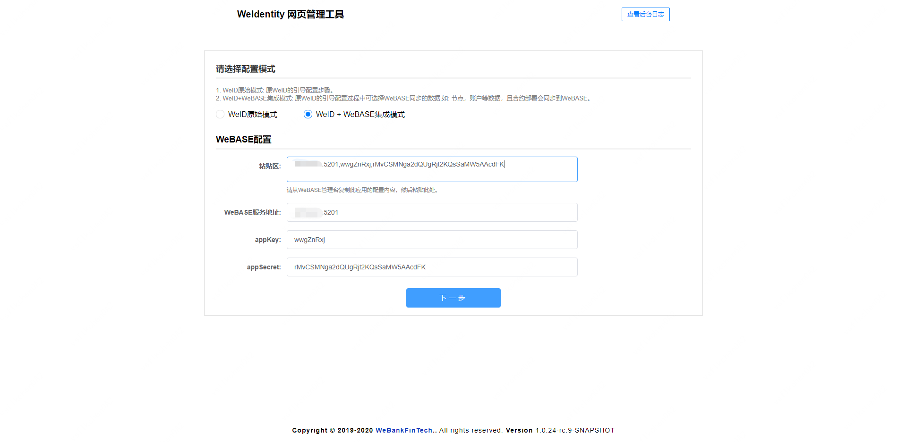
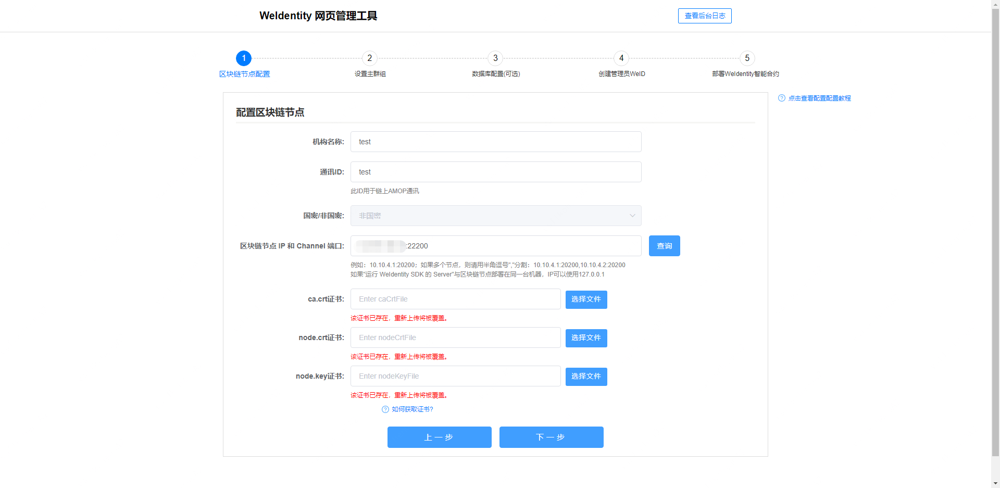
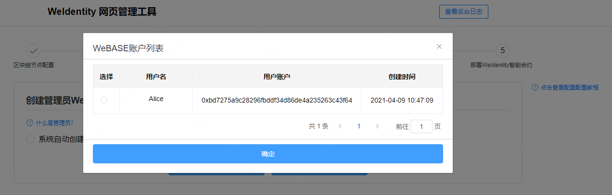

# 应用管理

应用管理是WeBASE管理台提供的一种第三方应用接入功能。WeBASE作为底层运维平台，已经有了底层运维基础能力。各个应用可以利用这些基础能力来开发自己的运维管理台。这些可以利用的基础能力主要包括四个方面：1、链信息和链运维（权限，配置等）；2、合约；3、链的私钥账号；4、管理账号（登录态）。

这样的主要好处是：

1. 各应用的进程管理还是自我管理，避免WeBASE过于笨重
2. WeBASE提供的是规范，方便其他应用参考打通应用与WeBASE的联系
3. 如果有扩展，WeBASE也方便提供API来实现
4. 不破坏各应用自身的完整性

管理台新增了应用管理菜单。新增应用有两种方式，一种是选择已有应用模板——目前仅支持WeID；另外一种是自定应用：

新增应用后，会生成应用相关的注册信息，为应用分配的`appKey`（应用Key）和`appSecret`（应用密码，应用自己保存，不要暴露），WeBASE的`IP`为内网IP，访问不了的话需对应修改：

第三方应用未向WeBASE进行注册时，WeBASE管理台不可以通过应用链接跳转到应用服务：

第三方应用接入时，使用注册信息向WeBASE进行注册，调用相关OPEN API。第三方应用接入请参考【[应用接入说明](./appintegration.html)】。以下以 [WeIdentity](https://weidentity.readthedocs.io/zh_CN/latest/docs/weidentity-installation-by-web.html) 可视化页面接入为例：

选择 WeID + WeBASE集成模式，从WeBASE复制注册信息：

点击下一步时，WeID会向WeBASE进行注册并调用相关API，从WeBASE获取群组、节点、证书等相关信息：

可以选择自动创建公私钥，或选择从WeBASE同步公私钥用户：

部署WeID之后，WeID会将合约相关信息通过API导入WeBASE：

第三方应用向WeBASE进行注册后，在WeBASE管理台可以通过应用链接跳转到应用服务：

注册后WeBASE将和应用间保持心跳。如果应用状态变成不能访问，则应用链接会置灰，变成不可跳转。

