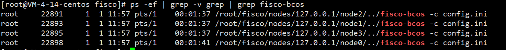
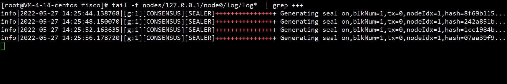
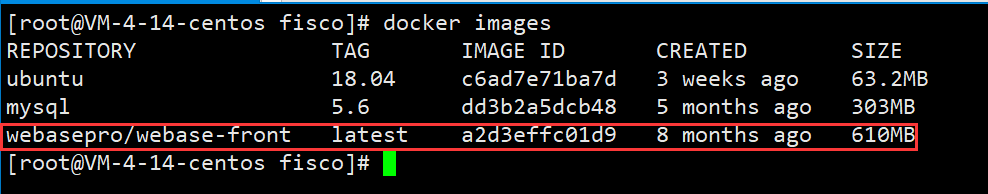
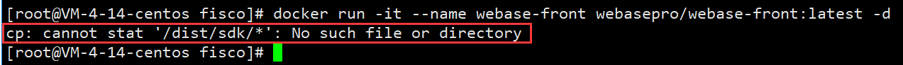
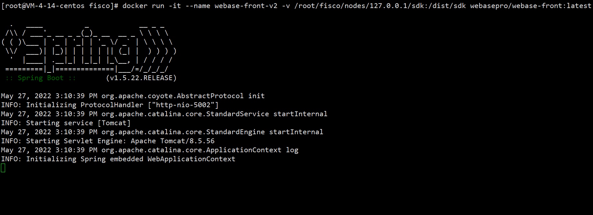
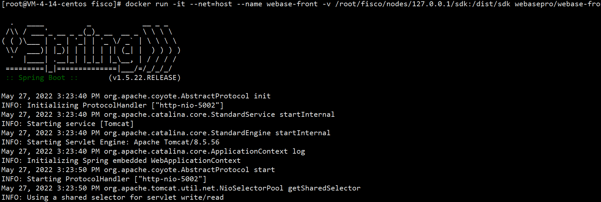
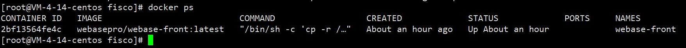
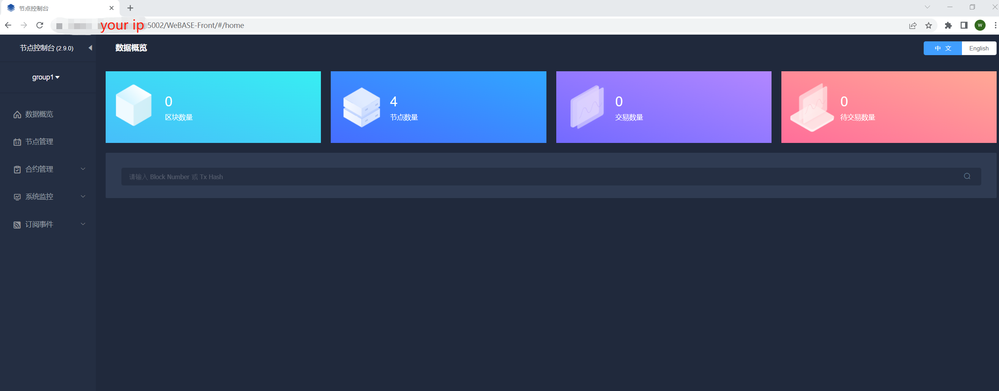
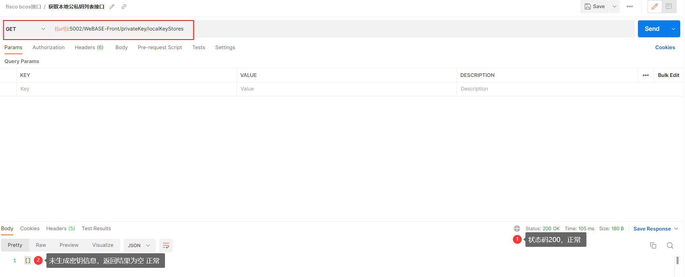

## BCOS WeBASE教程|使用Docker部署WeBASE-Front

> 作者：liwh1227
>
> github：https://github.com/liwh1227

### 1. 任务背景

BCOS WeBASE官方文档已经提供了[一建docker部署WeBASE](https://webasedoc.readthedocs.io/zh_CN/latest/docs/WeBASE-Install/docker_install.html)的文档，本文档主要对CentOS系统下如何使用docker单独部署WeBASE-Front并链接区块链节点进行说明。

### 2. 前提条件

#### 2.1 系统环境

| 环境     | 版本                                   |
| -------- | -------------------------------------- |
| 操作系统 | CentOS Linux release 7.9.2009 (Core)   |
| Docker   | Docker version 20.10.16, build aa7e414 |

#### 2.2 节点搭建

在WeBASE的服务架构中，WeBASE-Front必须和节点属于同机部署，所以本次搭建WeBASE务必先将节点运行起来，部署节点的方式可参照官方文档[搭建第一个区块链网络](https://fisco-bcos-documentation.readthedocs.io/zh_CN/latest/docs/installation.html)。本次直接搭建的单群组4节点联盟链，搭建成功后，使用命令查看节点状态和日志。

```bash
# 检查节点进程
[root@VM-4-14-centos fisco]# ps -ef | grep -v grep | grep fisco-bcos
```



```bash
# 进入到nodes所在路径，当前文档nodes目录位于/root/fisco下
[root@VM-4-14-centos ~]# cd /root/fisco/nodes/
# 检查节点日志情况
[root@VM-4-14-centos fisco]# tail -f nodes/127.0.0.1/node0/log/log*  | grep connected
```


```bash
# 查看共识是否正常
[root@VM-4-14-centos fisco]# tail -f nodes/127.0.0.1/node0/log/log*  | grep +++
```



#### 2.3 docker配置

为了提高docker镜像的拉取速度，首先配置docker的镜像源，以`docker-cn`源为例进行配置。

```bash
# 若目录不存在
[root@VM-4-14-centos fisco]# mkdir -p /etc/docker
# 创建/修改daemon.json配置文件
[root@VM-4-14-centos fisco]# vi /etc/docker/daemon.json

# 配置内容如下：
 {
      "registry-mirrors": ["https://registry.docker-cn.com"]                                                                                                                           
 }
```

重新加载配置并重启docker服务。*这里需要注意，重新启动docker会影响现有服务器正在运行的docker服务*

```bash
[root@VM-4-14-centos fisco]# systemctl daemon-reload
[root@VM-4-14-centos fisco]# systemctl restart docker.service
```

### 3. 运行服务

#### 3.1 拉取镜像

本次搭建直接使用了官方镜像进行搭建，使用命令和过程如下：

```bash
# docker pull拉取tag最新的镜像
[root@VM-4-14-centos fisco]# docker pull webasepro/webase-front:latest
```


拉取成功后，使用`docker images`查看。



#### 3.2 运行容器

##### 3.2.1 初次尝试

WeBASE-Front服务通过区块链sdk与节点建立链接，运行容器时，我们需要对该文件进行挂载，否则服务可能会出现如下错误：

```bash
[root@VM-4-14-centos fisco]# docker run -it --name webase-front webasepro/webase-front:latest
```



##### 3.2.2 挂载sdk目录，再次尝试

对节点的sdk目录进行挂载（本次测试sdk路径为：/root/fisco/nodes/127.0.0.1/sdk ），并执行`docker run`命令。

```bash
[root@VM-4-14-centos fisco]# docker run -it --name webase-front -v /root/fisco/nodes/127.0.0.1/sdk:/dist/sdk -d webasepro/webase-front:latest
```



在第一次运行时，遇到了如上图所示的问题，容器未报错误日志，但是日志显示服务停止了。

##### 3.2.3 修改容器网络模式，再次尝试

出现上述问题可能和容器的网络模式有关系，于是显示的指定了容器的网络模式为`host`模式后，再次运行容器。

```bash
[root@VM-4-14-centos fisco]# docker run -it --net=host --name webase-front -v /root/fisco/nodes/127.0.0.1/sdk:/dist/sdk webasepro/webase-front:latest
```



至此，服务正常运行，我们对上面的docker命令稍作调整，指定容器服务后台运行。

##### 3.2.3 优化启动命令，后台运行容器服务

```bash
# 停止当前服务并删除
[root@VM-4-14-centos fisco]# docker rm webase-front
# 加上-d参数，让容器后台运行
[root@VM-4-14-centos fisco]# docker run -it --net=host --name webase-front -v /root/fisco/nodes/127.0.0.1/sdk:/dist/sdk -d webasepro/webase-front:latest
# 执行docker ps查看容器运行状况
[root@VM-4-14-centos fisco]# docker ps
```



### 4. 验证

#### 4.1 登录web管理平台验证

容器正常运行后，通过浏览器能够正常访问节点控制台。

*这里需要注意，若要对外提供服务，（默认）5002端口要对外正常暴露*。在浏览器输入`http://Your-IP:5002/WeBASE-Front`，正常情况下，能够看见如下图所示界面：



#### 4.2 调用http接口验证

通过调用官方[接口文档](https://webasedoc.readthedocs.io/zh_CN/latest/docs/WeBASE-Front/interface.html)提供的接口方法验证服务能否正常对外提供服务。本次调用的是[获取本地公私钥列表接口](https://webasedoc.readthedocs.io/zh_CN/latest/docs/WeBASE-Front/interface.html#id117)，通过PostMan接口调用工具进行验证，验证结果如下图：



### 5. 参考

1. 一键Docker部署：https://webasedoc.readthedocs.io/zh_CN/latest/docs/WeBASE-Install/docker_install.html
2. docker网络模式：https://segmentfault.com/a/1190000040335988
3. webase-front：https://gitee.com/WeBank/WeBASE-Front