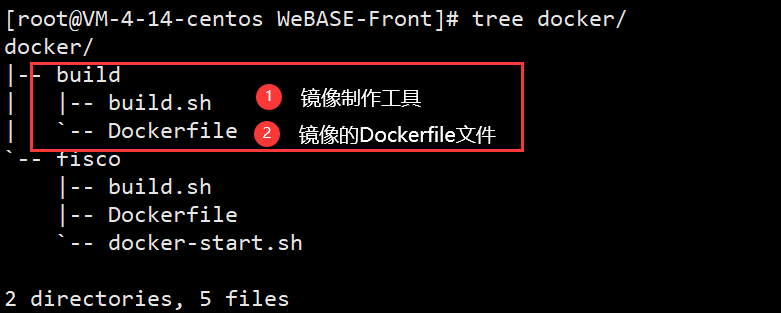
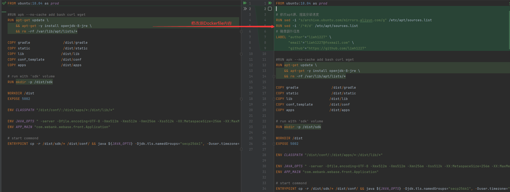
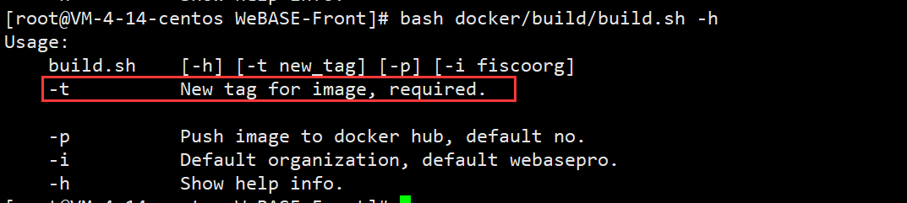
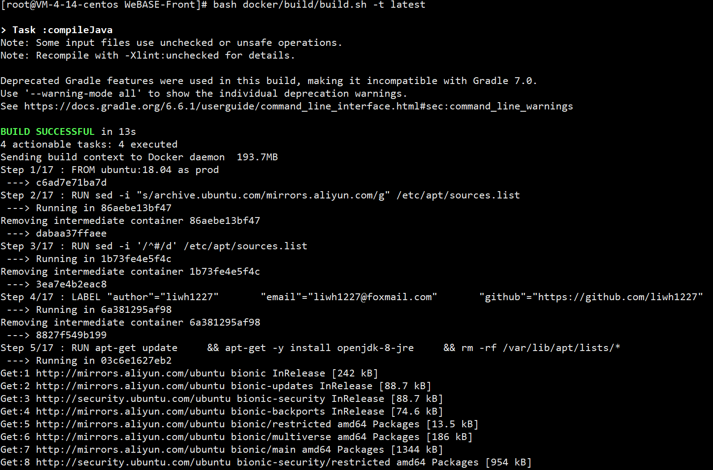
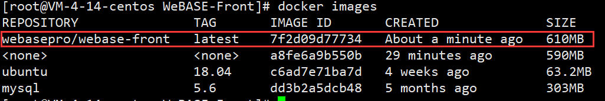
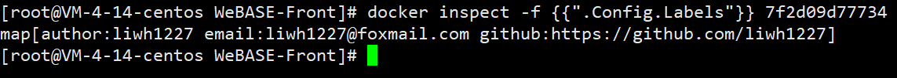
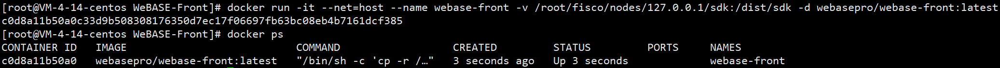
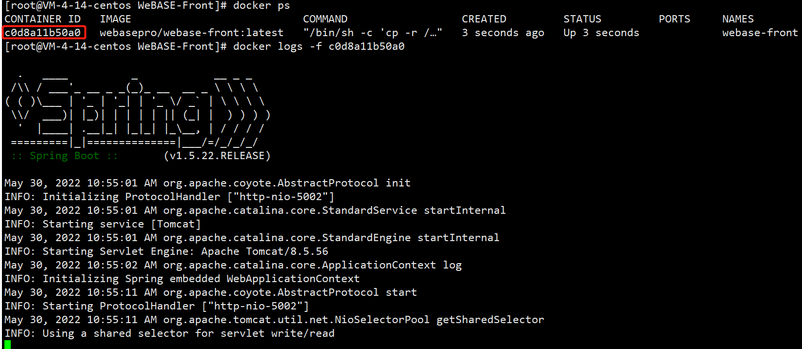
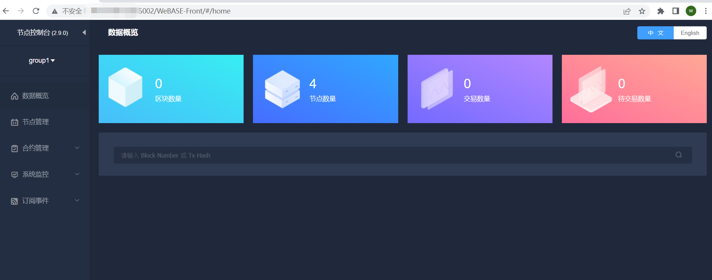

## liwh1227|构造属于自己的WeBASE-Front镜像 

> 作者：liwh1227
>
> github：https://github.com/liwh1227

### 1. 背景
官方文档已经提供了`WeBASE-Front`容器[一建docker部署WeBASE](https://webasedoc.readthedocs.io/zh_CN/latest/docs/WeBASE-Install/docker_install.html)和可执行程序[WeBASE-Front部署说明](https://webasedoc.readthedocs.io/zh_CN/latest/docs/WeBASE-Front/install.html)两种部署方式。本文档内容主要针对容器部署方式，如何修改Dockerfile并实现镜像打包和运行服务。

### 2. 前提条件

**备注：** 编译WeBASE-Front镜像依赖Java JDK和Gradle，可参考[Java JDK配置](https://webasedoc.readthedocs.io/zh_CN/latest/docs/WeBASE-Front/appendix.html#jdk)和[Gradle部署](https://webasedoc.readthedocs.io/zh_CN/latest/docs/WeBASE-Front/appendix.html#gradle)的说明文档。

#### 2.1 系统环境

基础环境：

| 环境     | 版本                                   |
| -------- | -------------------------------------- |
| 操作系统 | CentOS Linux release 7.9.2009 (Core)   |
| Docker   | Docker version 20.10.16, build aa7e414 |
| git      | git version 1.8.3.1                    |

检查java环境：
```bash
java -version
```

检查gradle环境
````bash
gradle --version
````

#### 2.2 拉取代码

执行命令：

```bash
git clone https://github.com/WeBankBlockchain/WeBASE-Front.git

# 若因网络问题导致长时间下载失败，可尝试以下命令
git clone https://gitee.com/WeBank/WeBASE-Front.git
```

进入目录：

```bash
cd WeBASE-Front
```

进入`WeBASE-Front`目录后，我们主要关注`docker`目录下的结构，使用`tree`命令查看该目录的结构。

```bash
tree docker
```

显示结果如下：



#### 2.3 文件解读

build.sh：

```shell
#!/usr/bin/env bash

LOG_WARN() {
    local content=${1}
    echo -e "\033[31m[WARN] ${content}\033[0m"
}

LOG_INFO() {
    local content=${1}
    echo -e "\033[32m[INFO] ${content}\033[0m"
}

# 命令返回非 0 时，就退出
set -o errexit
# 管道命令中任何一个失败，就退出
set -o pipefail
# 遇到不存在的变量就会报错，并停止执行
set -o nounset
# 在执行每一个命令之前把经过变量展开之后的命令打印出来，调试时很有用
#set -o xtrace

# 退出时，执行的命令，做一些收尾工作
trap 'echo -e "Aborted, error $? in command: $BASH_COMMAND"; trap ERR; exit 1' ERR

# Set magic variables for current file & dir
# 脚本所在的目录
__dir="$(cd "$(dirname "${BASH_SOURCE[0]}")" && pwd)"
# 脚本的全路径，包含脚本文件名
__file="${__dir}/$(basename "${BASH_SOURCE[0]}")"
# 脚本的名称，不包含扩展名
__base="$(basename ${__file} .sh)"
# 脚本所在的目录的父目录，一般脚本都会在父项目中的子目录，
#     比如: bin, script 等，需要根据场景修改
__root="$(cd "$(dirname "${__dir}")" && pwd)"/../ # <-- change this as it depends on your app
__root=$(realpath -s "${__root}")


########################### properties config ##########################
image_organization=webasepro
image_name="webase-front"
docker_push="no"
latest_tag=latest
new_tag=


########################### parse param ##########################
__cmd="$(basename $0)"
# 解析参数
# usage help doc.
usage() {
    cat << USAGE  >&2
Usage:
    ${__cmd}    [-h] [-t new_tag] [-p] [-i fiscoorg]
    -t          New tag for image, required.

    -p          Push image to docker hub, default no.
    -i          Default organization, default webasepro.
    -h          Show help info.
USAGE
    exit 1
}
while getopts t:i:ph OPT;do
    case $OPT in
        t)
            new_tag=$OPTARG
            ;;
        p)
            docker_push=yes
            ;;
        i)
            image_organization=${OPTARG}
            ;;
        h)
            usage
            exit 3
            ;;
        \?)
            usage
            exit 4
            ;;
    esac
done


# 必须设置新镜像的版本
if [[ "${new_tag}"x == "x" ]] ; then
  LOG_WARN "Need a new_tag for new docker image!! "
  usage
  exit 1
fi

########################### build docker image ##########################
image_repository="${image_organization}/${image_name}"

## compile project
cd "${__root}" && chmod +x ./gradlew && ./gradlew clean build -x test

## docker build
cd "${__root}"/dist

docker build -t ${image_repository}:${new_tag} -f "${__root}"/docker/build/Dockerfile .
docker tag "${image_repository}:${new_tag}" "${image_repository}:${latest_tag}"


########################### push docker image ##########################
if [[ "${docker_push}"x == "yesx" ]] ; then
    docker push "${image_repository}:${new_tag}"
    docker push "${image_repository}:${latest_tag}"
fi

```
通过阅读注释内容大致了解到该脚本主要完成自动化构建`WeBASE-Front`镜像的工作，其中"#############build docker images#############"是完成构建镜像的核心逻辑，这里单独摘出来并附上详细解释。

```shell
#!/usr/bin/env bash

## ...
########################### build docker image ##########################
## 设置仓库名和镜像名称
image_repository="${image_organization}/${image_name}"

## compile project
## 1、进入WeBASE-Front工程目录，
## 2、修改gradlew工具的执行权限，并执行./gradlew clean build -x test ，该命令执行成功后将产生dist目录
cd "${__root}" && chmod +x ./gradlew && ./gradlew clean build -x test

## docker build
## 进入dist目录
cd "${__root}"/dist

## 编译"/docker/build/Dockerfile"并构造镜像
docker build -t ${image_repository}:${new_tag} -f "${__root}"/docker/build/Dockerfile .
## 将新编译的镜像tag更改为latest
docker tag "${image_repository}:${new_tag}" "${image_repository}:${latest_tag}"
## ...

```

Dockerfile：

```dockerfile
# 使用ubuntu:18作为基础镜像
FROM ubuntu:18.04 as prod

#RUN apk --no-cache add bash curl wget
# 下载必要的依赖jdk
RUN apt-get update \
    && apt-get -y install openjdk-8-jre \
    && rm -rf /var/lib/apt/lists/*

# copy必要的文件到当前镜像
COPY gradle                /dist/gradle
COPY static                /dist/static
COPY lib                  /dist/lib
COPY conf_template        /dist/conf
COPY apps                 /dist/apps

# run with 'sdk' volume
# 在/dist目录下创建sdk目录
RUN mkdir -p /dist/sdk

# 设置dist为工作目录，并对外开发5002端口
WORKDIR /dist
EXPOSE 5002

# 设置依赖的环境变量
ENV CLASSPATH "/dist/conf/:/dist/apps/*:/dist/lib/*"

ENV JAVA_OPTS " -server -Dfile.encoding=UTF-8 -Xmx512m -Xms512m -Xmn256m -Xss512k -XX:MetaspaceSize=256m -XX:MaxMetaspaceSize=512m -XX:+HeapDumpOnOutOfMemoryError -XX:HeapDumpPath=/log/heap_error.log  -XX:+UseG1GC -XX:MaxGCPauseMillis=200 "
ENV APP_MAIN "com.webank.webase.front.Application"

# start commond
# 启动服务
ENTRYPOINT cp -r /dist/sdk/* /dist/conf/ && java ${JAVA_OPTS} -Djdk.tls.namedGroups="secp256k1", -Duser.timezone="Asia/Shanghai" -Djava.security.egd=file:/dev/./urandom, -Djava.library.path=/dist/conf -cp ${CLASSPATH}  ${APP_MAIN}

```

### 3. 构造镜像

根据上述的内容描述，我们将通过`build.sh`脚本工具进行镜像的构造。在执行镜像构造之前，我们首先修改Dockerfile内容，制作自己的Dockerfile。

**备注：** 以下工作均在`WeBASE-Front`工程目录下进行。

#### 3.1 修改Dockerfile

备份Dockerfile：

```bash
# 进入Dockerfile所在目录
cd docker/build
# 备份原Dockerfile文件
cp Dockerfile Dockerfile-tmp
```

修改Dockerfile文件:

```dockerfile
# ...
# 修改apt源，提高依赖安装速度
RUN sed -i "s/archive.ubuntu.com/mirrors.aliyun.com/g" /etc/apt/sources.list
RUN sed -i '/^#/d' /etc/apt/sources.list
# 镜像额外信息，作者、邮箱和github信息
LABEL "author"="liwh1227" \
      "email"="liwh1227@foxmail.com" \
      "github"="https://github.com/liwh1227"
# ...      
```

对比前后的变化：



#### 3.2 构造镜像

查看脚本帮助：

```bash
# 查看build脚本说明
bash docker/build/build.sh -h
```



执行构造命令：

```bash
# -t tag参数为latest
bash docker/build/build.sh -t latest
```



构造成功后，查看本地镜像情况：

```bash
docker images
```



查看刚才我们修改的镜像信息是否成功：

```bash
docker inspect -f {{".Config.Labels"}} 7f2d09d77734
```



从上述截图信息可以看到我们添加的定制化信息已经加到了镜像中。

#### 3.3 验证

通过运行构造成功的镜像运行web端的控制台服务，验证镜像的正确性。

挂载sdk文件，并运行镜像：

```bash
docker run -it --net=host --name webase-front -v /root/fisco/nodes/127.0.0.1/sdk:/dist/sdk -d webasepro/webase-front:latest
```



查看容器日志信息：

```bash
docker logs -f c0d8a11b50a0
```



通过web端访问控制台查看：



至此，通过自己编写的Dockerfile构造镜像并运行服务成功。

### 4. 参考

1. 节点前置服务：https://webasedoc.readthedocs.io/zh_CN/latest/docs/WeBASE-Front/install.html
2. dockerfile参考：https://yeasy.gitbook.io/docker_practice/image/build
3. jdk配置：https://webasedoc.readthedocs.io/zh_CN/latest/docs/WeBASE-Front/appendix.html#jdk
