# 上海久誉 | 基于FISCO-BCOS供应链支付结算应用案例

由**上海久誉软件系统有限公司**研发的针对基于 FISCO BCOS 的供应链支付结算案例。


  
  


## 1. 解决痛点

供应链金融的服务对象主要为中小企业，比较常见的是应收账款质押贷款或订单融资。

作为应收账款付款人的核心企业，其资信好、付款能力强，违约风险较低，所以中小企业将应收账款或订单向银行作为还款保证，其授信额度和融资成本自然也会下降。

供应链金融围绕三个主体：**供应商、核心企业和经销商**。

它依托于产业供应链核心企业，对单个企业或上下游多个企业提供全面金融服务，以促进供应链上核心企业及上下游配套企业「产-供-销」链条的稳固和流转顺畅，降低整个供应链运作成本。并且，通过金融资本与实业经济的协作，能够构建银行、企业和供应链互利共存的产业生态。

目前存在的问题是回款慢，导致下游的小的供应商不能及时拿到尾款导致资金断链。

## 2. 设计理念

基于区块链的供应链金融和贸易金融是基于分布式网络改造现有的大规模协作流程的典型。区块链可以缓解信息不对称的问题，十分适合供应链金融的发展。

供应链中商品从卖家到买家伴随着货币支付活动，在高信贷成本和企业现金流需求的背景下，金融服务公司提供商品转移和货款支付保障。供应链溯源防伪、交易验真、及时清算的特点将解决现有贸易金融网络中的诸多痛点，塑造下一代供应链金融的基础设施。

简单来说，供应链就是一系列交易节点，它连接着产品从供应端到销售端或终端的全过程。从生产到销售，产品历经了供应链的多个环节，有了区块链技术，交易就会被永久性、去中心化地记录，这降低了时间延误、成本和人工错误。

### 新型的纯线上供应链金融服务模式：
基于FISCO BCOS区块链技术，以核心企业为中心，以实际贸易背景为基础，为核心企业上下游提供融资金融服务。

### 线上供应链金融生态圈：
平台依托区块链一系列新型金融科技技术与产业经济的深度融合，通过核心企业汇聚1-N级供应商，引入合作银行等外部金融机构，共同构建及维护完整的线上供应链生态圈。

### 本案例试用场景可在两个模式下进行探索

#### 1）银行作为资金托管方
银行作为一个节点机构加入联盟链组织，在供应链各方签名确认后，银行再根据比例分成将资金打到各级供应商账户（为主要模式）
#### 2）普通C端用户消费商品
普通C端用户也可以作为节点，对于消费产品之后，链上的各方签名确认以后，自动分成结算（还在探索业务模式中）

## 3. 系统架构
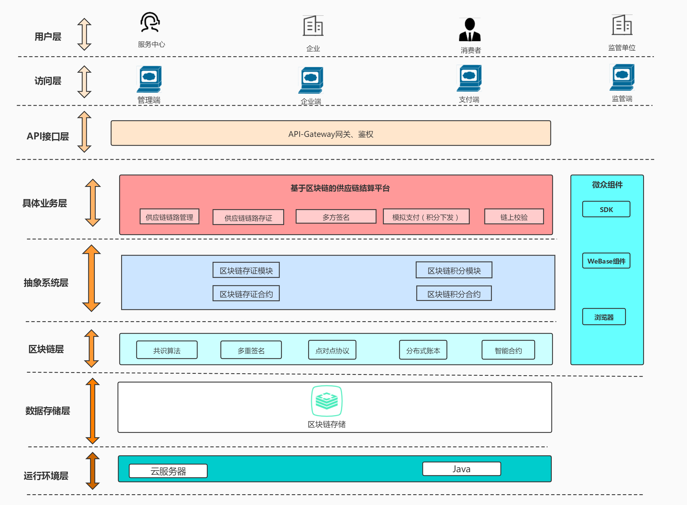

###  3.1 抽象系统层
```
抽象系统层描述的是底层合约层，主要涉及两部分合约，第一部分合约是存证合约，用于存储新建一条完整供应链的信息，主要存储各级供应商分成比例信息，将这部分信息上链；
  然后包括各方签名功能，多方签名确认后才可以进行分成，本案例模拟支付将由积分下发模式来进行演示。
  第二部分合约是积分合约，主要作用是供应链多方确认完成，模拟支付的时候用来积分下发的，积分是预分配的模式来进行管理的。也就是需要在WeBASE管理平台编译部署好积分合约，然后
  新建一个私钥账户，通过给该账户分配积分（比如999999999），然后在此案例中模拟支付的功能里，分配的积分就是从该账户里扣除下发到各级供应商的。

```

###  3.2 具体业务层
  #### 新建供应链流程图
  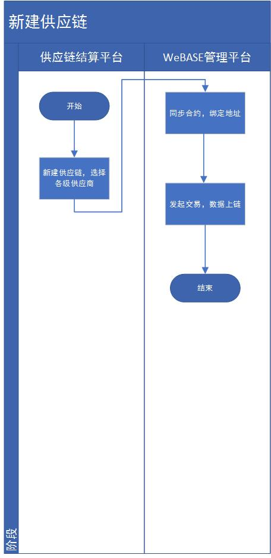

  #### 多方签名流程图
  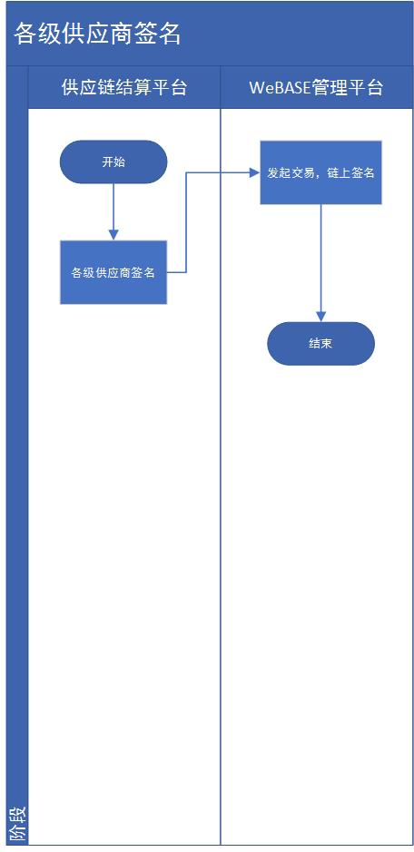

  #### 模拟支付流程图
  


## 4. 程序运行

### 4.1 前置工作
首先需要搭建FISCO BCOS链与WeBASE服务，本案例通过WeBASE一键部署搭建4节点的链和WeBASE服务

参考WeBASE官方提供的[文档](https://webasedoc.readthedocs.io/zh_CN/latest/docs/WeBASE/install.html)，详情请参见：https://webasedoc.readthedocs.io/zh_CN/latest/docs/WeBASE/install.html
- **注**：部署WeBASE时注意修改一键部署的配置文件`common.properties`中修改`node.counts=4`来搭建4节点的链
  
### 4.2 依赖安装

#### maven安装
```Bash
# 下载maven包
wget https://mirrors.bfsu.edu.cn/apache/maven/maven-3/3.8.1/binaries/apache-maven-3.8.1-bin.tar.gz
# 解压
tar -zxvf apache-maven-3.8.1-bin.tar.gz
# 重命名
mv apache-maven-3.8.1-bin maven
# 查看当前路径
cd maven/
pwd
	/data/home/webase/maven

# 配置mvn环境变量
vi /etc/profile 

	export MAVEN_HOME=/data/home/webase/maven
	export PATH=$PATH:$MAVEN_HOME/bin

# 更新环境变量
source /etc/profile 
# 检查mvn命令，正常输出版本号则安装成功
mvn -v
```

#### npm安装
```Bash
# 下载node包
wget https://npm.taobao.org/mirrors/node/v10.16.2/node-v10.16.2-linux-x64.tar.gz
# 解压
tar -zxvf node-v10.16.2-linux-x64.tar.gz
# 重命名
mv node-v10.16.2-linux-x64 node
# 查看路径
cd node/
pwd
	/data/home/webase/node

# 配置node环境变量
vi /etc/profile 

	export NODE_HOME=/data/home/webase/node
	export PATH=$PATH:$NODE_HOME/bin

# 更新环境变量
source /etc/profile 

# 检查npm命令，正常输出版本号则安装成功
npm -v
```

#### mysql创建数据库

以mysql用户为root为例，创建`supplychain`的数据库
```
mysql -uroot -p -e "create database supplychain"
```

### 4.2 拉取代码


1 拉取代码
```
git clone https://github.com/jiuyu-software/supply-chain-demo.git
## 网络失败时，使用gitee尝试
git clone https://gitee.com/cattwo/supply-chain-demo.git
```

项目源码中包含`frontend`前端代码和`backend`后端代码，目录结构如下

```Bash
cd cd supply-chain-demo/
ls
```

```Bash
├── backend
│   └── supply-chain-demo
├── frontend
│   └── supplychain
└── README.md
```


### 4.4 前端代码部署
前端代码基于VUE编写

#### 1 修改配置文件
进入`frontend/supplychain`目录，修改配置文件`vue.config.js`中`proxy`，连接上文的backend后端服务

```Bash
cd frontend/supplychain
vi vue.config.js
```

```Bash
# 以同机运行为例，后端服务同机运行，IP为127.0.0.1，端口为8080
# 修改proxy.target的值为对应的IP:PORT
    proxy: {
      // change xxx-api/login => mock/login
      // detail: https://cli.vuejs.org/config/#devserver-proxy
      [process.env.VUE_APP_BASE_API]: {
//        target: "http://**.**.**.**:**",
        target: "http://127.0.0.1:8080",
        changeOrigin: true,
        pathRewrite: {
          ["^" + process.env.VUE_APP_BASE_API]: "",
        },
      },
    },

```

#### 2 编译并运行
```Bash
# 安装前端依赖包
npm install
# 运行
npm run dev
# 运行成功后显示
  App running at:
    - Local:   http://localhost:9528 
    - Network: http://127.0.0.2:9528 # 127.0.0.2为内网或公网IP

    Note that the development build is not optimized.
    To create a production build, run npm run build.
```

我们可以通过在浏览器中访问`http://127.0.0.2:9528`即可访问
- **此处浏览器访问的URL和下文后端服务中配置的appLink需保持一致**
- 如果通过`npm build`构建静态文件 + nginx重定向的方式加载前端，需要修改nginx.conf中访问后端服务的IP端口，并对外暴露9528端口即可。
- 需要部署下文的后端服务后，才可正常操作页面。具体操作步骤可以参考下文的[运行演示](#demo)

### 4.4 后端代码部署
后端代码是基于SpringBoot工程

#### 1 执行sql脚本

```Bash
cd backend/supply-chain-demo/src/main/resources/db
# 通过mysql -e命令执行.sql脚本，以root用户，db名为supplychain为例
mysql -uroot -p  -D supplychain -e "source ./supplychain.sql"
```
chain

#### 2 部署erc20合约

```Bash
cd backend/supply-chain-demo/src/main/resources/contract
cat erc20.sol
```

将合约内容复制记录，随后到WeBASE中部署

**进入WeBASE管理台**
- 创建WeBASE私钥：在“私钥管理”中创建一个新的私钥用户，记录其signUserId，如：d0fb7d6c9fa04ef484e10f4bf5b34426
- WeBASE的“合约管理-合约IDE”中，创建erc20的合约，粘贴上文的erc20.sol内容，并编译，部署合约，记录合约地址，如：0xbbac4362f59a8ffe78ef4585460e9236c02b6c48

#### 3 WeBASE应用接入
点击“应用管理”，若该案例已集成在WeBASE，则选择模板，在注册信息里面可获得WeBASE-Node-Manager的 `IP,Port,appKey,appSecret` 相关信息，记录这些信息，在下文的的application.properties配置中会用到


#### 4 修改application.properties文件

```Bash
cd backend/supply-chain-demo/src/main/resources/
vi application.properties
```

- 修改配置文件的mysql连接配置
- 修改WeBASE-Front和WeBASE-Node-Manager的配置
- 修改本案例的前端访问URL配置
- 修改erc20合约的配置

```Bash
spring.application.name=supply-chain-demo
# 服务默认端口，若修改，需要在前端访问后端时对应修改
server.port=8080  

# mysql用户
spring.datasource.username=dbUserName     
# mysql密码
spring.datasource.password=dbPassword     
spring.datasource.url=jdbc:mysql://127.0.0.1:3306/supplychain 
spring.datasource.type=com.zaxxer.hikari.HikariDataSource
spring.datasource.driver-class-name=com.mysql.cj.jdbc.Driver
spring.datasource.hikari.connection-timeout=30000
spring.datasource.hikari.minimum-idle=10
spring.datasource.hikari.maximum-pool-size=20
spring.datasource.hikari.auto-commit=true
spring.datasource.hikari.idle-timeout=600000
spring.datasource.hikari.pool-name=DateSourceHikariCP
spring.datasource.hikari.max-lifetime=1800000
spring.datasource.hikari.connection-test-query=SELECT 1


### 后端服务所连接的WeBASE子系统服务的配置
# webase前置服务 1.2. 合约部署接口（结合WeBASE-Sign）
webase-front.contract.deploy.url=http://127.0.0.1:5002/WeBASE-Front/contract/deployWithSign
# webase前置服务 5.1. 交易处理接口（结合WeBASE-Sign）
webase-front.trans.handle.url=http://127.0.0.1:5002/WeBASE-Front/trans/handleWithSign

# webase-node-mgr的IP与端口
webase.node.mgr.url=http://127.0.0.1:5001
# webase管理台-应用管理，创建自定义应用生成的appKey
webase.node.mgr.appKey=Z5znCSmG
# webase管理台-应用管理，创建自定义应用生成的appSecret
webase.node.mgr.appSecret=ch8ZT7wpDxpacDGSYQfjTQjWWeV4bTXt
# 是否加密传输
webase.node.mgr.isTransferEncrypt=true

### 对应上文前端服务的配置，需要确保前端服务存活（正在运行）
# 本案例的前端访问的IP，同机访问可以使用127.0.0.1，非同机访问应为内网或公网IP
supplychain.node.mgr.appIp=127.0.0.1
# 本案例的前端访问端口
supplychain.node.mgr.appPort=9528
# 本案例的在浏览器中访问的URL，若浏览器在非同机访问，则访问的是内网或公网IP(以127.0.0.2为例)。使用域名则访问的是域名。同机访问前端则可以使用127.0.0.1
# 需要与上文文前端服务的访问IP端口一致
supplychain.node.mgr.appLink=https://127.0.0.2:9528


# erc20 合约初始化用户地址
erc20.supply.user.signUserId=d0fb7d6c9fa04ef484e10f4bf5b34426
# erc20 合约部署地址
erc20.contract.address=0xbbac4362f59a8ffe78ef4585460e9236c02b6c48
# erc20 合约名称
erc20.contract.name=erc20

#pagehelper分页插件配置
pagehelper.helperDialect=mysql
pagehelper.reasonable=true
pagehelper.supportMethodsArguments=true
pagehelper.params=count=countSql
# page-size-zero：默认值为 false，当该参数设置为 true 时，如果 pageSize=0 或者 RowBounds.limit = 0 就会查询出全部的结果
#pagehelper.page-size-zero=true

# mybatis-plus 配置
mybatis-plus.mapper-locations=classpath:/mapper/**/*.xml

# 日志配置
logging.config=classpath:logback-boot.xml

# 打印日志级别
logging.level.root=DEBUG

# 返回json的全局时间格式
spring.jackson.date-format=yyyy-MM-dd HH:mm:ss
spring.jackson.time-zone=GMT+8

```

#### 5 编译打包

编译项目，回到`backend/supply-chain-demo`目录，目录下有`pom.xml`的maven配置文件
```Bash
cd backend/supply-chain-demo
# maven 编译
mvn clean package -Dmaven.test.skip=true
```
打包完成后会得到`target`目录
- 若修改了`application.properties`，需要重新打包并运行

#### 6 运行

运行得到的jar
```Bash
cd target/
nohup java -jar supply-chain-demo-0.0.1-SNAPSHOT.jar &
```

查看日志
```Bash
tail -f logs/log/supply-chain-demo.log
```

当我们看到日志持续输出日志时即运行成功，就可以访问上文中部署的前端页面(`{IP}:9528`)进行操作了

### 4.5 运行演示

演示地址: 基于区块链的供应链支付结算管理平台： http://xxx.com 

三个账户密码分别为(Alice/123456,Bob/123456,Tom/123456)

WeBASE管理平台：http://xxx:5000/  账密：**admin/Abcd12345**

演示新建一条供应链有三级供应商，然后模拟支付分账
#### 进入首页
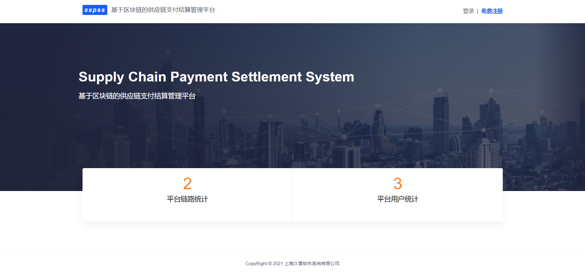

#### 注册
注册三个账户，zhangsan0623,lisi0623,wangwu0623
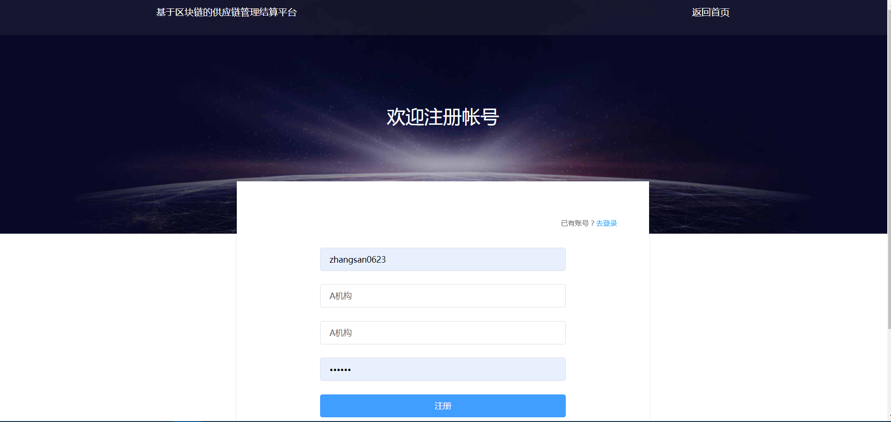

#### 登录 默认打开的是“自建链列表”，“参与链列表”是自己参与别人也包括自己的列表信息
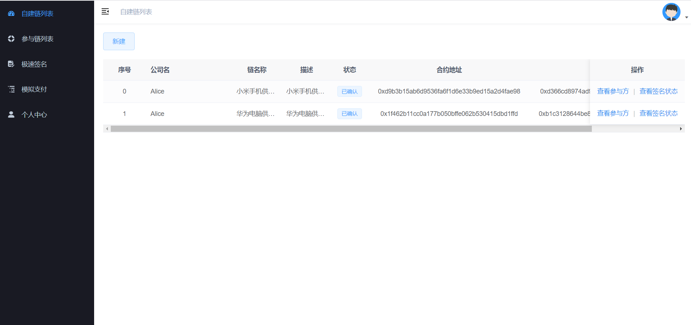


#### 建链,在“自建链列表”新建链
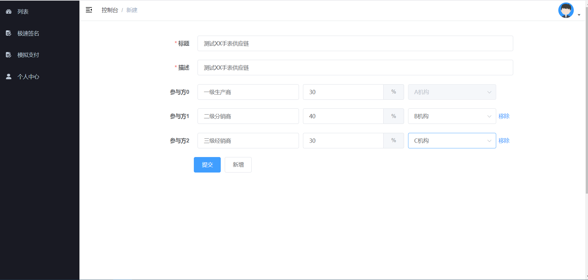

#### 查看链状态&&链签名
默认新建的链是草稿状态，当前建链的机构是默认已签名了的（看各业务需求，此案例仅如此设计），查看该供应链的各级参与方及分成比例和签名状态
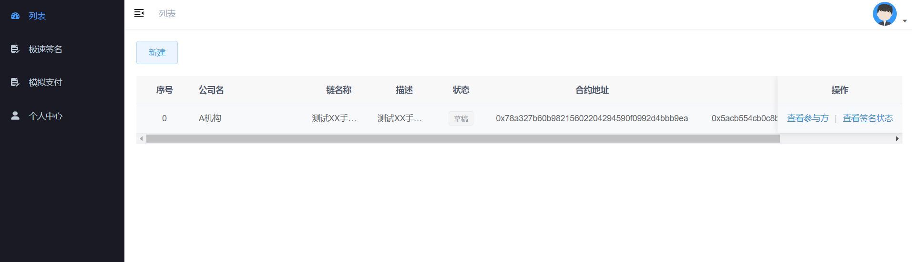
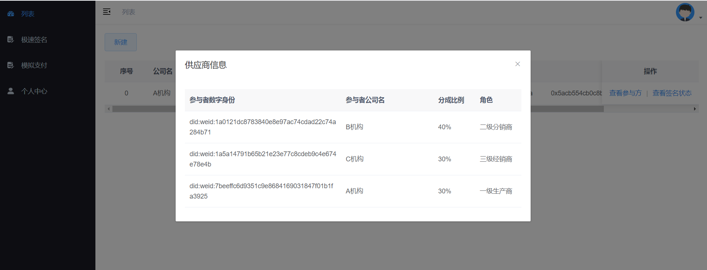
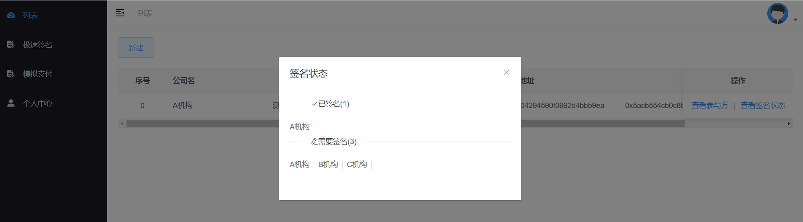

#### 模拟各方签名
已签名的无须重复签名，此案例功能为权限控制，各方仅能签名自己组织。
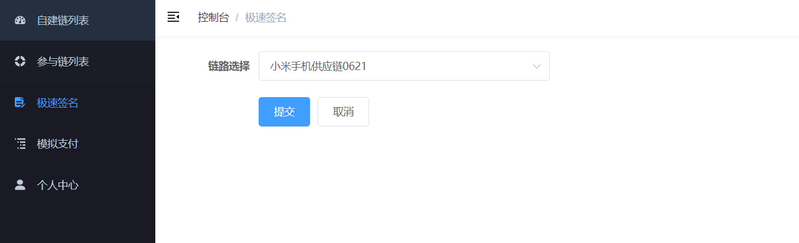

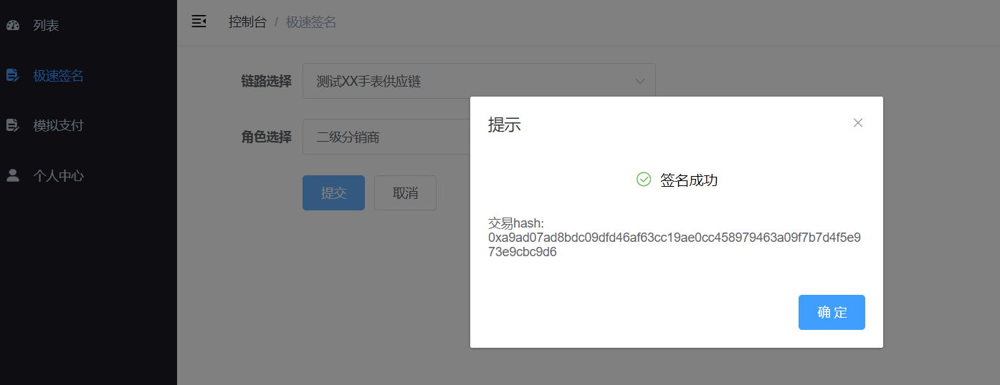

#### 各方签名确认完成，模拟支付
各方签名确认完成，在已有的账户里面模拟支付，积分可自动分成到供应链各方的账户
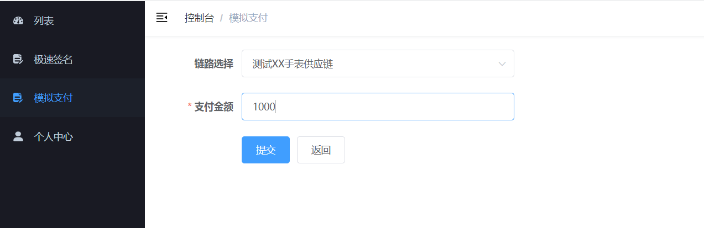
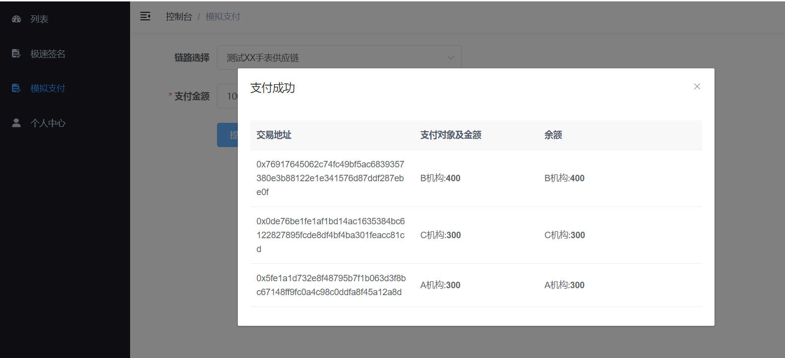

#### 查看WeBASE管理平台交易情况
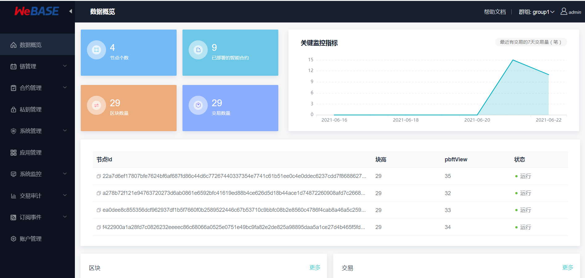

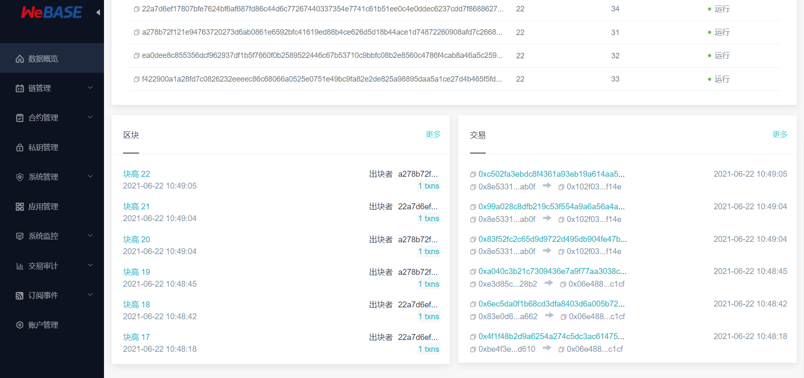

## 接入WeBASE过程介绍

### 4.2 WeBASE接入原理

本案例通过引入`webase-app-sdk`，并在项目的application.properties传入WeBASE应用管理中生成的配置信息即可。

##### 引入webase-app-sdk
本案例使用WeBASE提供的应用接入SDK`webase-app-sdk`接入WeBASE，在本案例的springboot pom.xml文件中已经集成
```
<dependency>
	<groupId>com.webank</groupId>
	<artifactId>webase-app-sdk</artifactId>
	<version>1.5.1-SNAPSHOT</version>
</dependency>
```

通过该SDK，我们可以在项目中调用WeBASE的接口，进行合约和私钥等数据的托管。如下文所示

##### 获取WeBASE应用接入配置
我们可以登录WeBASE 管理平台获取应用接入的配置信息

点击“应用管理”，若该案例已集成在WeBASE，则选择模板，在注册信息里面可获得IP,Port,appKey,appSecret 相关信息，拿到这些信息会放到java配置文件本案例中的application.properties
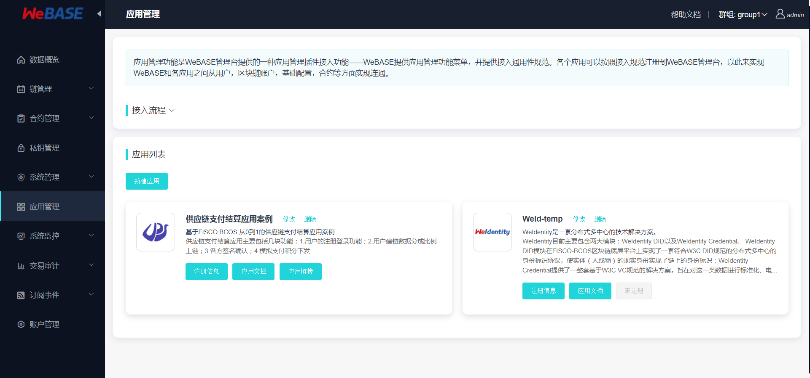

在配置了上述信息后，只要启动本案例的前后端服务，即完成了供应链服务接入WeBASE的操作，在WeBASE的“应用管理”中访问本案例的管理页面

### 通过WeBASE管理私钥与合约
在上述的应用接入和引入WeBASE的SDK后后，本案例的供应链服务可以通过WeBASE进行私钥创建、托管，也可以通过WeBASE管理合约。

#### 私钥管理
该案例用户通过注册业务系统调用sdk的newUser方法在链上新建私钥用户，密钥默认WeBASE-Sign托管模式
```
appClient.newUser(reqNewUser);
```
WeBASE管理平台在私钥管理可以查看通过业务系统注册的用户相关信息


#### 合约同步和绑定
合约部署调用的是WeBASE 前置服务的1.2. 合约部署接口（结合WeBASE-Sign）
```
接口URL
http://localhost:5002/WeBASE-Front/contract/deployWithSign

调用方法
HTTP POST

请求参数
1）参数表

序号	中文	参数名	类型	最大长度	必填	说明
1	所属群组	groupId	int		是	
2	用户编号	signUserId	String	64	是	WeBASE-Sign中的用户编号，通过webase-sign创建私钥获取
3	合约名称	contractName	String		是	
4	合约abi	abiInfo	List		是	合约编译后生成的abi文件内容
5	合约bin	bytecodeBin	String		是	合约编译的bytecode(bin)，用于部署合约
6	构造函数参数	funcParam	List		否	合约构造函数所需参数，JSON数组，多个参数以逗号分隔（参数为数组时同理），如：["str1",["arr1","arr2"]]
7	合约版本	version	String		否	用于指定合约在CNS中的版本
```
然后调用sdk 同步合约和保存地址接口，将合约相关信息同步到WeBASE管理平台，在管理平台页面展示如下
```
## 合约同步
appClient.contractSourceSave(reqContractSourceSave);

## 合约地址绑定
appClient.contractAddressSave(reqContractAddressSave);
```


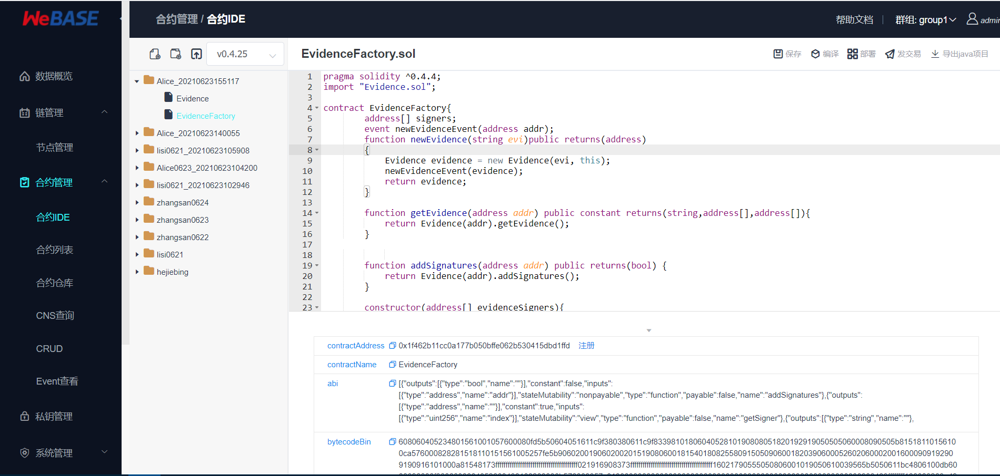


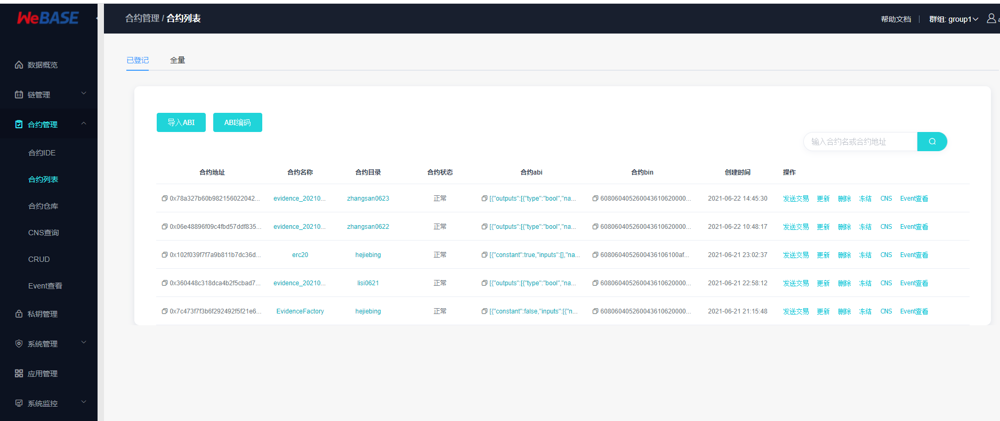

#### 发交易
业务系统通过调用WeBASE 前置服务的5.1. 交易处理接口（结合WeBASE-Sign）接口 将数据上链产生交易
```
接口URL
http://localhost:5002/WeBASE-Front/trans/handleWithSign

调用方法
HTTP POST

请求参数
1）参数表

序号	中文	参数名	类型	最大长度	必填	说明
1	用户编号	signUserId	String	64	是	WeBASE-Sign用户编号（查询方法可不传）
2	合约名称	contractName	String		是	
3	合约地址	contractAddress	String		是	
4	方法名	funcName	String		是	
5	合约编译后生成的abi文件内容	contractAbi	List		是	合约中单个函数的ABI，若不存在同名函数可以传入整个合约ABI，格式：JSONArray
6	方法参数	funcParam	List		否	JSON数组，多个参数以逗号分隔（参数为数组时同理），如：["str1",["arr1","arr2"]]
7	群组ID	groupId	int		是	默认为1
8	是否使用cns调用	useCns	bool		是	
9	cns名称	cnsName	String		否	CNS名称，useCns为true时不能为空
10	cns版本	version	String		否	CNS版本，useCns为true时不能为空
```


