# 向键雄|如何编译导入合约进行WeBASE交易解析
作者 重庆电子工程职业学院 | 向键雄

## 前言
这一篇文章是FISCO BCOS发起的task挑战的第十三个挑战，内容是如何编译/导入合约进行WeBASE交易解析,那么我们还是从一贯的作风开始，从基础讲起。

## 正文

这里的话我们使用的是WeBASE-Front的快速搭建,如何搭建具体的也不在这里多讲去看文章[文章在这](https://blog.csdn.net/qq_57309855/article/details/126453496?spm=1001.2014.3001.5501)


首先可以看看我的这张截图，这里有一个伏笔文末会给大家揭晓哦，里面的数据区块数量为0，这里呢是因为我新起的链条，怎么样会增加区块呢？我们接着往下走

本篇文章的重点是如何编译、导入合约进webase交易解析

### 编译
我们有两种方式，但是最终的结果都是要拿到程序的ABI和BIN，这里我们使用简单的webase进行编译

### 第一步
将文件导入进webase中，点击合约管理——>合约IDE——>智能合约列表点击新建文件——>创建HelloWorld.sol文件（代码我放在下面了）

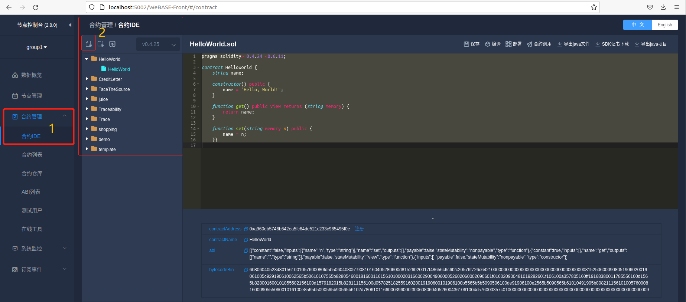


```

pragma solidity>=0.4.24 <0.6.11;

contract HelloWorld {
    string name;

    constructor() public {
        name = "Hello, World!";
    }

    function get() public view returns (string memory) {
        return name;
    }

    function set(string memory n) public {
        name = n;
    }}

```


### 第二步
之后点击右上角的保存和编译就可以获得我们想要的东西了

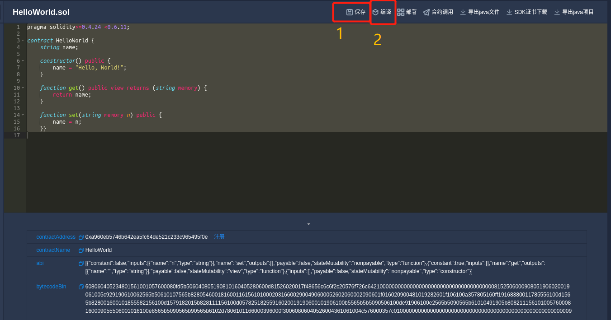

在下面我们就可以看到,一串不知名的代码串

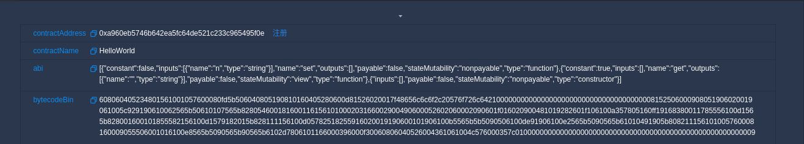

给大家解析一下

| 名称     | 作用 |
| ----------- | ----------- |
| contractAddress     | 这里就是由编译过后生成的合约地址修改状态等都需要用到合约地址要妥善保管     |
| contractName   | 这里就是那个contract定义的项目名|
|abi |这个就是我们的二进制程序接口根据智能合约的内容来生成的后续通过abi来进行合约调用|
|bytecodeBin |就是合约编译的二进制编码|

这里我们把abi和拿出来单独的讲一下

**ABI** 是编译器和链接器遵守的一组规则，以让编译后的程序可以正常工作。ABI里包含很多方面的内容：

- ABI 最大和最重要的部分是规定函数的调用顺序，也称为“调用约定”。调用约定标准化了如何将“函数”转换为汇编代码。
- ABI 还规定了库中公开函数的name（如printf）应该如何表示，以便在链接后可以正确的调用这些库函数并接收参数。
- ABI 还规定可以使用什么类型的数据类型、它们必须如何对齐以及其他低级细节。
- 此外，ABI还涉及操作系统的内容，如可执行文件的格式，虚拟地址空间布局，还有Program Loading and Dynamic Linking等细节。

**bytecodeBin** 是指合约编译的完整二进制码 (bytecode bin)，一般用于部署合约 将部分接口的 contractBin 字段修改为 bytecodeBin 字段，修改的接口包含 contract/deployWithSign ，共1个；


### 导入
导入我们上面已经试过一次了，我们再来一次，通常我们都是使用文件夹进行合约管理所以我们需要新建一个新的文件夹

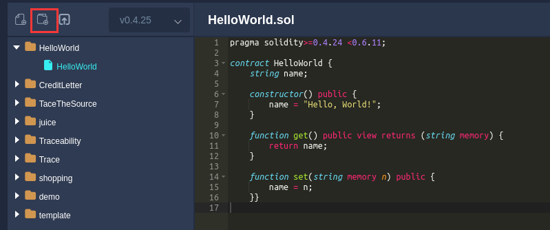

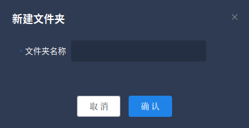

之后我们就可以将文件放入文件夹内

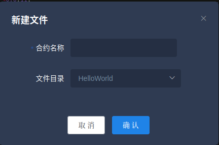

### 交易解析

在上面几个步骤都完成之后我们就可以开始一个完整的交易了这里还是使用我们的"新手必备——HelloWorld" <br>

在进行交易前我们创建一个test用户，来进行合约部署等操作

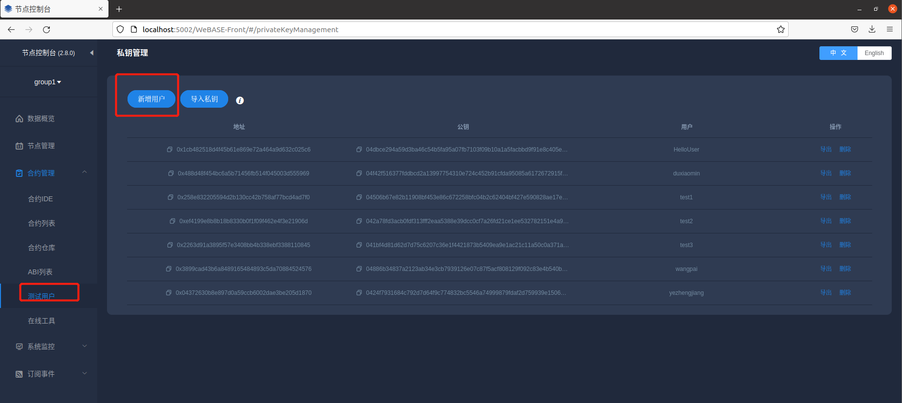
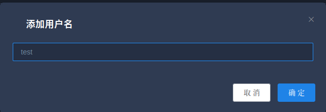

在创建用户过后我们就可以，先保存合约——>再进行编译——>合约部署——>合约调用

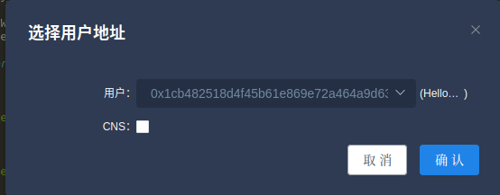

这里我们使用set方法将参数传进去，helloworld，源代码中使用的是Hello,world!哈这里不一样

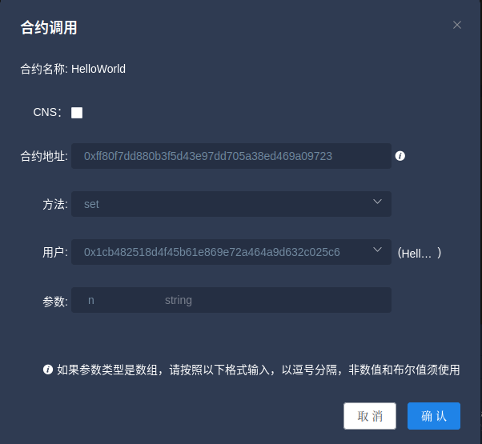

看看这里的交易回执，我们就可以读取到一些信息比如交易回执，块高等信息

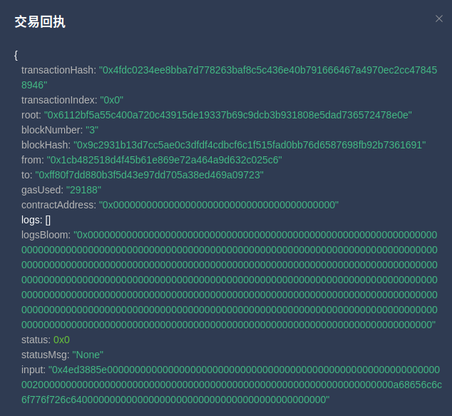

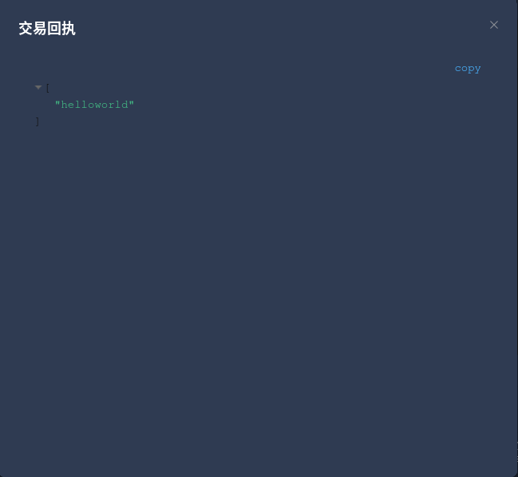

流程大概就是这样子，现在我们一个一个来解释刚才的回执码

| 名称|作用|
| -------------------|------------------|
|transactionHash|这里反馈的是交易哈希每有一笔交易产生就有一笔回执|
|root|区块根merkle树的内容，记载的是上一区块的地址|
|blockNumber|区块高度，区块链中使用高度来形容一个区块链的长度|
|blockHash|区块哈希值|
|from|交易从哪里来的|
|to|交易去往哪里|
|gasUsed|使用的gas值，FISCOBCOS中引入了EVM所以需要有gas的存在|

大家现在再回到首页去看看，就可以发现自己的首页和最开始的时候有不一样了，发现了吗，块高发生了变化，你的是几呢？
我是因为在录教程的时候，有一些失误操作所以区块数目为4，大家的在2和3的就比较正常。

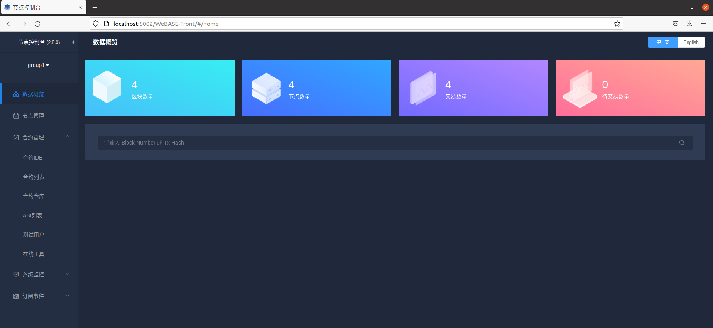

## 这里是重点

这里来讲一下为什么区块会变化，区块链分为和数据构成的数据链和节点构成的节点链，那么数据也分为链上和链下，这里呢我们就是数据链，那么数据链怎么增加呢，只要我们修改了区块链状态，他就会记录，比如我们部署智能合约，调用智能合约传入数据到接口，这时就会改变状态所以会增加区块高度，有WeBASE-Front就比较方便了，我们直接输入区块高度就可以查看区块里的内容。

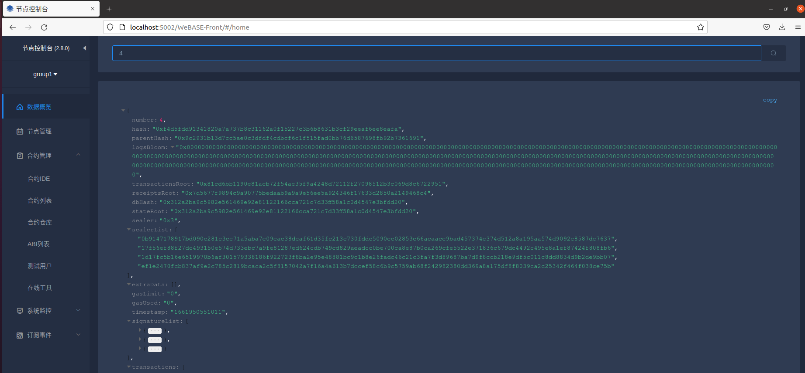

## 剩下的就没啥讲的了，一个交易从最开始的智能合约，到最后进入区块链中部署的智能合约再到调用，就这样简单的实现了，不得不感叹FISCO BCOS和WeBASE-Front的强大
