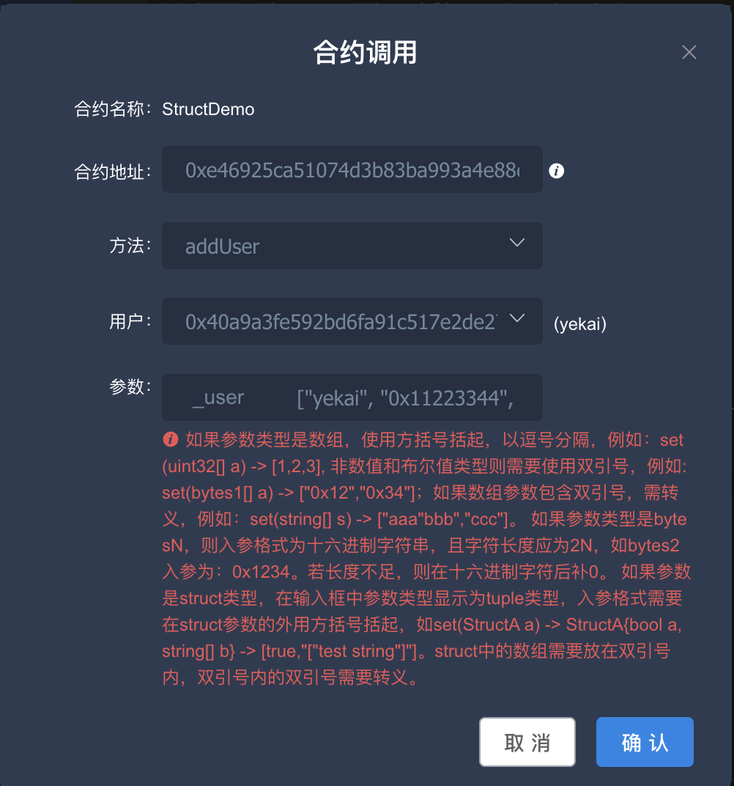
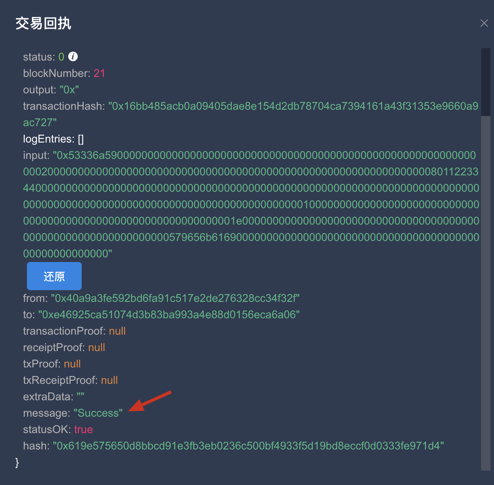
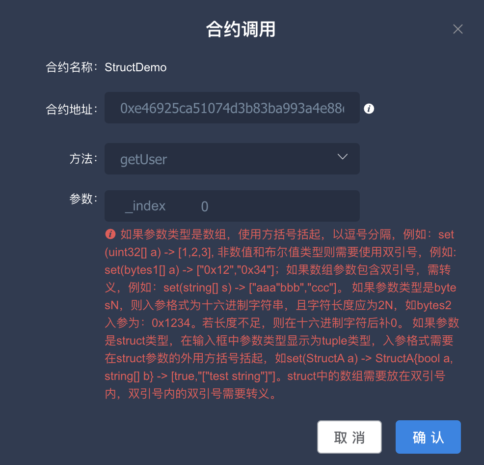
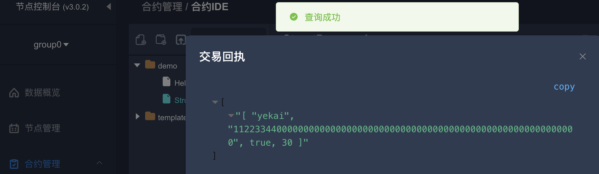
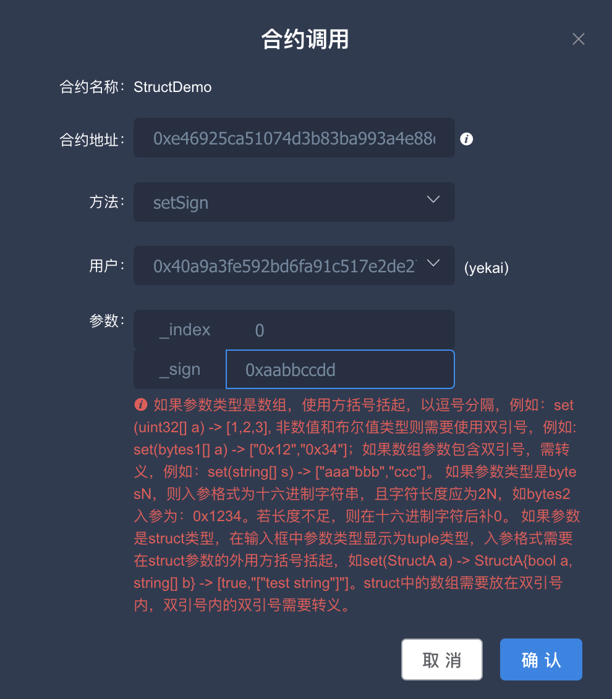
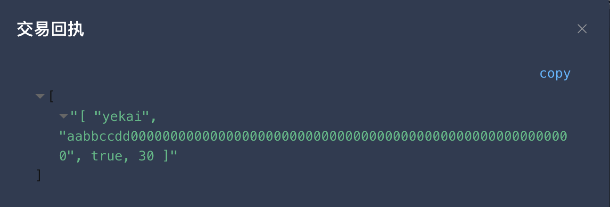
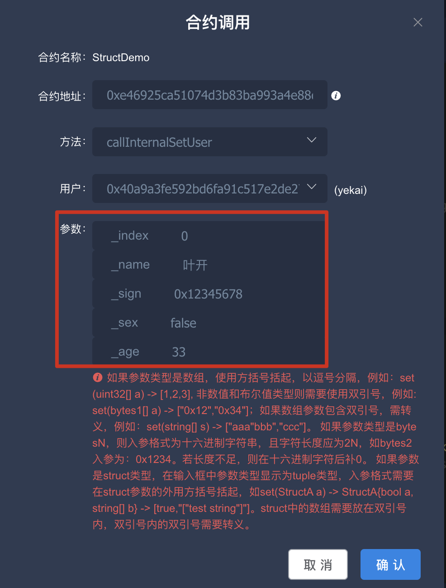

# 叶开 | 介绍struct和bytesN智能合约中的参数传递方法
作者：叶开

Solidity智能合约中可以使用uint、string、address、bool等数据类型。Solidity语言同样支持Struct，但是如果将Struct作为参数传递可能会让人头疼。本文主要介绍在智能合约中如何使用Struct，尤其是将其作为参数或者是返回值的时候，应该如何操作。另外，bytesN作为Solidity当中的特殊类型，在这篇介绍特殊参数传递的文章中也顺便一起介绍一下。

本篇文章涉及的知识点包括：

- Struct作为内部函数的参数；
- Struct作为外部函数的参数；
- Struct作为返回值；
- bytesN的传参方式和返回。

### 环境准备

本文基于FISCO-BCOS来介绍，节点采用3.3.0版本，智能合约IDE采用WeBASE-Front，版本为3.0.2。

节点搭建教程参考：[3.0+节点搭建教程](https://fisco-bcos-doc.readthedocs.io/zh_CN/latest/docs/tutorial/air/build_chain.html)。

WeBASE-Front搭建教程参考：[WeBASE-Front搭建教程](https://webasedoc.readthedocs.io/zh_CN/lab/docs/WeBASE-Front/install.html)。

### 合约编写

FISCO-BCOS3.0版本，可以支持Solidity编译器0.8.11的版本，所以可以开发编译器版本的智能合约。可以在IDE环境创建一个StructDemo的合约文件，接着声明编译器版本和结构体定义。

 ```solidity
 // SPDX-License-Identifier: Apache-2.0
 pragma solidity >=0.6.10 <0.8.20;
 
 struct User {
     string name;
     bytes4 sign; // 测试bytesN
     bool   sex;
     uint   age;
 }
 ```

编写StructDemo合约，为其创建一个状态变量users，它是一个User的结构数组。

```solidity
contract StructDemo {
    User[] users;
}
```

为StructDemo合约添加一个addUser方法，它的作用是向users数组内添加用户。

```solidity
		// 结构化数据作为传入参数
    // 传参示例：["yekai", "0x11223344", true, 30]
    function addUser(User memory _user) public {
        //user = _user;
        User memory u = _user;
        users.push(u);
    }
```

开发时，如果结构体内元素不多，可以使用基础数据类型作为函数参数，那样更简单一些。另外，当使用内部函数时，struct数据类型也可以使用storage方式（storage可以理解为链上数据，这个数据是不可能通过外部参数传入的）。

```solidity
		// storage 参数，只能使用内部函数
    function internalSetUser(
        User storage _user, 
        string memory _name, 
        bytes4 _sign, 
        bool _sex,
        uint _age
        ) internal {
        _user.name = _name;
        _user.sign = _sign;
        _user.sex  = _sex;
        _user.age  = _age;
    }
```

internalSetUser方法没办法直接调用，因此可以再提供一个callInternalSetUser方法来调用它。

```solidity
		// 基础类型作为参数处理结构化数据
    function callInternalSetUser(
        uint _index,
        string memory _name, 
        bytes4 _sign, 
        bool _sex,
        uint _age
        ) public {
        require(_index <= users.length, "index out of range");
        // 调用内部函数，可以传递状态变量作为storage参数
        internalSetUser(users[_index], _name, _sign, _sex, _age);
    }
```

为合约添加一个getUser的方法，通过索引编号来获得人员信息。

```solidity
		// 返回结构化数据
    function getUser(uint _index) public view returns (User memory) {
        return users[_index];
    }
```

编写一个测试bytesN的方法，setSign方法中的N=4。

```solidity
		// 设置签名 bytes4数据
    function setSign(uint _index, bytes4 _sign) public {
        require(_index <= users.length, "index out of range");
        users[_index].sign = _sign;
    }
```

完整合约代码如下：

```solidity
// SPDX-License-Identifier: Apache-2.0
pragma solidity >=0.6.10 <0.8.20;

struct User {
    string name;
    bytes4 sign;
    bool   sex;
    uint   age;
}

contract StructDemo {
    User[] users;
  
    // 结构化数据作为传入参数
    // ["yekai", "0x11223344", true, 30]
    function addUser(User memory _user) public {
        //user = _user;
        User memory u = _user;
        users.push(u);
    }
    // storage 通过内部函数处理
    function internalSetUser(
        User storage _user, 
        string memory _name, 
        bytes4 _sign, 
        bool _sex,
        uint _age
        ) internal {
        _user.name = _name;
        _user.sign = _sign;
        _user.sex  = _sex;
        _user.age  = _age;
    }
    // 基础类型作为参数处理结构化数据
    function callInternalSetUser(
        uint _index,
        string memory _name, 
        bytes4 _sign, 
        bool _sex,
        uint _age
        ) public {
        require(_index <= users.length, "index out of range");
        // 调用内部函数，可以传递状态变量作为storage参数
        internalSetUser(users[_index], _name, _sign, _sex, _age);
    }
    // 返回结构化数据
    function getUser(uint _index) public view returns (User memory) {
        return users[_index];
    }
    // 设置签名 bytes4数据
    function setSign(uint _index, bytes4 _sign) public {
        require(_index <= users.length, "index out of range");
        users[_index].sign = _sign;
    }
}
```


### 测试演示

上述合约代码编写完成后，接下来我们通过WeBASE-Front页面来测试该合约，由于没有书写构造函数，因此直接部署该合约即可。部署完成后，开始测试各个功能。

首先，我们测试addUser方法，这个是直接通过结构体数据传递参数，实际上在IDE上针对输入参数的书写说明已经做了明确提示。

> 如果参数类型是数组，使用方括号括起，以逗号分隔，例如：set(uint32[] a) -> [1,2,3], 非数值和布尔值类型则需要使用双引号，例如: set(bytes1[] a) -> ["0x12","0x34"]；如果数组参数包含双引号，需转义，例如：set(string[] s) -> ["aaa"bbb","ccc"]。 如果参数类型是bytesN，则入参格式为十六进制字符串，且字符长度应为2N，如bytes2入参为：0x1234。若长度不足，则在十六进制字符后补0。 如果参数是struct类型，在输入框中参数类型显示为tuple类型，入参格式需要在struct参数的外用方括号括起，如set(StructA a) -> StructA{bool a, string[] b} -> [true,"["test string"]"]。struct中的数组需要放在双引号内，双引号内的双引号需要转义。

根据上面的提示，我们若想传入User这样的结构，就要构造User这样的tuple。按照数据类型一一对应即可，User内的元素类型依次为：string、bytes4、bool、uint。bytes4代表4个字节，16进制的一个数字代表半个字节，因此bytesN类型需要填写8个16进制数。笔者经过测试，在tuple中，bytesN数据也要用“”来表达，否则会解析失败，因此传入的示例格式为：["yekai", "0x11223344", true, 30]。如下图所示。



确认后，如果执行成功，将会看到交易成功的提示。



可以通过getUser方法来获取之前添加的数据。输入参数0，获取数组第一个用户。如下图所示。



可以看到下图的回显效果，虽然sign的数据格式是bytes4，但是回显的仍然是32字节数据。



测试setSign方法，将其的sign修改为0xaabbccdd，操作如下图所示。



执行完成后，再次调用getUser，将会看到sign数据的变化。



最后，测试一下callInternalSetUser方法，如下图所示框入数据。点击确定，也可以顺利完成更新操作。



### 总结

struct作为参数传入确实有些麻烦，如果不懂传递方法，在页面操作上确实容易掉到坑里，WeBASE-Front的提示是非常友好的，基于提示可以很容易解决问题。这些基本原则搞清楚后，更复杂的结构数据也可以很方便的传递了。


