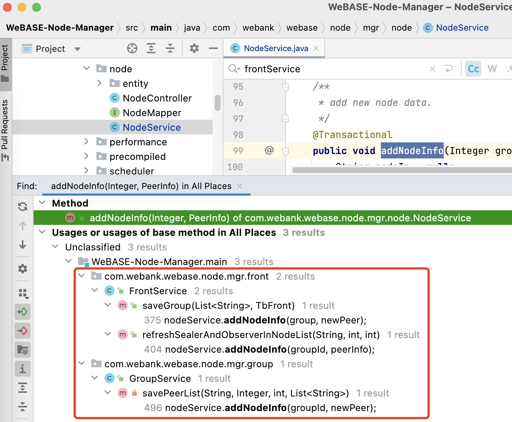

# 区块链教程 | 节点管理服务的NodeService层代码走读

&emsp;&emsp;本章节适用WeBASE新手，也欢迎指正。<br/>
&emsp;&emsp;主要通过走读节点管理服务`WeBASE-Node-Manager`的`nodeService`代码，介绍如何获取、判断、更新区块链的节点状态。

## 依赖知识

- 熟悉区块链基本概念，区块、交易、节点等；
- 熟悉WeBank开源区块链网络[FISCO BCOS](fisco-bcos-documentation.readthedocs.io/zh_CN/latest/index.html)的配置、部署；
- 掌握WeBank开源区块链中间件[WeBASE](https://webasedoc.readthedocs.io/zh_CN/latest/docs/WeBASE-Web/index.html)的整体架构，各中间件服务功能，如何部署等；

## 节点服务介绍

&emsp;&emsp;服务通过注入前置服务`WeBASE-Front`实例`frontInterface`查询链上的节点数据；通过注入`Mapper`类，提供存取、更新节点表`tb_node`、前置表`tb_front`数据的功能。注入描述：
```java
    /**
     * 本地数据库存取节点数据
     */
    @Autowired
    private NodeMapper nodeMapper;
    /**
     * WeBASE-Front前置服务实例接口
     * 主要查询链上的节点信息
     */
    @Autowired
    private FrontInterfaceService frontInterface;

    /**
     * 查询链运行状态
     */
    @Autowired
    private ChainService chainService;

    /**
     * 在Linux主机环境执行shell命令，
     * 使用mkdir和mv命令，来管理远程主机的FISCO BCOS网络节点数据
     */
    @Autowired
    private AnsibleService ansibleService;
    /**
     * update front status
     * 查询、更新前置表`tb_front`数据
     */
    @Autowired
    private FrontService frontService;
```

## 接口介绍

### 节点信息的数据库存取类接口
- addNodeInfo 插入节点信息接口
- countOfNode 统计节点数接口
- queryNodeList 查新节点列表接口
- queryByGroupId 通过群组ID查询节点信息接口
- updateNode 更新节点信息接口
- deleteByNodeAndGroupId 通过群组ID删除节点信息接口<br/>

上述接口主要是节点信息的数据库存取操作。以`addNodeInfo`为例走读代码，IntelliJ IDEA打开工程代码，查找接口调用信息，图示，包含`FrontService`的保存群组`saveGroup`、刷新节点列表`refreshSealerAndObserverInNodeList`接口，`GroupService`的保存共识列表`savePeerList`接口。继续查阅各接口功能可知，在区块链群组信息刷新、新建前置服务信息时会调用`addNodeInfo`接口，感兴趣的可以查阅源码。


### 节点状态判断逻辑接口
- checkAndUpdateNodeStatus 检查并更新节点状态接口<br/>

该接口是`nodeService`的核心接口，判断节点状态并同步更新数据库。通过IDEA查找接口调用信息可知，在节点状态监控的定时任务以及查询信息类接口等多处被调用。接口代码主要逻辑：
- 1、获取本地节点列表；
- 2、通过前置服务查询区块链网络的的共识节点列表；
- 3、通过前置服务查询区块链网络的观察者节点列表；
- 4、计算节点总数；
- 5、循环节点列表，判断并更新节点信息。

```java
/**
* check node status, if pbftView or blockNumber not changing, invalid consensus
* @case: observer(no pbftView), if observer's blockNumber not equal consensus blockNumber
* @1.4.3: if request consensus status but return -1, node is down
*
*/
public void checkAndUpdateNodeStatus(int groupId) {
    //1、get local node list 获取本地节点列表
    List<TbNode> nodeList = queryByGroupId(groupId);

    /**
    * 2、getPeerOfConsensusStatus 通过前置服务查询区块链网络的的共识节点列表
    * 注: 前置服务通过FISCO BCOS提供的java SDK连接到区块链网络底层节点
    */
    List<PeerOfConsensusStatus> consensusList = getPeerOfConsensusStatus(groupId);
    if (Objects.isNull(consensusList)){
        log.error("fail checkNodeStatus, consensusList is null");
        return;
    }
    
    // 3、getObserverList 通过前置服务查询区块链网络的观察者节点列表
    List<String> observerList = frontInterface.getObserverList(groupId);

    // 4、计算节点总数
    int nodeCount = CollectionUtils.size(consensusList) + CollectionUtils.size(observerList);

    // 5、循环节点列表，判断并更新节点信息
    for (TbNode tbNode : nodeList) {...}

}
```
展开`for`循环，判断节点状态的主要逻辑如下：
- 1、取节点信息
- 2、如果节点信息刚被修改过，则跳过本次更新（即上次修改时间距今毫秒 < 节点数*1000+最小间隔3500毫秒）
- 3、判断节点状态，默认共识节点
- 4、取节点的块高，共识时钟
- 5、判断节点状态
- 5.1 若是共识节点，取链上指定群组的块高、共识时钟，如果两值没变化，则节点状态异常，否则正常
- 5.2 若是观察者节点（即只同步链上数据，不参与共识的节点），判断节点中的块高和共识网络上的块高，若相同则异常，否则正常
- 6、更新节点信息
- 7、判断链状态（如果链是手工部署的，更新前置状态；如果是基于WeBASE可视化部署的，则取部署的链状态并返回）
- 8、同步更新前置状态

代码走读：
```java
    for (TbNode tbNode : nodeList) {
        //1、取节点信息
        String nodeId = tbNode.getNodeId();
        BigInteger localBlockNumber = tbNode.getBlockNumber();
        BigInteger localPbftView = tbNode.getPbftView();
        LocalDateTime modifyTime = tbNode.getModifyTime();
        LocalDateTime createTime = tbNode.getCreateTime();

        //2、如果节点信息刚被修改过，则跳过本次更新（即上次修改时间距今毫秒 < 节点数*1000+最小间隔3500毫秒）
        Duration duration = Duration.between(modifyTime, LocalDateTime.now());
        Long subTime = duration.toMillis();
        if (subTime < (nodeCount * 1000 + EXT_CHECK_NODE_WAIT_MIN_MILLIS) && createTime.isBefore(modifyTime)) {
            log.warn("checkNodeStatus jump over. for time internal subTime:{}", subTime);
            return;
        }

        //3、判断节点状态，默认共识节点
        int nodeType = 0;   //0-consensus;1-observer
        if (observerList != null) {
            nodeType = observerList.stream()
                    .filter(observer -> observer.equals(tbNode.getNodeId())).map(c -> 1).findFirst()
                    .orElse(0);
        }

        //4、取节点的块高，共识时钟
        BigInteger latestNumber = getBlockNumberOfNodeOnChain(groupId, nodeId);//blockNumber
        BigInteger latestView = consensusList.stream()
            .filter(cl -> nodeId.equals(cl.getNodeId())).map(PeerOfConsensusStatus::getView).findFirst()
            .orElse(BigInteger.ZERO);//pbftView

        //5.1 若是共识节点
        if (nodeType == 0) {    //0-consensus;1-observer
            // if local block number and pbftView equals chain's, invalid
            //取链上指定群组的块高、共识时钟，如果两值没变化，则节点状态异常，否则正常
            if (localBlockNumber.equals(latestNumber) && localPbftView.equals(latestView)) {
                log.warn("node[{}] is invalid. localNumber:{} chainNumber:{} localView:{} chainView:{}",
                    nodeId, localBlockNumber, latestNumber, localPbftView, latestView);
                tbNode.setNodeActive(DataStatus.INVALID.getValue());
            } else {
                tbNode.setBlockNumber(latestNumber);
                tbNode.setPbftView(latestView);
                tbNode.setNodeActive(DataStatus.NORMAL.getValue());
            }
        } else {
            //5.2 若是观察者节点（即只同步链上数据，不参与共识的节点）
            //observer
            // if latest block number not equal block number of consensus network
            // 观察者节点不参与共识。判断节点中的块高和共识网络上的块高，若相同则异常，否则正常
            if (!latestNumber.equals(frontInterface.getLatestBlockNumber(groupId))) {
                // if node's block number is not changing, invalid
                if (localBlockNumber.equals(latestNumber)) {
                    log.warn("node[{}] is invalid. localNumber:{} chainNumber:{} localView:{} chainView:{}",
                        nodeId, localBlockNumber, latestNumber, localPbftView, latestView);
                    tbNode.setNodeActive(DataStatus.INVALID.getValue());
                } else {
                    // if latest block number not equal network's, but is changing, normal
                    tbNode.setBlockNumber(latestNumber);
                    tbNode.setPbftView(latestView);
                    tbNode.setNodeActive(DataStatus.NORMAL.getValue());
                }
            } else {
                tbNode.setBlockNumber(latestNumber);
                tbNode.setPbftView(latestView);
                tbNode.setNodeActive(DataStatus.NORMAL.getValue());
            }
        }
        //重置节点修改时间
        tbNode.setModifyTime(LocalDateTime.now());
        //update node
        //6、更新节点信息
        updateNode(tbNode);

        // only update front status if deploy manually
        //如果链是手工部署的，更新前置状态；如果是基于WeBASE可视化部署的，则取部署的链状态并返回。(英文注释不太准确？)
        if (chainService.runTask()) {
            TbFront updateFront = frontService.getByNodeId(nodeId);
            if (updateFront != null) {
                // update front status as long as update node (7.5s internal)
                log.debug("update front with node update nodeStatus:{}", tbNode.getNodeActive());
                // update as 2, same as FrontStatuaEnum
                if (tbNode.getNodeActive() == DataStatus.NORMAL.getValue()) {
                    updateFront.setStatus(FrontStatusEnum.RUNNING.getId());
                } else if (tbNode.getNodeActive() == DataStatus.INVALID.getValue()) {
                    updateFront.setStatus(FrontStatusEnum.STOPPED.getId());
                }
                frontService.updateFront(updateFront);
            }
        }
    }
```

## 扩展走读

&emsp;&emsp;通过WeBASE的[整体架构图](https://webasedoc.readthedocs.io/zh_CN/latest/docs/WeBASE/introduction.html#id3)可知，节点管理服务`WeBASE-Node-Manager`是通过部署在各区块链底层节点的前置服务`WeBASE-Front`与区块链网络通信的，而前置服务是通过`java sdk`调用`FISCO BCOS`底层网络提供的`rpc`接口获取链上信息的。以获取观察者节点列表为例：
```java
    // 不同文件代码
    // nodeService代码：
    List<String> observerList = frontInterface.getObserverList(groupId);
    
    // frontInterfaceService服务层接口实现：
    /**
     * get group peers
     */
    public List<String> getObserverList(Integer groupId) {
        log.debug("start getObserverList. groupId:{}", groupId);
        List<String> observers =
                frontRestTools.getForEntity(groupId, FrontRestTools.URI_GET_OBSERVER_LIST, List.class);
        log.debug("end getObserverList. observers:{}", JsonTools.toJSONString(observers));
        return observers;
    }
```

`getObserverList`接口调用了前置服务提供的RESTful API，即`web3/observerList`。打开`WeBASE-Front`代码，定位接口位置：

```java
    //Web3ApiController提供了查询链信息的RESTful接口
    @ApiOperation(value = "getObserverList", notes = "get list of group's observers")
    @GetMapping("/observerList")
    public List<String> getObserverList(@PathVariable int groupId) {
        return web3ApiService.getObserverList(groupId);
    }

    //Web3ApiService实现controller层接口
    public List<String> getObserverList(int groupId) {
        return getWeb3j(groupId).getObserverList().getObserverList();
    }
```
`Web3ApiService`通过区块链网络客户端连接的实例`getWeb3j(groupId)`获取链上数据。
