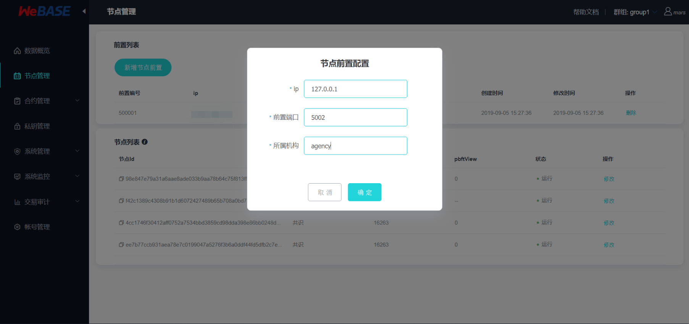
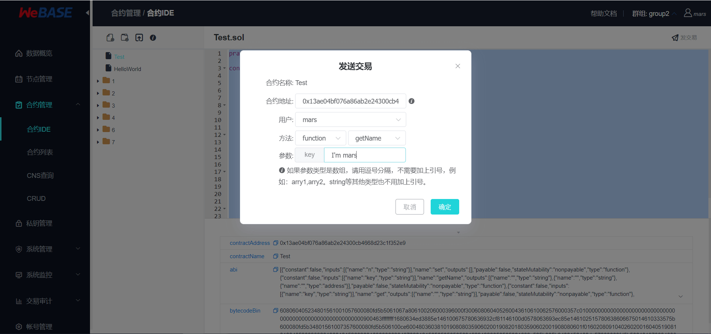
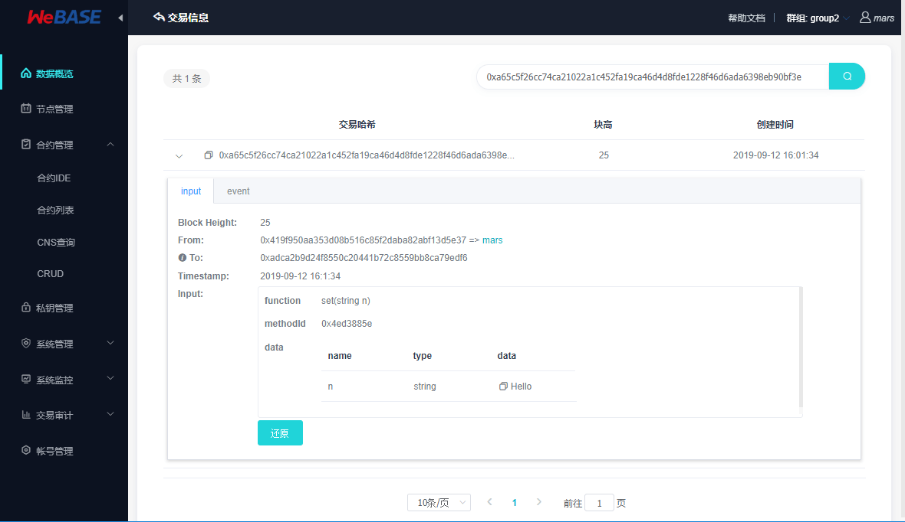
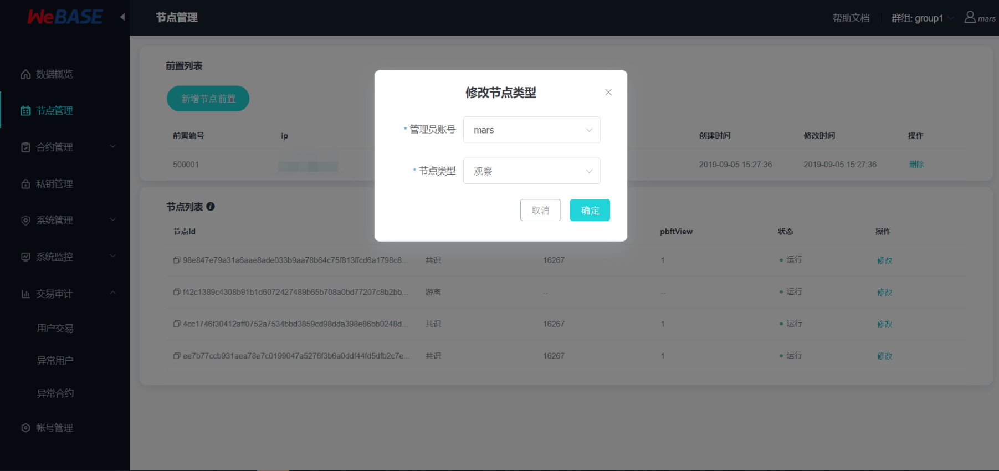
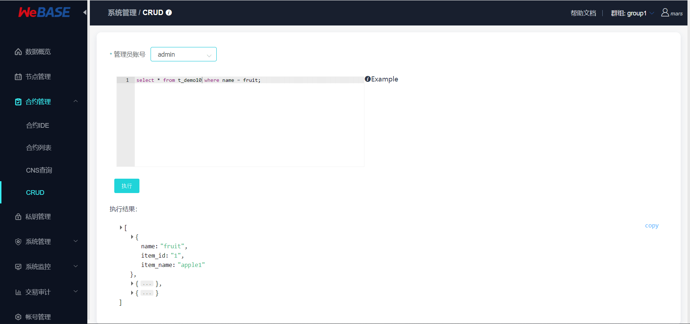
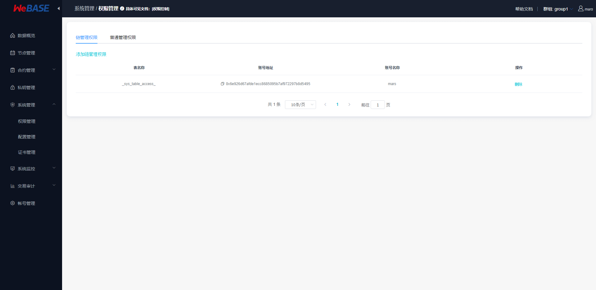
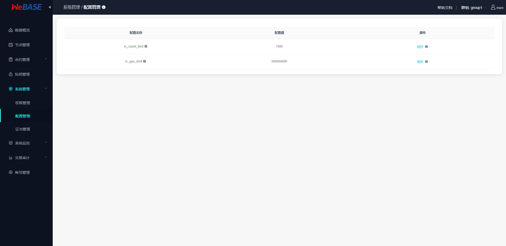
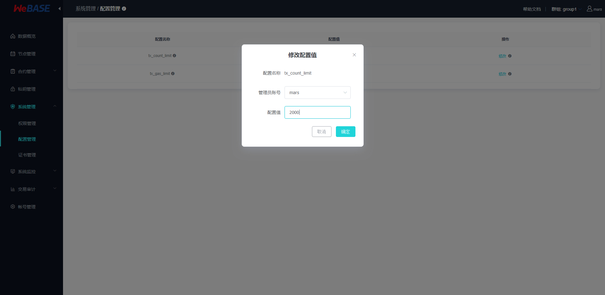
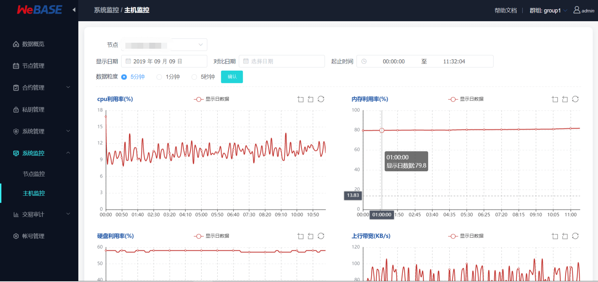
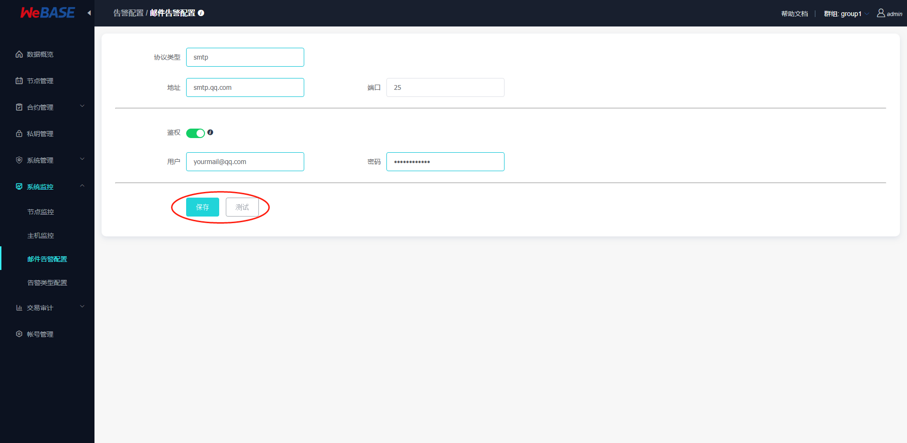

# WeBASE管理平台使用手册

## 概览

### 基本描述

WeBASE管理平台是由三个WeBASE子系统组成的一套管理FISCO-BCOS联盟链的工具集。

### 主要功能

1. 区块链数据概览
2. 节点管理
3. 合约管理
4. 私钥管理
5. 系统管理
6. 系统监控
7. 交易审计
8. 账号管理

### 部署架构

这套管理工具主要由：节点前置，节点管理，WeBASE管理平台三个WeBASE子系统构成。WeBASE三个服务的部署架构如下图：节点前置需要和区块链节点部署在同一台机器；节点管理和WeBASE管理平台可以同机部署，也可以分开部署。

## 使用前提

### 群组搭建

区块链浏览器展示的数据是从区块链上同步下来的。为了同步数据需要初始化配置（添加群组信息和节点信息），故在同步数据展示前需要用户先搭建好区块链群组。[FISCO-BCOS 2.0](https://github.com/FISCO-BCOS/FISCO-BCOS.git)提供了多种便捷的群组搭建方式。

1. 如果是开发者进行开发调试，建议使用[build_chain](https://fisco-bcos-documentation.readthedocs.io/zh_CN/release-2.0/docs/installation.html)。
2. 如果是开发企业级应用，建议使用企业部署工具[FISCO-BCOS generator](https://fisco-bcos-documentation.readthedocs.io/zh_CN/release-2.0/docs/tutorial/enterprise_quick_start.html)。

两者的主要区别在于build_chain为了使体验更好，搭建速度更快，辅助生成了群组内各个节点的私钥；但企业部署工具出于安全的考虑不辅助生成私钥，需要用户自己生成并设置。

### WeBASE管理平台搭建

WeBASE管理平台分为三个部分：节点前置，节点管理，WeBASE管理台。

当前版本我们提供了两种搭建方式：[**一键搭建**](../WeBASE/install.md)和手动搭建。

#### 1、一键搭建

适合同机部署，快速体验的情况使用。具体搭建流程参见[**安装文档**](../WeBASE/install.md)。

#### 2、手动搭建

##### 2.1、节点前置搭建

节点前置使用Spring Boot的JAVA后台服务，具体搭建流程参见[《节点前置安装说明》](../WeBASE-Front/install.md)。

##### 2.2、节点管理搭建

节点管理使用Spring Boot的JAVA后台服务，具体搭建流程参见[《节点管理安装说明》](../WeBASE-Node-Manager/install.md)。

##### 2.3、WeBASE管理平台

WeBASE管理台使用框架`vue-cli`，具体搭建流程参见[《WeBASE管理平台安装说明》](../WeBASE-Web/install.md)。

## 系统初始化配置

服务搭建成功后，可使用网页浏览器访问nginx配置的WeBASE管理台IP和端口(例如XXX.XXX.XXX.XXX:XXXX)，进入到管理平台页面。管理平台默认用户为admin，默认密码为Abcd1234（第一次登陆成功后会要求重置密码，请按照密码标准设置一个更加安全的密码）。

### 添加节点前置

 未初始化节点前置的管理平台，会引导去节点管理页面添加节点前置。

前置添加完成后，管理平台就会开始拉取群组信息和群组的区块信息。此时数据概览页面应该就有数据了。为了解析和审计区块数据，需要把相关的合约和用户导入到管理平台。具体看下面两个小节。

### 合约管理

#### 1、添加合约

管理平台提供两种添加合约的方式，一个是新建一个合约，一个是导入已有合约。同时合约编辑器还提供新建目录。用目录的形式管理合约，主要是为了解决同名合约引用的问题。合约添加完成后，需要编译保存。

#### 2、部署合约

合约编译时会自动保存合约内容，编译成功后可以执行合约部署。

#### 3、合约调用

在合约部署成功后，可以在合约IDE页面的右上角点击发交易，向合约发送交易进行合约调用。

交易发送成功后，将返回交易回执。可以在数据概览-交易列表-更多中根据transactionHash搜索交易，通过交易解析和Event解析查看可视化的交易回执信息。具体操作方法参考下文的区块链数据概览章节中的交易解析与Event解析。

### 私钥管理

私钥管理提供了新建私钥用户和导入公钥用户两种用户导入方式。第一种方式主要用于新建用户在管理平台的合约管理中部署和调用合约。第二种方式主要用于把交易和用户关联起来。

## 各模块的详细介绍

本小节概要介绍管理平台的各个模块，方便大家对WeBASE管理平台套件有一个整体的认识。这套工具集主要提供的管理功能有：

### 区块链数据概览

数据概览页面，展示了区块链的核心数据指标：节点个数，区块数量，交易数量，通过管理台部署的合约数量。关键监控指标：历史15天的交易量。
- 节点信息列表：展示了节点的ID，节点块高，节点view和运行状态；
- 区块信息列表：展示了最近5个块的概览信息，点击更多可以查看更多历史区块；
- 交易信息列表：展示了最近5个交易的概览信息，点击更多可以查看更多历史交易；

其中右下角的交易信息列表点击可跳入具体一条交易中查看交易详细信息：交易详细信息还包含了
- 交易解析：可以将交易返回的交易回执数据进行解析并可视化；
- Event解析：可以将交易返回的Event数据进行解析并可视化；

未解析的raw数据如下图所示：

进行交易解析后如下图所示：

同样的，Event数据解析后可以看到：

### 节点管理

节点管理主要提供了前置列表、节点列表、修改节点共识状态的功能。

用户可以通过新增节点前置，把新的节点前置添加到前置列表。系统会默认拉取这些前置所在的群组和各个群组的节点信息。在节点列表中，用户可以修改节点的共识状态：共识节点、观察节点、游离节点。其中修改为游离节点相当于将节点移出群组，停止节点前务必先将节点设置为游离节点，否则将触发节点异常。

节点管理：

显示所有的共识/观察节点（无论运行或停止），以及正在运行的游离节点

修改节点共识状态：

### 合约管理

合约管理提供了一个图形化的合约IDE环境、已部署的合约列表、合约CNS查询以及预编译合约的CRUD功能。

图形化合约IDE提供了一整套的合约管理工具：新建合约，保存合约，编译合约，部署合约，调用合约接口。其中，新建合约可以通过编辑键入合约内容，也可以上传合约文件；编译合约后才可以部署合约；部署合约成功后，可以通过发送交易调用合约接口。具体操作步骤可以参考上一章节中系统初始化配置介绍。

合约IDE：

合约列表：

CNS查询：CNS（Contract Name Service）是通过提供链上合约名称与合约地址映射关系的记录及相应的查询功能，方便调用者通过记忆简单的合约名来实现对链上合约的调用。详情可查看FISCO-BCOS文档的 [CNS方案](https://fisco-bcos-documentation.readthedocs.io/zh_CN/latest/docs/design/features/cns_contract_name_service.html#cns)

CNS可以根据合约名和合约版本号查询CNS信息(合约名和合约版本号用英文冒号连接)。若缺失合约版本号，则返回所有符合合约名的合约信息。

CRUD：CRUD通过在Solidity合约中支持分布式存储预编译合约，可以实现将Solidity合约中数据存储在FISCO BCOS平台AMDB的表结构中，实现合约逻辑与数据存储的分离。CRUD可以在FISCO-BCOS链上创建数据表，并对表进行增删改查操作，具体CRUD操作教程查看[FISCO-BCOS控制台CRUD命令](https://fisco-bcos-documentation.readthedocs.io/zh_CN/latest/docs/manual/console.html#create-sql)

### 私钥管理

私钥管理包含新建私钥用户和新建公钥用户两个功能。在合约管理界面，可以看到合约部署和交易调用功能。这里的私钥管理可以新建私钥用户，然后拿新建用户的私钥来做合约部署和合约调用的签名。注：外部账户可通过新建公钥账户导入，主要用于把交易和用户关联起来。

私钥管理：

添加私钥用户：

### 系统管理

系统管理目前支持权限管理、系统配置管理、证书管理的功能。

**权限管理**：支持链权限管理和普通权限（四种）管理:
- 链权限管理为分配权限的链管理员，可以使用权限分配功能，非链管理员账户无权限分配功能；
- 普通权限管理包含四种权限： 部署合约和创建用户表权限, 节点管理权限, CNS管理权限, 系统参数管理权限；

> 注：链管理员为空时，不作权限限制，所有用户拥有权限，可以自由给自身或其他用户添加权限；设置了第一个链管理员后，非管理员用户无权限分配功能；请谨慎设置第一个链管理员;
> 
> 普通权限管理员为空时，所有用户拥有特定功能，如：节点管理员为空时，所有用户可以管理节点状态，设置了第一个节点管理员后，非节点管理员不可管理节点状态;

FISCO-BCOS权限管理机制详情可以参考文档[FISCO-BCOS权限控制](https://fisco-bcos-documentation.readthedocs.io/zh_CN/latest/docs/manual/permission_control.html)

链权限管理：

普通权限管理：

**系统配置管理**：系统属性包含FISCO-BCOS链的tx_count_limit和tx_gas_limit两种属性值的配置。注：一般不建议随意修改tx_count_limit和tx_gas_limit，如下情况可修改这些参数：
- 机器网络或CPU等硬件性能有限：调小tx_count_limit，降低业务压力； 
- 业务逻辑太复杂，执行区块时gas不足：调大tx_gas_limit。

配置管理：

配置系统属性值：

**证书管理**：支持导入和查看证书信息，包括查看Front对应节点的链证书、机构证书、节点证书，可查看证书内容、证书有效期、证书链关系等信息；
- 证书链关系可通过比对父证书指纹与证书指纹查找；
- 平台将默认加载所有Front的证书，需要在Webase-Front配置文件中配置nodePath节点路径；

FISCO-BCOS证书说明可以参考FISCO-BCOS使用手册的[证书说明](https://fisco-bcos-documentation.readthedocs.io/zh_CN/latest/docs/manual/certificates.html)

证书列表：

导入证书：

### 系统监控

系统监控包含了监控与异常告警两部分，其中监控主要包括节点监控和主机监控，可以选择节点、时间范围等条件进行筛选查看：
- 节点监控主要有区块高度，pbftview，待打包交易；
- 主机监控主要有主机的CPU，内存，网络和硬盘IO；

节点监控：

主机监控：

告警部分主要包括邮件服务配置和告警类型配置：

邮件告警配置：

可配置邮件告警所用到的邮件服务器相关参数，包含邮件协议类型protocol、邮件服务器地址host、服务使用端口port、用户邮箱地址username、用户邮箱授权码password；鉴权选项包含Authentication验证开关（默认开启）authentication；
- 邮件告警的邮箱协议类型默认使用SMTP协议，使用25默认端口，默认使用username/password进行用户验证，目前仅支持通过TLS/SSL连接邮件服务器；
- 目前仅支持更新原有的邮件服务器配置，不支持新增配置；
- 使用测试功能时需要到“告警类型配置”中，在左上角**开启邮件服务总开关**；

注：邮件告警功能需要确保邮件服务器配置正确；务必使用`测试`按键，向指定的邮箱地址发送测试邮件，如果配置错误将发送测试邮件失败；

邮件告警配置：

邮件告警配置测试：

以当前表单中输入的配置值发送测试邮件（无论是否已保存，都以表单中当前的值为配置发送测试邮件）

告警类型配置（告警邮件配置）：

包含了告警类型的配置，告警日志的查看；可配置告警类型的参数值，包含告警邮件标题ruleName，告警邮件内容alertContent，告警邮件发送时间间隔alertIntervalSeconds（单位：秒），上次告警时间lastAlertTime，目标告警邮箱地址userList，是否启用该类型的邮件告警enable，告警等级alertLevel等；
- 包含了节点状态告警、审计告警、证书有效期告警三种；
- 目前仅支持更新原有的三个邮件告警的配置，不支持新增配置；
- 需要先在左上角**开启邮件服务**才可以开启各个类型的邮件告警以及发送测试邮件；

包含了不同告警类型的配置，左上角可以开启邮件服务（作为告警邮件的全局开关），点击告警标题可查看详细配置内容；

下方则是告警日志的内容，可查看告警邮件的具体内容；告警项已处理后，可以点击确认键确认已消除异常；

注：其中在WeBASE-Node-Manager的配置文件application.yml的constant可以配置定时任务监控节点状态、审计状态、证书有效期的频率，监控到异常状态时将触发邮件告警，发送告警邮件到联系人邮箱，同时按配置的间隔时间定时重复发送告警邮件，直到异常状态消除；

点击修改可以修改配置项的值，启用/禁用不同类型的告警，修改配置后不需要重启即可生效；

注：修改告警内容时，大括号`{}`以及里面的变量名不可去除，否则无法正常发送告警邮件。

### 交易审计

联盟链中各个机构按照联盟链委员会制定的规章在链上共享和流转数据。这些规章往往是字面的，大家是否遵守缺乏监管和审计。因此为了规范大家的使用方式，避免链的计算资源和存储资源被某些机构滥用，急需一套服务来辅助监管和审计链上的行为。交易审计就是结合上面的区块链数据，私钥管理和合约管理三者的数据，以区块链数据为原材料，以私钥管理和合约管理为依据做的一个综合性的数据分析功能。交易审计提供可视化的去中心化合约部署和交易监控、审计功能，方便识别链资源被滥用的情况，为联盟链治理提供依据。

交易审计主要指标：

| 主要指标             | 指标描述                                                     |
| :------------------- | ------------------------------------------------------------ |
| 用户交易总量数量统计 | 监控链上各个外部交易账号的每日交易量                         |
| 用户子类交易数量统计 | 监控链上各个外部交易账号的每种类型的每日交易量               |
| 异常交易用户监控     | 监控链上出现的异常交易用户（没在区块链中间件平台登记的交易用户） |
| 异常合约部署监控     | 监控链上合约部署情况，非白名单合约（没在区块链中间件平台登记的合约）记录 |

用户交易审计：可以指定用户、时间范围、交易接口进行筛选查看交易

异常用户审计：

异常合约审计：

### 账号管理

账号管理提供管理台登陆账号的管理功能。管理台用户分为两种角色：
- 普通用户，只有查看权限；
- 管理员用户，拥有管理平台的读写权限；

注：此处账号与私钥管理的私钥用户为两种不同的概念，账号用于管理台权限控制，私钥用户为区块链账户。

账号管理：

添加登陆账号并指定账号类型：

