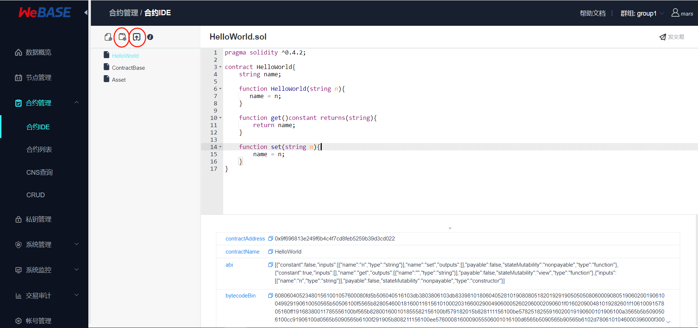
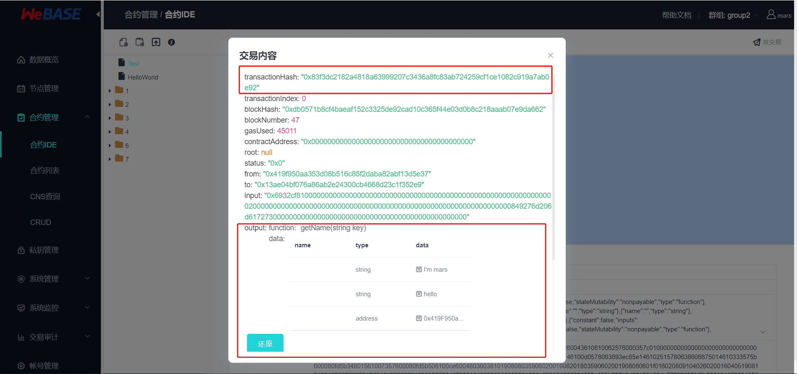
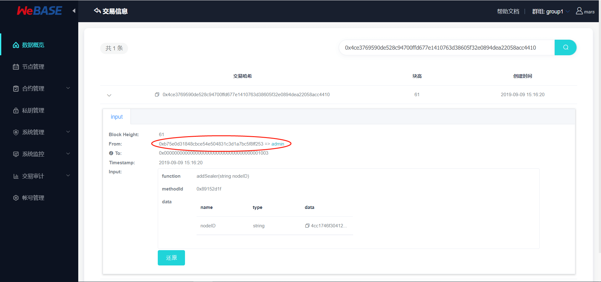
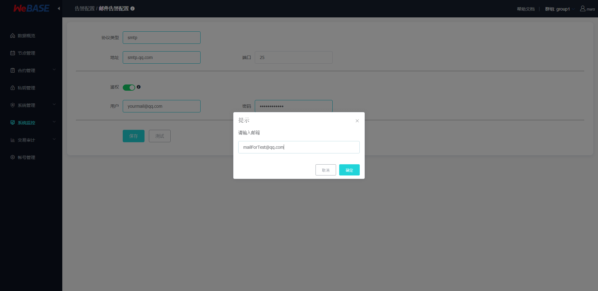
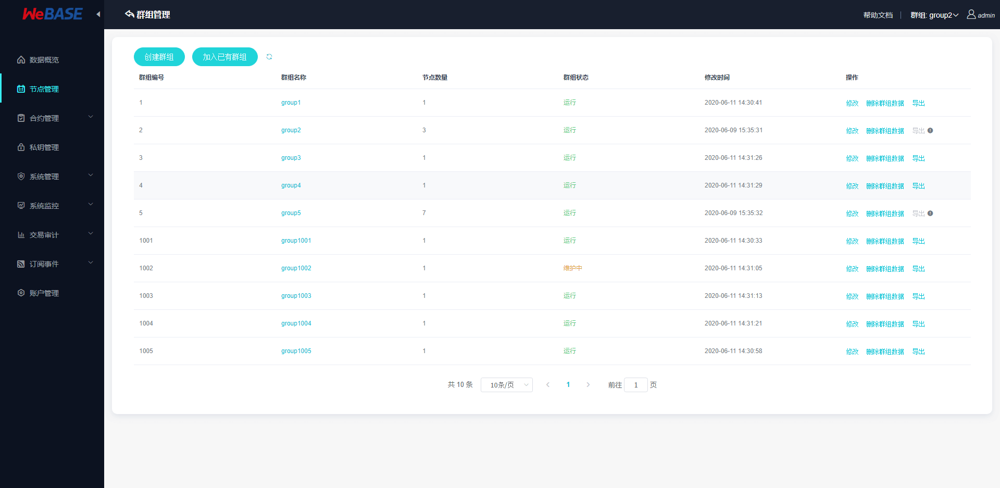

# WeBASE管理平台使用手册

## 概览

### 基本描述

WeBASE管理平台是由四个WeBASE子系统组成的一套管理FISCO-BCOS联盟链的工具集。

### 主要功能

1. 区块链数据概览
2. 节点管理
3. 合约管理
4. 私钥管理
5. 系统管理
6. 系统监控
7. 交易审计
8. 订阅事件
9. 账号管理
10. 群组管理


### 部署架构

这套管理工具主要由：节点前置，签名服务，节点管理，WeBASE管理平台四个WeBASE子系统构成。WeBASE四个服务的部署架构如下图：节点前置需要和区块链节点部署在同一台机器；节点管理和WeBASE管理平台可以同机部署，也可以分开部署。


## 使用前提

### 群组搭建

区块链浏览器展示的数据是从区块链上同步下来的。为了同步数据需要初始化配置（添加群组信息和节点信息），故在同步数据展示前需要用户先搭建好区块链群组。[FISCO-BCOS 2.0](https://github.com/FISCO-BCOS/FISCO-BCOS.git)提供了多种便捷的群组搭建方式。

1. 如果是开发者进行开发调试，建议使用[build_chain](https://fisco-bcos-documentation.readthedocs.io/zh_CN/latest/docs/manual/build_chain.html)。
2. 如果是开发企业级应用，建议使用企业部署工具[FISCO-BCOS generator](https://fisco-bcos-documentation.readthedocs.io/zh_CN/latest/docs/enterprise_tools/index.html)。

两者的主要区别在于build_chain为了使体验更好，搭建速度更快，辅助生成了群组内各个节点的私钥；但企业部署工具出于安全的考虑不辅助生成私钥，需要用户自己生成并设置。

### WeBASE管理平台搭建

WeBASE管理平台分为四个部分：节点前置，签名服务，节点管理，WeBASE管理台。

当前版本我们提供了三种搭建方式：[**一键搭建**](../WeBASE/install.md)、纯手动搭建各子系统、[可视化部署](../WeBASE-Install/visual_deploy.md)。

#### 1、一键搭建

适合同机部署，快速体验的情况使用。具体搭建流程参见[**安装文档**](../WeBASE/install.md)。

#### 2、手动搭建

##### 2.1、签名服务搭建

签名服务使用Spring Boot的JAVA后台服务，具体搭建流程参见[《签名服务安装说明》](../WeBASE-Sign/install.md)。

##### 2.2、节点前置搭建

节点前置使用Spring Boot的JAVA后台服务，具体搭建流程参见[《节点前置安装说明》](../WeBASE-Front/install.md)。

##### 2.3、节点管理搭建

节点管理使用Spring Boot的JAVA后台服务，具体搭建流程参见[《节点管理安装说明》](../WeBASE-Node-Manager/install.md)。

##### 2.4、WeBASE管理平台

WeBASE管理台使用框架`vue-cli`，具体搭建流程参见[《WeBASE管理平台安装说明》](../WeBASE-Web/install.md)。

#### 3、可视化部署

可视化部署的具体使用方法搭建流程参见[《WeBASE 可视化部署》](../WeBASE-Install/visual_deploy.md)。

可视化部署是指通过 WeBASE 管理平台的Web页面上通过可视化的操作，快速在**多台**主机上完成**FISCO-BCOS 底层节点和 WeBASE-Front 前置**的部署操作。

**可视化部署分为部署子系统和搭链两个步骤：**

- 步骤一：部署子系统依赖服务，包括管理平台（WeBASE-Web）、节点管理子系统（WeBASE-Node-Manager）、签名服务（WeBASE-Sign）。依赖服务可以通过 **一键搭建** 或 **手动搭建** 完成。

    - 使用**一键搭建**的`installWeBASE`命令，一键部署依赖服务
    
    - **手动搭建**部署依赖服务，参考上文的各子系统搭建指引
    
- 步骤二：使用WeBASE-Web界面搭链，部署 **FISCO-BCOS 底层节点** 和 **节点前置服务（WeBASE-Front）**

## 系统初始化配置

服务搭建成功后，可使用网页浏览器访问nginx配置的WeBASE管理台IP和端口(例如`127.0.0.1:5000`)，进入到管理平台页面。

管理平台默认用户为`admin`，默认密码为`Abcd1234`（第一次登陆成功后会要求重置密码，请按照密码标准设置一个更加安全的密码）。

### 添加节点前置

未初始化节点前置的管理平台，会引导去节点管理页面添加节点前置。
- 节点前置服务需要填写前置的IP与端口（默认为`127.0.0.1`和`5002`），机构名则根据实际自定义填写


前置添加完成后，管理平台就会开始拉取群组信息和群组的区块信息。此时数据概览页面应该就有数据了。为了解析和审计区块数据，需要把相关的合约和用户导入到管理平台。具体看下面两个小节。

### 合约管理

#### 1、添加合约

管理平台提供两种添加合约的方式，一个是新建一个合约，一个是导入已有合约。同时合约编辑器还提供新建目录。用目录的形式管理合约，主要是为了解决同名合约引用的问题。合约添加完成后，需要编译保存。



#### 2、部署合约

合约编译时会自动保存合约内容，编译成功后可以执行合约部署。


#### 3、合约调用

在合约部署成功后，可以在合约IDE页面的右上角点击发交易，向合约发送交易进行合约调用。


交易发送成功后，将返回交易回执。可以在数据概览-交易列表-更多中根据transactionHash搜索交易，通过交易解析和Event解析查看可视化的交易回执信息。具体操作方法参考下文的区块链数据概览章节中的交易解析与Event解析。



### 私钥管理

私钥管理提供了新建私钥用户和导入公钥用户两种用户导入方式。第一种方式主要用于新建用户（私钥托管在签名服务中），在管理平台的合约管理中部署和调用合约。第二种方式主要用于把交易和用户关联起来。



## 各模块的详细介绍

本小节概要介绍管理平台的各个模块，方便大家对WeBASE管理平台套件有一个整体的认识。这套工具集主要提供的管理功能有：

### 区块链数据概览

数据概览页面，展示了区块链的核心数据指标：节点个数，区块数量，交易数量，通过管理台部署的合约数量。关键监控指标：历史15天的交易量。
- 节点信息列表：展示了节点的ID，节点块高，节点view和运行状态；
- 区块信息列表：展示了最近5个块的概览信息，点击更多可以查看更多历史区块；
- 交易信息列表：展示了最近5个交易的概览信息，点击更多可以查看更多历史交易；


其中右下角的交易信息列表点击可跳入具体一条交易中查看交易详细信息：交易详细信息还包含了
- 交易解析：可以将交易返回的交易回执数据进行解析并可视化；
- Event解析：可以将交易返回的Event数据进行解析并可视化；

未解析的raw数据如下图所示：


进行交易解析后如下图所示：


同样的，Event数据解析后可以看到：


### 节点管理

节点管理主要提供了前置列表、节点列表、修改节点共识状态的功能。

用户可以通过新增节点前置，把新的节点前置添加到前置列表。系统会默认拉取这些前置所在的群组和各个群组的节点信息。在节点列表中，用户可以修改节点的共识状态：共识节点、观察节点、游离节点。其中修改为游离节点相当于将节点移出群组，停止节点前务必先将节点设置为游离节点，否则将触发节点异常。

节点管理：

显示所有的共识/观察节点（无论运行或停止），以及正在运行的游离节点


修改节点共识状态：


### 合约管理

合约管理提供了一个图形化的合约IDE环境、已部署的合约列表、合约CNS查询以及预编译合约的CRUD功能。

图形化合约IDE提供了一整套的合约管理工具：新建合约，保存合约，编译合约，部署合约，调用合约接口。其中，新建合约可以通过编辑键入合约内容，也可以上传合约文件；编译合约后才可以部署合约；部署合约成功后，可以通过发送交易调用合约接口。具体操作步骤可以参考上一章节中系统初始化配置介绍。

合约IDE：


合约列表：


ABI列表：支持导入已部署的合约ABI进行合约调用


ABI编码：支持对ABI的方法与入参进行编码


CNS查询：CNS（Contract Name Service）是通过提供链上合约名称与合约地址映射关系的记录及相应的查询功能，方便调用者通过记忆简单的合约名来实现对链上合约的调用。详情可查看FISCO-BCOS文档的 [CNS方案](https://fisco-bcos-documentation.readthedocs.io/zh_CN/latest/docs/design/features/cns_contract_name_service.html#cns)

注册CNS后，CNS可以根据合约名和合约版本号查询CNS信息(合约名和合约版本号用英文冒号连接)。若缺失合约版本号，则返回所有符合合约名的合约信息。
- 需要在合约管理页面部署合约时**勾选CNS**，或合约列表页面中点击**CNS注册**，即可完成注册


CRUD：CRUD通过在Solidity合约中支持分布式存储预编译合约，可以实现将Solidity合约中数据存储在FISCO BCOS平台AMDB的表结构中，实现合约逻辑与数据存储的分离。CRUD可以在FISCO-BCOS链上创建数据表，并对表进行增删改查操作，具体CRUD操作教程查看[FISCO-BCOS控制台CRUD命令](https://fisco-bcos-documentation.readthedocs.io/zh_CN/latest/docs/console/console.html#create-sql)


EventLog查看：支持输入合约地址和ABI、区块范围和Event名，即可查询并同步返回


### 私钥管理

私钥管理包含新建私钥用户和新建公钥用户两个功能。在合约管理界面，可以看到合约部署和交易调用功能。这里的私钥管理可以新建私钥用户，私钥将托管在签名服务中，然后通过签名服务对合约部署和合约调用进行签名。注：外部账户可通过新建公钥账户导入，主要用于把交易和用户关联起来。

私钥管理：


添加私钥用户：


导入私钥：支持导入.txt/.pem/.p12格式及明文的私钥，其中.txt私钥可由WeBASE-Front导出，.pem/.p12私钥可由console控制台导出。如果需要导入自定义私钥，可根据节点前置导出的.txt私钥，编辑其中的privateKey字段内容。


### 系统管理

系统管理目前支持权限管理、系统配置管理、证书管理的功能。

**权限管理**

**基于FISCO BCOS 2.5.0及以上版本的基于角色的权限管理**：支持链委员会管理和运维管理员管理：
- **链委员会管理**：链委员会的修改操作均需要通过多个委员投票完成，链委员拥有投票权，可以增删节点、修改链配置、添加撤销运维、冻结解冻合约、对用户表的写权限控制；
	- 修改委员会成员（新增/撤销委员）、修改委员投票阈值、修改委员投票权重值等操作均需要通过投票进行修改；
	- 投票阈值为投票生效的阈值，**有效投票权重数/委员总权重数>生效阈值**投票才能生效，阈值为开区间，即：投票权重比例必须大于阈值（不包含等于）；
	- 每次投票操作，如果是委员投票，则记录操作内容和投票委员，不重复计票；
	- 投票设置过期时间，根据块高，blockLimit的10倍(即10000)，固定不可改；
	- 用户不能同时成为链委员和运维管理员；
- **运维管理**： 运维由链委员直接赋予（无需通过投票赋予），运维可以部署合约、创建表、管理合约版本、冻结解冻本账号部署的合约；

> 注：链委员会为空时，不作链委员会权限限制，所有用户拥有委员权限，可以自由给自身或其他用户添加链委员权限；设置了第一个链委员后，非链委员用户无权限；请妥善保管链委员的私钥！
> 
> 运维管理员为空时，所有用户拥有运维权限；同理，设置了第一个运维管理员后，非运维用户无权限；

FISCO-BCOS基于角色的权限管理机制详情可以参考文档[使用手册-基于角色的权限控制](https://fisco-bcos-documentation.readthedocs.io/zh_CN/latest/docs/manual/permission_control.html#id2)，具体的设计原理可以参考文档
[系统设计-基于角色的权限控制](https://fisco-bcos-documentation.readthedocs.io/zh_CN/latest/docs/design/security_control/chain_governance.html)

链委员会管理：


运维管理员管理：


**基于FISCO BCOS 2.0.0 - 2.4.x版本的基于表的权限管理**：支持链权限管理和普通权限（四种）管理：
- 链权限管理为分配权限的链管理员，可以使用权限分配功能，非链管理员账户无权限分配功能；
- 普通权限管理包含四种权限： 部署合约和创建用户表权限, 节点管理权限, CNS管理权限, 系统参数管理权限；

> 注：链管理员为空时，不作权限限制，所有用户拥有权限，可以自由给自身或其他用户添加权限；设置了第一个链管理员后，非管理员用户无权限分配功能；请谨慎设置第一个链管理员;
> 
> 普通权限管理员为空时，所有用户拥有特定功能，如：节点管理员为空时，所有用户可以管理节点状态，设置了第一个节点管理员后，非节点管理员不可管理节点状态;

FISCO-BCOS基于表的权限管理机制详情可以参考文档[FISCO-BCOS基于表的权限控制](https://fisco-bcos-documentation.readthedocs.io/zh_CN/latest/docs/manual/permission_control.html)

链权限管理：


普通权限管理：


**系统配置管理**：系统属性包含FISCO-BCOS链的tx_count_limit和tx_gas_limit两种属性值的配置。注：一般不建议随意修改tx_count_limit和tx_gas_limit，如下情况可修改这些参数：
- 机器网络或CPU等硬件性能有限：调小tx_count_limit，降低业务压力； 
- 业务逻辑太复杂，执行区块时gas不足：调大tx_gas_limit。

配置管理：


配置系统属性值：


**证书管理**：支持导入和查看证书信息，包括查看Front对应节点的链证书、机构证书、节点证书，可查看证书内容、证书有效期、证书链关系等信息；
- 证书链关系可通过比对父证书指纹与证书指纹查找；
- 平台将默认加载所有Front的证书，需要在Webase-Front配置文件中配置nodePath节点路径；

FISCO-BCOS证书说明可以参考FISCO-BCOS使用手册的[证书说明](https://fisco-bcos-documentation.readthedocs.io/zh_CN/latest/docs/manual/certificates.html)

证书列表：


导入证书：


### 系统监控

系统监控包含了**监控**与**异常告警**两部分；

监控主要包括节点监控和主机监控，可以选择节点、时间范围等条件进行筛选查看：
- 节点监控主要有区块高度，pbftview，待打包交易；
- 主机监控主要有主机的CPU，内存，网络和硬盘IO；

节点监控：


主机监控：


异常告警部分主要包括**邮件服务配置**和**告警类型配置**：

**邮件服务配置：**
<span id="mail-config"></span>

如何配置邮件服务可查看本文档末尾的[附录-配置邮件服务指南](#mail-use)

可配置邮件告警所用到的邮件服务器相关参数，包含邮件协议类型protocol、邮件服务器地址host、服务使用端口port、用户邮箱地址username、用户邮箱授权码password；鉴权选项包含Authentication验证开关authentication（默认开启）；
- 邮件告警的邮箱协议类型默认使用SMTP协议，使用25默认端口，默认使用username/password进行用户验证，目前仅支持通过TLS/SSL连接邮件服务器；
- 目前仅支持更新原有的邮件服务器配置，不支持新增配置；

```eval_rst
.. important::
	使用测试功能前，需要到“告警类型配置”中，在左上角**开启邮件服务总开关**；
```

注：邮件告警功能需要确保邮件服务器配置正确；务必使用`测试`按键，向指定的邮箱地址发送测试邮件并查收邮件。如果配置错误，将发送测试邮件失败，指定邮箱将收不到测试邮件；


邮件服务配置测试：

以当前表单中输入的配置值发送测试邮件（无论是否已保存，都以表单中当前的值为配置发送测试邮件）；**需要提前开启邮件服务开关**；




**告警类型配置（告警邮件配置）：**

包含了告警类型的配置，告警日志的查看；可配置告警类型的参数值，包含告警邮件标题ruleName，告警邮件内容alertContent，告警邮件发送时间间隔alertIntervalSeconds（单位：秒），上次告警时间lastAlertTime，目标告警邮箱地址userList，是否启用该类型的邮件告警enable，告警等级alertLevel等；
- 包含了节点状态告警、审计告警、证书有效期告警三种；
- 目前仅支持更新原有的三个邮件告警的配置，不支持新增配置；
- 需要先在左上角**开启邮件服务**才可以开启各个类型的邮件告警以及发送测试邮件；

包含了不同告警类型的配置，左上角可以开启邮件服务（作为告警邮件的全局开关），点击告警标题可查看详细配置内容；

下方则是告警日志的内容，可查看告警邮件的具体内容；告警项已处理后，可以点击确认键确认已消除异常；

其中在WeBASE-Node-Manager的配置文件application.yml的constant可以配置定时任务定时监控节点状态、审计状态、证书有效期的频率，监控到异常状态时将触发邮件告警，发送告警邮件到联系人邮箱，同时按配置的间隔时间定时重复发送告警邮件，直到异常状态消除；

**注：定时任务的频率为检查系统是否异常的频率，而配置不同的告警类型中的告警时间间隔是发送告警邮件的频率**，如，设置检查频率为1h，配置的告警频率为6h，那么，系统会每小时检查一次系统状态，若出现异常，在定时任务检查到异常时，距离上次告警邮件超过6小时，则会发送一次告警邮件。


点击修改可以修改配置项的值，启用/禁用不同类型的告警，修改配置后不需要重启即可生效；

注：修改告警内容时，大括号`{}`以及里面的变量名不可去除，否则无法正常发送告警邮件。


### 交易审计

联盟链中各个机构按照联盟链委员会制定的规章在链上共享和流转数据。这些规章往往是字面的，大家是否遵守缺乏监管和审计。因此为了规范大家的使用方式，避免链的计算资源和存储资源被某些机构滥用，急需一套服务来辅助监管和审计链上的行为。交易审计就是结合上面的区块链数据，私钥管理和合约管理三者的数据，以区块链数据为原材料，以私钥管理和合约管理为依据做的一个综合性的数据分析功能。交易审计提供可视化的去中心化合约部署和交易监控、审计功能，方便识别链资源被滥用的情况，为联盟链治理提供依据。

交易审计主要指标：

| 主要指标             | 指标描述                                                     |
| :------------------- | ------------------------------------------------------------ |
| 用户交易总量数量统计 | 监控链上各个外部交易账号的每日交易量                         |
| 用户子类交易数量统计 | 监控链上各个外部交易账号的每种类型的每日交易量               |
| 异常交易用户监控     | 监控链上出现的异常交易用户（没在区块链中间件平台登记的交易用户） |
| 异常合约部署监控     | 监控链上合约部署情况，非白名单合约（没在区块链中间件平台登记的合约）记录 |

用户交易审计：可以指定用户、时间范围、交易接口进行筛选查看交易


异常用户审计：


异常合约审计：


### 订阅事件

订阅事件管理：可查看前置中已订阅的链上事件通知，包括出块事件列表和合约Event事件列表。详情请参考[节点前置-链上事件订阅和通知](../WeBASE-Front/appendix.html#event_subscribe)

出块事件列表：


合约Event事件列表：


### 账号管理

账号管理提供管理台登陆账号的管理功能。管理台用户分为三种角色：
- 普通用户，只有查看权限；

- 管理员用户，拥有管理平台的读写权限；

- 开发者用户，拥有开发者自身的合约和私钥用户的读写权限，数据概览权限；

  开发者模式默认关闭。如需开启此功能，可以在WeBASE-Node-Manager配置文件application.yml中修改developerModeEnable为true，然后重启服务。

  

注：此处账号与私钥管理的私钥用户为两种不同的概念，账号用于管理台权限控制，私钥用户为区块链账户。

账号管理：


添加登陆账号并指定账号类型：


### 群组管理
<span id="dynamic_group"></span>

群组管理提供动态管理群组的功能，包含：生成群组（生成群组配置文件到单个或多个节点）、启动群组、停止群组、移除群组（标记为移除）、恢复群组、删除群组数据等操作

群组管理入口位于右上角切换群组的下拉窗口中：


进入群组管理后，可以看到群组列表中有“运行”、“维护中”、“异常”的三种状态。
- 正常运行的群组为“运行”；
- 群组中所有节点（节点前置）已**停止**了群组，会显示为“维护中”，此时只需要将节点的群组重新**启动**即可恢复正常；
- 本地群组数据与链上数据冲突时，会显示为“异常”：
  - 若本地群组的区块数据与链上区块数据存在冲突，如搭建了新的链而后台数据库没有重置，或者群组的所有前置处于异常状态，则会显示群组为异常；
  - 如果同一个群组编号的不同节点之间创世块的配置不同，即群组同名，但各节点的群组创世块不同，也会标记该群组为异常。在群组显示异常时，需要用户检查前置状态，如重建链了，可通过删除群组数据重新拉取来恢复正常，如创世块冲突，则需要删除冲突的节点前置；




删除群组数据，将删除后台数据库中保存的群组数据，不会删除链数据。


如果未停止所有节点的群组就删除群组，会在删除后重新拉取数据


下面介绍如何进行动态群组管理，包含在多个节点中**批量生成群组**、**节点加入已有群组**：

批量生成群组

选中节点后，生成群组将自动创建群组、启动群组、并通过创世块配置将节点设置为共识节点

如下图，可以选中需要创建新群组的节点，点击确认后即可完成创建


节点加入已有群组

点击群组状态/修改群组，可以查看群组中各个节点的状态；也可以在该页面启动/停止/删除/恢复节点的群组，或添加节点到已有群组


不属于当前群组的节点中会显示“添加”，可以将节点加入该群组；

该操作实际上包含三个步骤，创建与启动是加入的同时自动完成的，**用户需要确保新节点加入新群组的共识节点/观察节点**
- 加入群组操作会在该节点的conf目录下生成群组创世块文件，并启动群组
- 创世块文件的配置需和加入群组的原有配置完全一致，可通过群组列表中**导出配置**后**导入配置**，或到群组中节点conf目录下查看群组的时间戳与共识节点列表
- 创建并启动群组后，需要**将节点加入到新群组的共识节点/观察节点**：
  - 若本地有新群组的节点前置，则可以通过切换到相应群组的“节点管理”中设置新节点为共识节点；
  - 如果本地没有新群组的节点前置，则需要到已加入该群组的节点的控制台或节点管理平台将新节点加入到共识节点/观察节点

加入新群组的共识节点/观察节点说明，或直接继续添加节点到新群组


填写已有群组的创世块文件配置，包含时间戳与共识节点NodeId列表，如下图：

*注，创世块是群组的标志。新节点加入群组需保证创世块的`nodeIdList`完全一致，例：若已有群组的共识节点列表只有node0，当node1加入该群组时，创世块配置的共识节点列表仍填写只有node0的列表，然后再通过节点管理将新节点node1动态添加到该群组。如果错填成包含node0和node1的共识节点列表，那么将生成一个和当前群组同名，但创世块完全不同的新群组。而群组管理会监控到同名群组的创世块存在冲突，标志群组为“异常”。*


节点加入新群组后，如果节点未添加到共识节点/观察节点，所属群组一列将显示为横杠；已加入的节点该列会显示具体的群组编号


在右上角切换到新群组后，在“节点管理”页面中可以将游离的新节点加入到共识节点/观察节点中


详情使用说明可以参考本文档[附录-动态群组管理使用指南](#dynamic_group_use)

## 升级兼容说明

WeBASE-Front升级至最新版，可查看[节点前置升级说明](../WeBASE-Front/upgrade.md)，请结合[WeBASE-Front Changelog](https://github.com/WeBankFinTech/WeBASE-Front)进行阅读

WeBASE-Node-Manager升级至最新版，可查看[节点管理服务升级说明](../WeBASE-Node-Manager/upgrade.md)，请结合[WeBASE-Node-Manager Changelog](https://github.com/WeBankFinTech/WeBASE-Node-Manager)进行阅读

WeBASE-Sign升级至最新版，可查看[签名服务升级说明](../WeBASE-Sign/upgrade.md)，请结合[WeBASE-Sign Changelog](https://github.com/WeBankFinTech/WeBASE-Sign)进行阅读

## 附录

### 配置邮件服务指南 
<span id="mail-use"></span>

请先阅读本文档中管理平台使用手册的[各模块的详细介绍-系统监控-邮件服务配置](#mail-config)

问：邮件服务怎么用？

答：在后台搭建邮件服务（邮箱服务器），用于后台监控到系统异常情况时，发送告警邮件到指定邮箱，方便运维；

下面介绍具体的使用方法：

邮件服务所使用的邮箱服务器：
1. 企业可使用自行搭建的邮箱服务器；
2. 普通用户可以使用QQ邮箱、网易邮箱等第三方邮箱；

#### 开通邮箱服务

163邮箱开通邮箱服务：

- 登陆邮箱后，在邮箱的`设置`中找到包含`SMTP`的设置项；


- 勾选`IMAP/SMTP`和`POP3/SMTP`，初次开启时，会提醒用户设置**授权码**，并进行手机安全验证；
- 设置授权码后，勾选`IMAP`, `POP3`, `SMTP`开启全部服务；


QQ邮箱开通邮箱服务：

- 登陆邮箱后，在邮箱的`设置账户`中找到`POP3/IMAP/SMTP/Exchange/CardDAV/CalDAV服务`项；


- 开启`POP3/SMTP服务`和`IMAP/SMTP服务`并按照指引进行手机安全验证并设置授权码，；


#### 配置邮件服务

记下所设置的**授权码**，授权码即邮件服务中用到的“密码”，按照本文档[各模块介绍-系统监控](#mail-config)进行配置：

第一步，进入“告警类型配置”中，点击左上角“启用告警”以**开启邮件服务开关**


第二步，进入“邮件告警配置”，配置邮件服务

- 因为Node-Manager仅使用邮箱服务器的发件服务，因此**协议类型**填写`smtp`（IMAP/POP3均为收件服务协议）；
- 邮箱服务器填写`smtp.xx.com`，端口号默认为`25`即可启用邮件服务；如需使用其他端口如465则需要开放WeBASE-Node-Manager所在服务器的相应端口限制；
- 用户名填写邮箱地址，密码填写上文设置的**授权码**；


配置完成后，点击“测试”后，输入接收测试邮件的邮箱地址，测试成功即可“保存”邮件服务的配置；


#### 注意事项

“邮件告警配置”中填写的端口默认为25，在不同服务器环境和不同邮箱所需的端口号有所差异，如果需要开启SSL进行邮箱安全验证则需要开通服务器防火墙相应的端口号。

目前已知的包含：
- SMTP协议：默认使用25端口(非SSL)，SSL默认465端口(SSL)或587端口(TLS)
- POP3/IMAP协议：因为邮箱服务使用的是发邮件功能，未用到POP3或IMAP收件协议，此处仅作端口说明：其中POP3默认110端口(非SSL)和995端口(SSL)，IMAP默认143端口(非SSL)和993端口(SSL)
- 126邮箱的SSL端口除了587，还可尝试994；在阿里云下25端口被禁用，请尝试587端口或其他端口；

### 动态群组管理使用指南
<span id="dynamic_group_use"></span>

v1.3.1新增的动态群组功能支持用户在可视化页面中动态管理群组，包括创建多个节点的群组、节点加入已有群组等功能。群组模块介绍可参考本文档[群组管理](#dynamic_group)

**注：动态群组管理要求各节点间已建立了P2P连接**

群组管理入口


群组管理页面


下面我们使用2个节点管理平台，4个节点前置，每个管理台包含两个前置来展示：


管理台1中包含前置A和B，管理台2中包含前置C和D：

管理台1：


管理台2：


#### 群组管理与群组配置文件

动态创建群组包含三个基本操作：**创建群组、启动群组、节点加入群组共识**

**注：节点的动态群组操作是针对单个节点进行的**，即，如果创建一个新群组包含4个节点，则需要对4个节点分别调用“创建”、“启动”命令；如果需要查询群组中各节点的群组状态，也需要对4个节点轮询获取群组状态。

WeBASE已对这一步骤进行了封装，自动批量调用各个节点前置的“创建”、“启动”和“查询群组状态”的接口。

操作群组的状态转换如下图：


创建群组：
- 创建群组实际上是调用节点的`generateGroup` JSON RPC接口，传入参数`timestamp`和`sealers`(WeBASE中为`nodeList`)，并在节点的conf目录下**生成群组配置文件**`group.x.genesis`和`group.x.ini`
- 其中`group.x.genesis`是群组的创世块配置，包含`timestamp`和`sealers`，，**该配置一旦启动群组之后就不能再修改**，否则引起群组异常。详情可以参考文档[FISCO BCOS-配置文件与配置项](https://fisco-bcos-documentation.readthedocs.io/zh_CN/latest/docs/manual/configuration.html)

启动群组：
- 启动群组是将节点的群组状态标记为“RUNNING"
- 启动后，节点进程将读取上文的`group.x.genesis`中的`sealers`项，将`sealers`中的所有节点设置为共识节点，开始共识

例如：
- 如果需要动态创建一个4节点的群组时，需要设置4个节点均为共识节点，可以在`sealers`中加入所有共识节点，然后启动各个节点的群组即可。
- 但是，如果创建群组时只将其中2个节点设置为`sealers`，那么，另外2个节点需要加入该群组时，调用创建群组接口时，需要传入相同的`sealers`，即**传入相同的群组原配置中的2个节点**，创建群组并启动后，需要通过“节点管理”（`addSealer/addObserver`接口）将新节点加入共识。不可修改该群组的`sealers`配置，否则将引起群组异常。

下面我们通过**单个管理台批量创建群组**和**多个管理台创建群组并加入群组**这两个例子来了解动态群组管理的操作步骤与注意事项

#### 单个节点管理台-批量创建群组

此处采用单个节点管理台，两个节点前置，动态创建一个2节点的群组group333

我们**在管理台1中将在节点A和节点B中生成群组group333**


具体操作如下：

批量创建群组指的是向`group.x.genesis-sealers`中包含的所有节点前置发起创建群组的请求（群组的创世块配置如下所示），这要求所有节点的前置在同一个管理台里，才能一次性对所有节点发起创建群组的请求。
**若节点分布在多个管理台中，则参考下一小节**。

```
{
	// timestamp
	"groupTimestamp": "1591013023063",
	// 群组333共识节点列表
	"nodeIdList": [
		// node A
		"31e2b051abc27b49aff8846a4037e8bdb45acd6ff98fdad42f7b8a9c4887fffcc99edbf4eeafff656f00df07f44ae3609463a7ddc3ba8481f88b43424007fafe",
		// node B
		"c867302e786a790663c5cf6fdbbff96570d00a3500b23c9ddd2dd63ada07b85fbc6f4549a9f05cad60bcf7a6199caa95781fd40a25e9098a2c728b90d88938f8"
	]
}
```

选中管理台的两个节点后，将分别对这两个节点发起创建群组、启动群组的请求


创建成功后，可以看到节点A和节点B的group333已处于running状态，且两个节点已经参与新群组group333共识了（橙色区域）；


但是可以看到节点列表中还有两个外部节点；节点A、B的群组编号中显示了号码，则代表该群组属于群组的共识节点/观察节点，否则显示"-"代表是游离节点，仅有P2P连接；


下一步，我们将处于管理台2的节点C和节点D也加入到这个群组333中来，因此我们进入下一小节，多个管理台之间创建群组，最终实现如下图的状态：


#### 多个节点管理台-创建群组并加入群组

此处例子使用两个节点管理台，而更复杂情况可以以此类推。

我们在上面通过管理台1创建了一个由节点A和节点B组成的新群组group333，现在我们把管理台2的节点C和节点D加入到管理台1中创建的群组group333，实现下图的效果，节点C/D的group333处于running状态，且加入group333的共识


具体操作如下：

在管理台1中，进入群组管理，导出群组group333的配置内容


返回到管理台2的界面中，点击“加入已有群组按钮”

加入群组时，用户需要再加入群组后，手动将群组的新节点添加为共识/观察节点；


点击加入已有群组后，导入群组group333的配置；也可以直接键入群组编号、群组时间戳、创世块共识节点列表


选中需要加入该群组的节点后，点击确定；


创建成功后，可以看到群组列表新增了一个group333，节点C/D的group333处于running状态


点开可以查看新群组的节点，可以看到节点C和节点D的“群组编号”为空，即**未参与群组共识**


**注：加入群组后，需要手动将新节点加入到群组的共识/观察节点，节点才会参与新群组的共识**。

因此，下面我们把节点C和节点D加入到新群组的共识/观察节点列表

由于管理台2中没有已属于群组共识/观察节点的节点，因此需要**进入管理台1，切换右上角到群组group333，然后将新加入群组的节点C和节点D修改为共识节点/观察节点**。
（修改节点类型需要管理员权限私钥，如果未启用首个管理员，则任意私钥即可修改）


全部修改为观察节点后


点击进入群组管理中，查看群组的节点状态，节点C和节点D的“群组编号”已显示333，代表修改成功了


即如下图所示，节点C/D都已加入群组group333的共识


**至此，四个节点A/B/C/D成功通过动态群组管理加入到新群组group333中并参与共识了**

#### 其他情况

- 案例1：管理台2中先**创建含有节点C的群组group9后，然后将节点D加入group9**；

如果管理台2中的节点C已在新群组group9中，需要将节点D加入该群组，当前群组拓扑如下


可以通过点击群组列表中的群组，点击“**添加**”，按照与上文类似的提示即可添加成功。


此时节点D的group9状态为running


添加完成后，右上角切换到对应的群组group9，到“节点管理”页，将该节点**设置为共识/观察节点**（需要创建私钥用户来发交易），即完成加入群组的操作

节点D加入群组group9成功


修改节点D的节点类型为观察节点


点开群组管理中的group9查看节点状态，可以看到节点C和节点D的群组编号已经显示为"9"，说明节点D已成功加入群组group9


至此，节点C/D的群组group9如下图所示，都处于running状态，且都已参与群组group9的共识


- 案例2：管理台1中先创建**共识节点包含四个节点A/B/C/D的群组group10后，在管理台2将节点C/D直接加入group10，省略加入为共识/观察节点步骤**；


如果一次性创建一个4节点的新群组group4，需要把4个节点的前置都加入到同一个节点管理台，此时，由于`nodeList`中已经设置了4个节点均为共识节点，只需要**分别到两个管理台**中，通过“加入已有群组”中填入一致的配置，即可创建群组，并可以省去上文的“加入群组共识”这一步了

如下图所示，先将创建一个群组group10，在共识节点列表写入所有节点的nodeId。可以看到group10包含了所有节点，但是节点C/D的群组尚不存在


我们通过管理台1中的“**加入已有群组**”**来自定义共识节点列表**，在节点列表中包含所有的4个节点A/B/C/D，然后生成群组group10

```
{
	"groupId": 10
	"groupTimestamp": "1591079269841",
	"nodeIdList": [
		"a95ff41839bd9f4576138833a36c4e48e0268dda6ab77ecca468c4f50454ca4faf6609cc7c8126c439380d1df462c098369eea8feff4c9e22e35bfc830818d3d",
		"16f6882456e7f05ca90cbe3ca1dbdb49ca84702ccfd0cebb5894624ec475d5ae7b504a136aca2559fdf4e4c27dce7c72a674d0dd3ae339ba6a3a0906a0072aa8",
		"31e2b051abc27b49aff8846a4037e8bdb45acd6ff98fdad42f7b8a9c4887fffcc99edbf4eeafff656f00df07f44ae3609463a7ddc3ba8481f88b43424007fafe",
		"c867302e786a790663c5cf6fdbbff96570d00a3500b23c9ddd2dd63ada07b85fbc6f4549a9f05cad60bcf7a6199caa95781fd40a25e9098a2c728b90d88938f8"
	]
}
```


我们点开群组列表中的群组group10，可以看到4个节点的群组编号已经显示了"10"，说明4个节点都已经在群组group10的共识节点了。

*注：如果采用PBFT共识，此时节点C/D已加入了群组group10，但仍未加入共识，将不满足`3F+1>N`的共识准则，导致群组共识异常。将节点C/D创建群组后即可消除异常*


下一步我们只需要按照上文所说的，导出当前群组group10的配置文件，在管理台2中导入配置，选中剩余的节点C和节点D，点击确定

进入管理台2，点击“**加入已有群组**”


加入完成后


操作完成后，如下图所示，节点C/D的群组group10也生成并出于running状态了，至此，我们就顺利完成创建群组group10的所有操作了！


