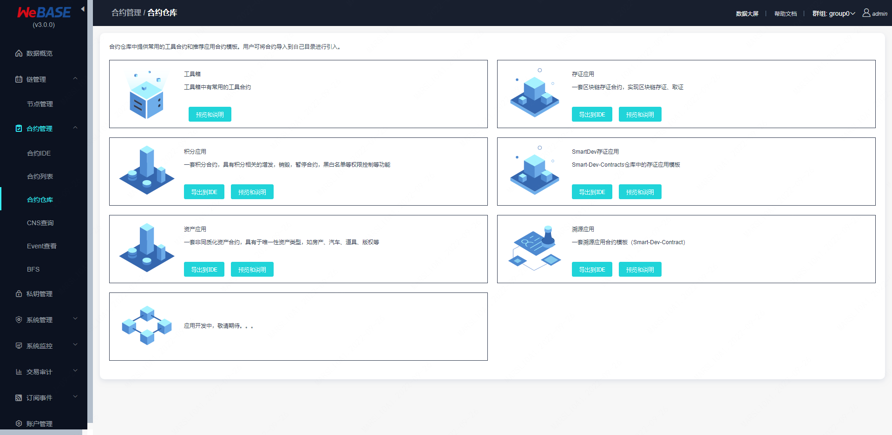

# WeBASE合约仓库

合约仓库内置于[WeBASE-Front](../WeBASE-Install/developer.html)与[WeBASE管理平台](../WeBASE-Console-Suit/index.html)中。其中提供常用的工具合约和推荐应用合约模板，用户可将合约导入到自己目录进行引入。

  <!--  -->


## 合约仓库贡献者

| 贡献者名称 | github账号 | 贡献工程 |
| ---------- | ---------- | ---------- |
|  刘明臻   |  https://github.com/mingzhenliu  |  存证合约仓库  |
|  肖东    |  https://github.com/xiaomdong  |  代理合约仓库  |
|  枫桥    |  https://github.com/fengqiao |  溯源合约仓库  |
|  WeBASE    |  https://github.com/WeBankBlockchain/WeBASE  |  积分合约仓库  |
|  WeBASE    |  https://github.com/WeBankBlockchain/WeBASE  |  资产合约仓库  |
|  WeBankBlockchain-SmartDev    |  https://github.com/WeBankBlockchain/WeBankBlockchain-SmartDev  |  SmartDev存证合约仓库  |

```eval_rst
.. toctree::
   :maxdepth: 1

   ./tools/index.md
   ./Evidence/Evidence.md
   ./Proxy/Proxy.md
   ./Trace/Trace.md
   ./Asset/BAC002.md
   ./Points/BAC001.md
   ./Evidence/SmartDev-Evidence.md
```
