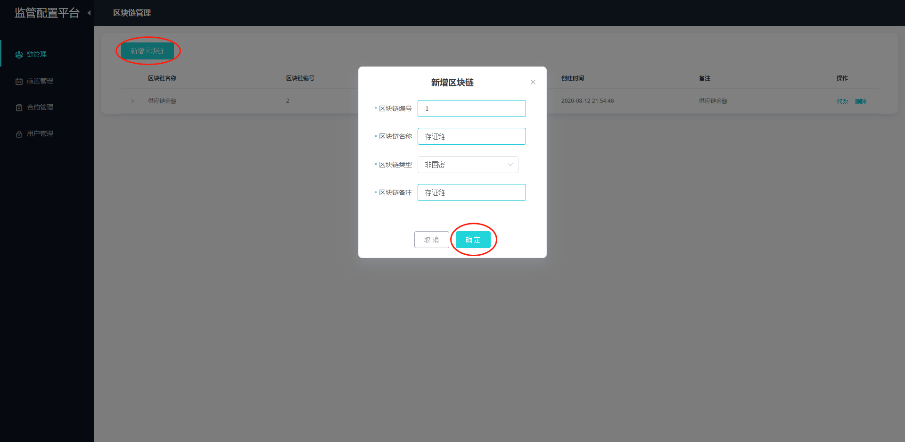
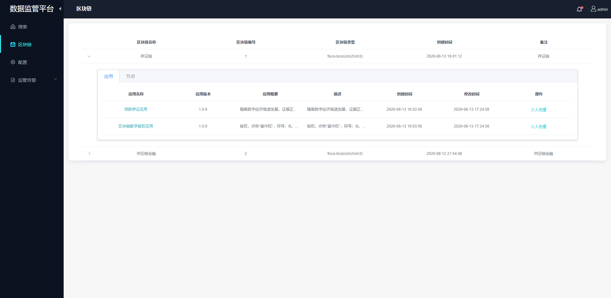

# 使用手册

## 1. 简介

本文将用一个实例来说明数据监管服务的部署和使用。实例详情如下图：从下至上我们可以看到：

1. 部署两条物理链，包括四个区块链应用（后面以存证链为例存证链）。
2. 监管机构在每一套链中都有一个监管节点用于同步数据。
3. 监管节点之上部署了一个WeBASE-Front(区块链节点前置)，这个服务主要作用是代理节点，提供restful的接口。
4. 在WeBASE-Front之上是WeBASE-Data-Collect（监管数据导出和分析服务），这个服务主要用于导出数据到DB和ES，用于分析。
5. WeBASE-Data-Collect（监管数据导出和分析服务）之上是WeBASE-Data-Fetcher（监管数据查询服务），这个服务主要的功能是对外提供数据查询服务。
6. WeBASE-Data-Web（数据监管平台）是一个网页服务，对外提供数据展示和交互UI。

  

## 2. 平台搭建

平台搭建的具体详情请查看[部署说明](./install.md)。

## 3. 数据上链（mock数据，真实环境有数据不需要此步骤）

根据部署说明将数据监管平台搭建成功后，可以通过WeBASE-Front（节点前置服务）**模拟存证交易**（默认：http://localhost:5002/WeBASE-Front）。

首先，创建测试用户，供交易使用

节点前置服务已内置存证合约，可以使用该存证合约将存证数据上链。过程包括：合约编译、合约部署、调用合约将存证数据上链。

合约编译：

合约部署，部署时私钥地址选择创建的测试用户地址。存证合约部署时需要设置签名用户地址，可以使用测试用户地址作为参数。

合约调用，调用合约将存证数据上链。

## 4. 运维配置

WeBASE-Data-Collect服务搭建成功后，可使用网页浏览器访问管理平台配置页面（默认：http://localhost:5009/WeBASE-Data-Collect）。

### 4.1 新增区块链信息

首先在链管理页面新建链信息。可以选择国密或非国密。部署的存证链为非国密链，选择非国密。

### 4.2 添加节点前置

 进入前置管理页面，右上角切换到存证链，然后添加对应节点前置信息，节点前置的类型需要与链的类型一致（国密或非国密）。

### 4.3 设置应用信息和节点机构信息

前置添加完成后，管理平台就会开始拉取群组信息和群组的区块信息。此时链管理下应该就有相关数据了。可以通过修改按钮设置应用信息（每个应用对应一个群组）。还可以设置链下节点机构信息。

应用信息：

节点机构信息，节点编号可以通过节点目录下个的node.nodeid文件获取，如：nodes/127.0.0.1/node0/conf/node.nodeid

### 4.4 合约管理

为了解析和审计区块数据，需要把相关的合约导入到管理平台。

管理平台提供支持导入已有合约（支持同时选择多个合约文件上传）。同时合约编辑器还提供新建目录，用目录的形式管理合约，主要是为了解决同名合约引用的问题。合约添加完成后，需要编译保存。

将存证合约Evidence.sol、EvidenceFactory.sol上传编译，**注意选择编译器版本（国密版本名称带有gm字样）**

### 4.5 用户管理

为了解析和审计区块数据交易用户，需要把相关的用户地址导入到管理平台。将存证测试用户的地址导入。

## 5. 平台使用

WeBASE-Data-Fetcher和WeBASE-Data-Web服务搭建成功后，可使用网页浏览器访问数据监管平台（默认：http://127.0.0.1:5200）。

### 5.1 搜索页

搜索页展示全局数据概览：链数量，应用数量，用户数量，智能合约数量，区块数量，交易数量。

搜索支持关键字搜索和条件搜索。条件搜索包括区块搜索、交易搜索、用户搜索、合约搜索。

其中，交易搜索出的交易数据如果需要监管处理，可以通过介入处理按钮添加到监管告警列表。

如下搜索出存证上链的数据：

### 5.2 区块链数据概览

区块链概览页展示链列表信息，以及链下应用和节点信息。

通过应用跳转到具体应用数据概览页面，页面展示了区块链应用的核心数据指标：用户数量，合约数量，区块数量，交易数量。关键监控指标：最近7天的交易量。
- 节点信息列表：展示了节点的ID，所属机构，节点块高，节点view和运行状态；
- 区块信息列表：展示了最近区块的概览信息，点击更多可以查看更多历史区块；
- 交易信息列表：展示了最近交易的概览信息，点击更多可以查看更多历史交易；

其中右下角的交易信息列表点击可跳入具体一条交易中查看交易详细信息：交易详细信息还包含了
- 交易解析：可以将交易返回的交易回执数据进行解析并可视化；
- Event解析：可以将交易返回的Event数据进行解析并可视化；

### 5.3 关键字配置

可以在配置页设置关键字，后台服务会检测拉取解析后的数据是否包含关键字，包含关键字的数据信息会添加到监管告警信息列表。比如设置存证的关键字。

### 5.4 监管信息处理

#### 5.4.1 应用告警

如果需要监管整个应用信息，可以在区块链概览页通过应用列表里的介入处理按钮将应用信息添加到应用告警列表。处理后可通过确认按钮修改状态。如果需要将应用信息从应用告警移除，可以调用删除按钮。

#### 5.4.2 交易告警

交易告警包括搜索出的的交易数据告警和交易列表页的交易数据告警。处理后可通过确认按钮修改状态。如果需要将应用信息从应用告警移除，可以调用删除按钮。

关键字查询的交易：

条件查询的交易：

交易列表页的交易：

交易告警信息处理：

