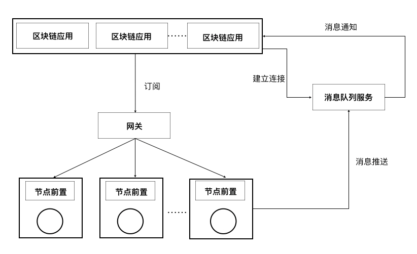

# 升级说明

WeBASE-Front升级的兼容性说明，请结合[WeBASE-Front Changelog](https://github.com/WeBankFinTech/WeBASE-Front)进行阅读

#### v1.3.1

##### 新增动态群组接口
- 新增动态群组接口，包含生成群组、启动/停止群组、删除/恢复群组、单个/批量查询群组状态等接口

注：动态群组注意操作

详情可参考接口文档、FISCO BCOS动态群组说明

##### 新增导入已部署合约Abi功能、合约Abi编码器
- 前置的“合约管理”Tab中，新增导入合约abi功能，可以导入已部署的合约进行管理
- 前置的“合约管理”Tab中，新增ABI编码功能，可用于构造交易input入参

##### 新增导入.p12私钥用户
- 私钥管理中，新增导入控制台所导出的.p12私钥；

#### v1.3.0

##### 私钥管理修改
- 节点前置Web页面中的**私钥管理**转移至**合约管理**Tab下，改为**测试用户**管理

WeBASE-Front本地私钥仅用于本地的合约调试，不建议用于生产；因此Web页面中的**私钥管理**转移至**合约管理**Tab下，改为**测试用户**管理；

在WeBASE-Front的Web页面部署合约、发交易时所使用的私钥均为本地私钥，与WeBASE-Node-Manager私钥区分开；

##### 节点管理与前置私钥模块调整
- WeBASE-Node-Manager的私钥将通过WeBASE-Sign托管（新建私钥、保存私钥和交易签名），不再由WeBASE-Front生成和保存（仅保存公钥与地址）；
- 节点管理WeBASE-Node-Manager **v1.3.0前**通过节点前置WeBASE-Front的`/trans/handle`和`/contract/deploy`进行合约交易与部署，**v1.3.0后**将通过`/trans/handleWithSign`接口和`/contract/deployWithSign`接口进行合约部署与交易

生成私钥的流程（此处为type=2的外部私钥，WeBASE-Front的私钥始终留在Front的数据库中）


交易签名的流程


因此WeBASE-Node-Manager私钥数据需要转移到WeBASE-Sign数据库中，具体操作请参考[WeBASE-Node-Manager v1.3.0升级说明](../WeBASE-Node-Manager/upgrade.html#v1-3-0)

##### API字段更新
- WeBASE-Front的`/trans/handleWithSign`接口和`/contract/deployWithSign`接口传参修改如下；

`/trans/handleWithSign`接口：
```
{
    "groupId" :1,
    "signUserId": "458ecc77a08c486087a3dcbc7ab5a9c3",
    "contractAbi":[],
    "contractAddress":"0x14d5af9419bb5f89496678e3e74ce47583f8c166",
    "funcName":"set",
    "funcParam":["test"]
}
```

`/contract/deployWithSign`接口
```
{
    "groupId":1,
    "signUserId": "458ecc77a08c486087a3dcbc7ab5a9c3",
    "bytecodeBin":"xxx",
    "abiInfo": [],
    "funcParam":[]
}
```

- WeBASE-Front的所有接口中`useAes`字段将默认为`true`，即私钥默认采用aes加密保存，调用时可不传入`useAes`；

##### 部署合约时不再自动注册CNS
- `/trans/handle`接口中，`contractAbi`修改为必填，即需要传入合约abi或合约单个函数的abi。

具体修改可参考[接口文档](../WeBASE-Front/interface.html)


#### v1.2.3

##### 修复api中的合约Bin字段

修复了WeBASE-Front接口中`contractBin`与`bytecodeBin`字段的bug

- `contractBin`是指合约编译后的运行时二进制码(runtime-bin)，多用于交易解析用
- `bytecodeBin`是指合约编译的完整二进制码(bytecode bin)，一般用于部署合约

将部分接口的`contractBin`字段修改为`bytecodeBin`字段，修改的接口包含`contract/deployWithSign`，共1个；

其余包含以上两个字段的接口，均在接口文档中丰富了字段说明，方便区分

##### 支持链上事件订阅和通知

在某些业务场景中，应用层需要实时获取链上的事件，如出块事件、合约Event事件等。应用层通过WeBASE连接节点后，**由于无法和节点直接建立长连接**，难以实时获取链上的消息。

为了解决这个问题，应用层可通过WeBASE-Front订阅链上事件，当事件触发时，可通过RabbitMQ消息队列通知到应用层，架构如下：



启用消息队列的事件推送服务，需要以下几步操作：
1. 安装RabbitMQ Server，启动mq服务，并确保RabbitMQ Server服务所在服务器的`5672`, `15672`端口可访问；
2. 启用RabbitMQ的`rabbitmq_managerment`功能,（在mq服务所在主机中运行`rabbitmq-plugins enable rabbitmq_management`）；
3. 配置`application.yml`中`spring-rabbitmq`项，通过`host`, `port`连接mq server, 且`username`, `password`有足够权限配置管理mq服务；

*注：需要在build.gradle的dependencies中添加`org.springframework.boot:spring-boot-starter-amqp:1.5.9.RELEASE`的依赖*

**WeBASE-Front默认不启用事件消息推送功能**，如需启用请参考[附录-链上事件订阅和通知](./appendix.html#id11)

