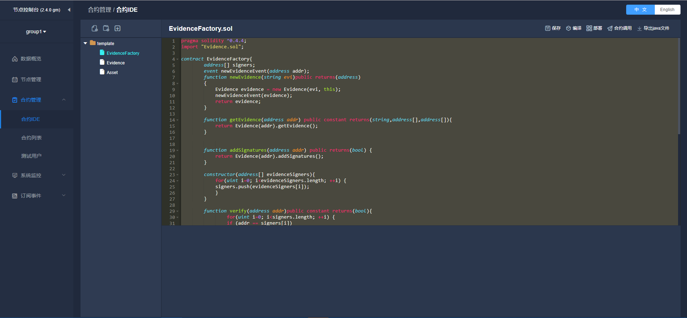

# 快速入门搭建

我们推荐的快速入门，只需要搭建节点和节点前置服务(WeBASE-Front)，就可通过WeBASE-Front的合约编辑器进行合约的编辑，编译，部署，调试。

### 节点搭建

节点搭建的方法建议使用[build_chain](https://fisco-bcos-documentation.readthedocs.io/zh_CN/latest/docs/installation.html)。

### 节点前置服务(WeBASE-Front)搭建
**前提条件** 

| 依赖软件 | 支持版本 |
| :-: | :-: |
| Java | [JDK 8 至JDK 14](../WeBASE-Front/appendix.html#java) |

备注：部署出现问题请查看[问题记录](../WeBASE-Front/appendix.html#id6)。

1. 下载安装包
    ```shell
    wget https://osp-1257653870.cos.ap-guangzhou.myqcloud.com/WeBASE/releases/download/v1.4.2/webase-front.zip
    ```


2. 解压
    ```shell
    unzip webase-front.zip
    cd webase-front
    ```

3. 拷贝sdk证书文件（build_chain的时候生成的） 

    将节点所在目录`nodes/${ip}/sdk`下的ca.crt、node.crt和node.key文件拷贝到conf下

    *如果使用了国密版SSL* `nodes/${ip}/sdk/gm/`下的**所有证书**拷贝到conf目录下。
    - 注，国密版**默认使用非国密SSL**，只有在建链时手动指定了`-G`(大写)时才会使用国密SSL


4. 服务起停

    **国密版**则通过vi修改`application.yml`中将`sdk-encryptType`设置为`1`（默认为0），也可以直接通过以下命令进行快速修改，修改后即可执行启停命令进行服务启停。
    ```shell
    sed -i "s%encryptType: 0%encryptType: 1%g" ./conf/application.yml
    ```

    服务启停命令：
    ```shell
    启动： bash start.sh
    停止： bash stop.sh
    检查： bash status.sh 
    ```

启动成功将出现如下日志：
```
...
	Application() - main run success...
```

### 状态检查

成功部署后，可以根据以下步骤**确认各个子服务是否启动成功**

##### 1. 检查各子系统进程

通过`ps`命令，检查节点与节点前置的进程是否存在
- 包含：节点进程`nodeXX`，节点前置进程`webase.front`

检查方法如下，若无输出，则代表进程未启动，需要到`webase-front/log`中查看日志的错误信息，并根据错误提示或根据[WeBASE-Front常见问题](../WeBASE-Front/appendix.html)进行错误排查

检查节点进程
```shell
$ ps -ef | grep node
```
输出如下，此处部署了两个节点node0, node1
```
root     29977     1  1 17:24 pts/2    00:02:20 /root/fisco/webase/webase-deploy/nodes/127.0.0.1/node1/../fisco-bcos -c config.ini
root     29979     1  1 17:24 pts/2    00:02:23 /root/fisco/webase/webase-deploy/nodes/127.0.0.1/node0/../fisco-bcos -c config.ini
```

检查节点前置webase-front的进程
```
$ ps -ef | grep webase.front 
```
输出如下
```
root     31805     1  0 17:24 pts/2    00:01:30 /usr/local/jdk/bin/java -Djdk.tls.namedGroups=secp256k1 ... conf/:apps/*:lib/* com.webank.webase.front.Application
```

##### 2. 检查进程端口

通过`netstat`命令，检查节点与节点前置的端口监听情况

检查方法如下，若无输出，则代表进程端口监听异常，需要到`webase-front/log`中查看日志的错误信息，并根据错误提示或根据[WeBASE-Front常见问题](../WeBASE-Front/appendix.html)进行错误排查

检查节点channel端口(默认为20200)是否已监听
```shell
$ netstat -anlp | grep 20200
```
输出如下
```
tcp        0      0 0.0.0.0:20200           0.0.0.0:*               LISTEN      29069/fisco-bcos
```

检查webase-front端口(默认为5002)是否已监听
```
$ netstat -anlp | grep 5002
```
输出如下
```
tcp6       0      0 :::5002                 :::*                    LISTEN      2909/java 
```

##### 3. 检查服务日志 

日志中若出现报错信息，可根据信息提示判断服务是否异常，也可以参考并根据错误提示或根据[WeBASE-Front常见问题](../WeBASE-Front/appendix.html)进行错误排查

- 如果节点进程**已启用**且端口**已监听**，可调过本章节
- 如果节点前置异常，如检查不到进程或端口监听，则需要`webase-front/log`中查看日志的错误信息
- 如果检查步骤出现检查不到进程或端口监听等异常，或者前置服务无法访问，可以按以下顺序逐步检查日志：
  - 检查`webase-front/log`中查看节点前置日志的错误信息，如果无错误，且日志最后出现`application run success`字样则代表运行成功
  - 检查`nodes/127.0.0.1/nodeXXX/log`中的节点日志

启动失败或无法使用时，欢迎到WeBASE-Front[提交Issue](https://github.com/WeBankFinTech/WeBASE-Front/issues)或到技术社区共同探讨
- 提交Issue或讨论问题时，可以在issue中配上自己的**环境配置，操作步骤，错误现象，错误日志**等信息，方便社区用户快速定位问题


### 访问

访问 http://{deployIP}:{frontPort}/WeBASE-Front，示例：  

    ```
    http://localhost:5002/WeBASE-Front 
    ```

    

**注**：若服务启动后无异常，但仍然无法访问，可以检查服务器的网络安全策略：
- **开放节点前置端口**：如果希望通过浏览器直接访问webase-front节点前置的页面，则需要开放节点前置端口`frontPort`（默认5002）
