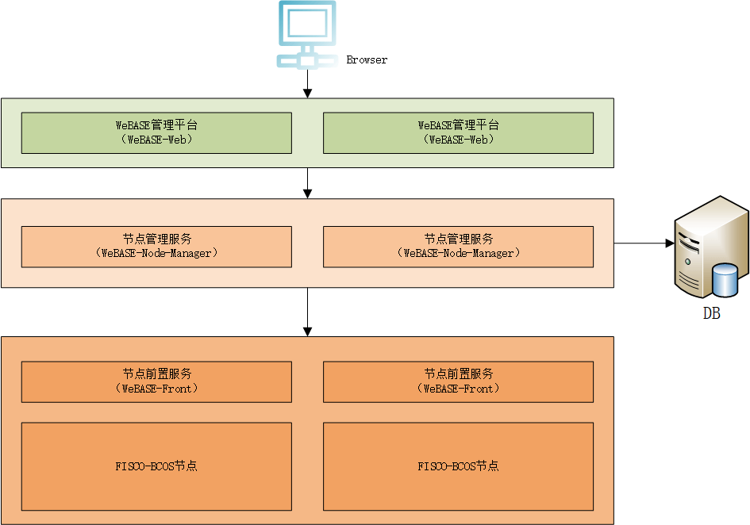

# WeBASE管理平台企业部署

##  1、部署架构

WeBASE三个服务的部署架构如下图：节点前置需要和区块链节点部署在同一台机器；节点管理和WeBASE管理平台可以同机部署，也可以分开部署。在企业生产环境，为了容灾往往会在多个节点上部署节点前置，也会部署多个节点管理和WeBASE管理台。

## 2、企业部署

### 2.1、节点前置搭建

节点前置使用Spring Boot的JAVA后台服务，具体搭建流程参见[《节点前置安装说明》](../WeBASE-Front/install.md)。

### 2.2、节点管理搭建

节点管理使用Spring Boot的JAVA后台服务，具体搭建流程参见[《节点管理安装说明》](../WeBASE-Node-Manager/install.md)。

### 2.3、WeBASE管理台

WeBASE管理台使用框架`vue-cli`，具体搭建流程参见[《WeBASE管理平台安装说明》](../WeBASE-Web/install.md)。

