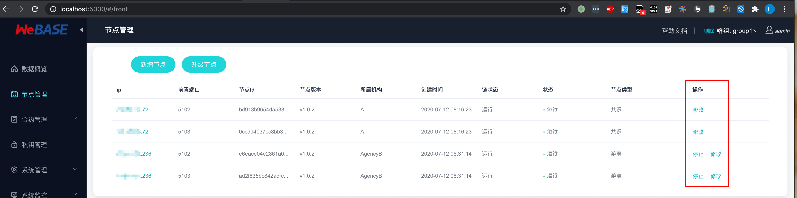

# 可视化部署

可视化部署，即通过界面化的操作来部署和管理区块链服务，主要包括：

    1. 部署区块链服务；
    2. 新增，删除节点；
    3. 启动，停止节点
    4. 变更节点类型（共识，观察，游离）
    5. 群组和节点管理；
    6. 区块链版本升级；
    7. 删除区块链服务；

    
### 准备事项
#### 兼容性
1. 可视化部署是 WeBASE 1.4.0 版本提供的功能，暂时不支持前向兼容。所以，如果需要体验可视化部署，只能部署新的区块链服务；
2. 由于可视化部署处于版本迭代中，所以在部署 **节点管理服务 WeBASE-Node-Manager**  时，需要使用 `dev-deploy` 代码分支；
3. 如果执行可视化部署时，有任何的问题，欢迎提交 issue 或者提交 PR；
 
#### 操作系统要求
由于在部署区块链底层节点（FISCO-BCOS）服务时，需要使用 Docker 服务，需要选择合适的主机操作系统：
 
| 操作系统 |  版本最低要求|
| :-: | :-: |
| CentOS / RHEL | CentOS 7.3（kernel >= 3.10.0-514）|
| Debian | Stretch 9  |
| Ubuntu | Xenial 16.04 (LTS) |


#### 节点最大部署数量
1. 采用单机部署，单机内存至少需要 **4GB 及以上**，并且部署**节点数量最大为 4 个；**
2. 采用多主机部署，一个运行节点需要占用大概 `0.6GB` 内存。**比如，一台 2G 内存的主机，最多只能部署 3 个节点；**


#### SSH 免密登录（仅限多主机部署）
**注意：如果采用单机部署，可以略过。**

多主机的可视化部署，在部署和维护区块链服务器的过程时，**节点管理服务（WeBASE-Node-Manager ）的主机** 会使用 SSH 免密登录其它主机：

1. 使用 `ssh` 命令远程登录主机，初始化主机环境，安装系统依赖和 Docker 服务，修改文件；
2. 使用 `scp` 命令在主机之间进行文件传输；

所以，需要配置主机之间的 SSH 免密登录，同时为了保证有足够的权限操作运行节点的主机，默认使用的 SSH 登录账号为 root 账号。

### 部署依赖服务

#### 签名服务

WeBASE-Sign 作为区块链的私钥管理服务，管理发送交易时所需要的私钥。

在可视化的部署后，如果需要对节点进行游离、共识和观察操作（通过发送一笔交易实现），此时需要提供一个私钥来发送变更交易。所以需要部署一个 WeBASE-Sign 服务，来管理发送交易所需要的私钥账户。

参考 [签名服务 WeBASE-Sign 部署文档](../WeBASE-Sign/install.html#id1) 优先部署 WeBASE-Sign 服务。


#### 节点管理服务
WeBASE-Node-Manager 是整个区块链节点的管理服务，同时，节点的部署也是通过 WeBASE-Node-Manager 来完成的。

**注意：**
1. 由于可视化部署的功能还处于迭代中，所以在使用 `git clone` 拉取了 WeBASE-Node-Manager 的仓库代码后，使用命令 `git checkout dev-deploy` 切换到 `dev-deploy` 分支。 

2. 初始化数据库时，使用 `dev-deploy` 中的数据库初始化脚本。

参考 [节点管理服务 WeBASE-Node-Manager 部署文档](../WeBASE-Node-Manager/install.html#id1) 部署 WeBASE-Node-Manager 服务。

#### 节点管理平台
WeBASE-Web 是节点的管理页面，提供节点管理服务的界面化操作。

**注意：**
1. 由于可视化部署的功能还处于迭代中，所以在使用 `git clone` 拉取了 WeBASE-Web 的仓库代码后，使用命令 `git checkout dev-deploy` 切换到 `dev-deploy` 分支。 

参考 [节点管理平台 WeBASE-Web 部署文档](../WeBASE-Web/install.html#id1) 部署 WeBASE-Web 服务。

### 可视化部署
在部署完成节点管理服务（WeBASE-Node-Manager）和节点管理平台（WeBASE-Web）后，使用浏览器，访问节点管理平台页面：

```Bash
http://{deployIP}:{webPort}

# 默认端口：5000

示例：http://127.0.0.1:5000
```
#### 部署操作
1. 修改密码后，默认进入部署操作界面：
    

2. 点击部署，打开部署界面：
    

**示例：**
    
    
3. 点击开始部署后，等待区块链服务部署完成。

4. 根据进度条，在部署完成后，如图：
    

**注意：**
1. **节点数量：** 每个群组**至少部署 2 个节点；**
2. **机构名：** 必须为英文和数字，不能含有空格和汉字；
3. **群组：** 必须为大于 0 的数字；
4. **部署过程等待时间可能较长：** 可视化部署会更新主机系统，安装 Docker 服务，拉取 Docker 镜像服务，请耐心等待；
5. **手动拉取 Docker 镜像：** 由于网络原因，Docker 镜像的拉取会出现失败。此时，可以尝试使用命令 `docker pull fiscoorg/front:{version}` 手动拉取（替换 {version} 为下拉框相应版本）；
 
#### 新增节点
节点新增，也称作区块链扩容，指在已有的区块链服务中，增加新的节点。

新增的节点，**默认处于游离状态**，需要手动**变更节点为共识或者观察节点**后，新节点开始从原有节点同步区块数据。

**具体操作：**

1. 点击**新增节点**按钮；
2. 输入主机 IP 地址，如果是新的 IP 地址，需要输入机构名称；
3. 选择群组；
4. 输入新增节点数量；
5. 点击确认，即可完成增加节点操作；

    


#### 节点操作
节点操作，包括节点的具体操作有：
1. 启动，停止；
2. 类型切换：共识，观察和游离；
3. 删除节点；




点击节点列表的操作项操作即可。但是需要注意：
1. 停止操作时，节点必须处于游离状态；
2. 变更节点为游离节点时，该群组内，至少有两个共识节点；
3. 变更节点类型，需要发送交易，请先在**私钥管理添加私钥账号；**
4. 删除节点时，节点必须处于停止状态；


#### 升级区块链
升级区块链，指升级整个区块链底层服务的版本。

1. 点击升级节点；
2. 点击更新按钮，获取最新的 Docker 镜像版本；
3. 选择新版本，点击确认；
4. 等待区块链完成升级；

#### 删除区块链
删除区块链，当部署出现异常，或者不可预期的错误时，可以使用删除功能，删除已经区块链服务，然后重新部署即可。

如果要删除当前区块链，点击右上角**删除**按钮，等待删除完成后，会自动退出到登录页面。

当执行删除操作时，并不会真正物理删除节点的数据，而是使用 `mv` 命令，将区块链的整个数据移动到临时目录（在部署时配置的目录同级目录）。


    
