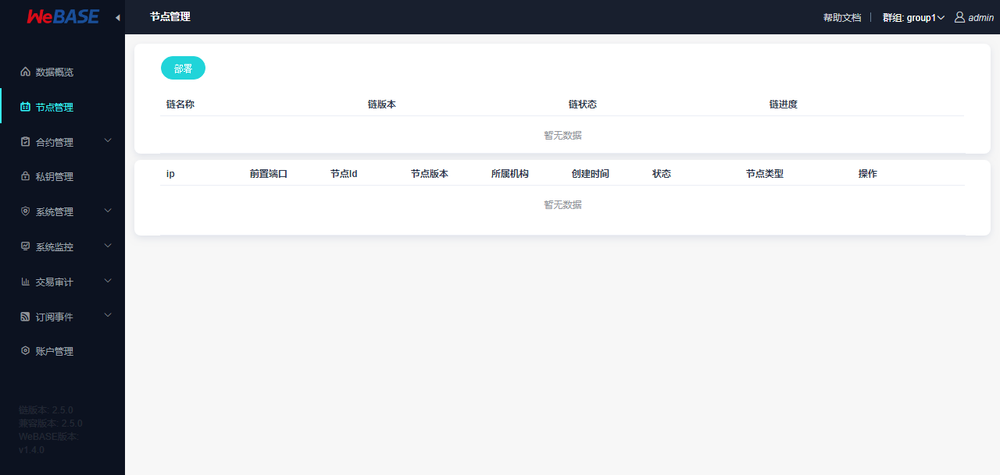
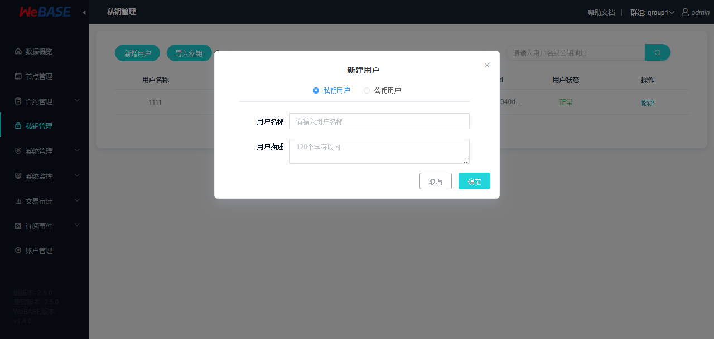

# 可视化部署

可视化部署，即通过界面化的操作来部署和管理区块链服务，主要包括：

1. 部署区块链底层服务；
2. 新增，删除节点；
3. 启动，停止节点
4. 变更节点类型（共识，观察，游离）
5. 群组和节点管理；
6. 区块链版本升级；
7. 删除区块链服务；


### 部署方式
可视化部署主要包含两种部署方式：**单机部署**和**多机部署**；

两种部署方式最大的区别在于**拷贝文件**和**操作节点**的方式不同。

* **单机部署：**
    * 指部署 WeBASE-Node-Manager 的主机和部署节点的主机是**同一台**；
    * 使用 `cp` 命令拷贝文件；
    * 本地调用 `docker command` 操作节点；

* **多机部署：**
    * 是指部署 WeBASE-Node-Manager 的主机和部署节点的主机是**多台**；
    * 使用 `scp` 命令拷贝文件；
    * 通过 SSH 远程登录主机后执行 `docker command` 命令操作节点；

### 实现原理
可视化部署的实现原理如下：

* WeBASE-Node-Manager 根据填写的主机，调用初始化脚本，通过 SSH 远程登录每台主机，初始化主机环境，包括安装 `Docker`，`wget`，`curl` 等服务；

* WeBASE-Node-Manager 根据填写的部署信息，调用 `build_chain.sh` 脚本，生成每台主机上各个节点的配置信息，同时还有各个机构的私钥和证书，链私钥和证书等等配置文件；

* WeBASE-Node-Manager 通过使用 `scp（多机部署）` 或 `cp（单机部署）` 命令，将文件从 WeBASE-Node-Manager 主机上拷贝到相应主机；

* WeBASE-Node-Manager 通过 SSH 远程调用 Docker 指令根据每个节点配置使用 `docker run` 启动节点；

* 新增机构时，通过调用 `gen_agency_cert.sh` 脚本根据链私钥生成机构的私钥和证书；

* 新增节点时，通过调用 `gen_node_cert.sh` 脚本根据机构的私钥生成节点的私钥和证书； 

### 注意事项
#### 兼容性
* 可视化部署是 WeBASE 1.4.0 版本提供的功能，暂时不支持前向兼容。所以，如果需要体验可视化部署，只能部署新的区块链服务；
* 由于可视化部署处于版本迭代中，所以在部署 **节点管理服务 WeBASE-Node-Manager**  时，需要使用 `dev-deploy` 代码分支；
* 如果执行可视化部署时，有任何的问题，欢迎提交 issue 或者提交 PR；

#### 操作系统
由于在部署区块链底层节点（FISCO-BCOS）服务时，需要使用 Docker 服务，针对部署节点的主机需要选择合适的操作系统：

| 操作系统 | 最低要求 |
| ---- | -------- |
| CentOS / RHEL | CentOS 7.3 |
| Debian | Stretch 9  |
| Ubuntu | Xenial 16.04 |

#### 节点的最大部署数量
* 采用单机部署，单机内存至少需要 **4GB 及以上**，并且部署**节点数量最大为 4 个；**

* 采用多主机部署，一个运行节点需要占用大概 `0.6GB` 内存。**比如，一台 2G 内存的主机，最多只能部署 3 个节点；**

#### SSH 免密登录
**注意：仅仅是针对多机部署方式，如果采用单机部署，可忽略**

在多机部署时，会使用 SSH 免密登录节点主机，所以需要在部署前完成如下配置：

1. 配置 WeBASE-Node-Manager 主机到其它节点主机的 SSH 免密登录；

2. 注意免密登录的账号权限，否则会造成创建文件目录失败，Docker 命令执行失败等；

关于 SSH 密码登录配置，请参考：[SSH 免密登录主机配置](https://www.jianshu.com/p/079740a82623)

#### 网络问题
由于网络原因，在初始化主机安装 Docker 服务，拉取 Docker 镜像，`build_chain.sh` 从 Github 下载 tassl 国密包时，大概率会出现网络断开导致失败。

**所以，为了保证部署过程顺利完成，建议优先参考[常见问题]()，手动进行部分操作。**

### 部署依赖服务

#### 签名服务

WeBASE-Sign 作为区块链的私钥管理服务，管理发送交易时所需要的私钥。

在可视化的部署后，在对节点进行游离、共识和观察操作时（通过发送一笔交易实现），此时需要提供一个私钥来发送变更交易。所以需要部署一个 WeBASE-Sign 服务，来管理发送交易所需要的私钥账户。

* 参考 [签名服务 WeBASE-Sign 部署文档](../WeBASE-Sign/install.html#id1) 优先部署 WeBASE-Sign 服务。

>**注意：**
>
> * 采用单机部署方式时，如果部署多个节点，节点的 WeBASE-Front 端口会从 `5002` 根据部署节点个数依次递增。而 WeBASE-Sign 默认监听在 `5004` 端口，所以当采用单机不是，超过 3 个节点时，会造成端口冲突，**建议采用单机部署时，修改 WeBASE-Sign 的默认监听地址为 6004**。


#### 节点管理服务
WeBASE-Node-Manager 是整个区块链节点的管理服务，同时，节点的部署也是通过 WeBASE-Node-Manager 来完成的。

**注意：**
1. 由于可视化部署的功能还处于迭代中，所以在使用 `git clone` 拉取了 WeBASE-Node-Manager 的仓库代码后，使用命令 `git checkout dev-deploy` 切换到 `dev-deploy` 分支。 

2. 初始化数据库时，使用 `dev-deploy` 中的数据库初始化脚本。

* 参考 [节点管理服务 WeBASE-Node-Manager 部署文档](../WeBASE-Node-Manager/install.html#id1) 部署 WeBASE-Node-Manager 服务。

#### 节点管理平台
WeBASE-Web 是节点的管理页面，提供节点管理服务的界面化操作。


**注意：**
1. 由于可视化部署的功能还处于迭代中，所以在使用 `git clone` 拉取了 WeBASE-Web 的仓库代码后，使用命令 `git checkout dev-deploy` 切换到 `dev-deploy` 分支；

2. 如果 WeBASE-Sign 监听地址不是默认的 `5004`，需要修改 WeBASE-Node-Manager 中 application.yml 配置文件 中的`webaseSignAddress` 配置；

```yml
#constants
constant:
  webaseSignAddress: "127.0.0.1:新的端口"
```

* 参考 [节点管理平台 WeBASE-Web 部署文档](../WeBASE-Web/install.html#id1) 部署 WeBASE-Web 服务。

### 可视化部署
在部署完成节点管理服务（WeBASE-Node-Manager）和节点管理平台（WeBASE-Web）后，使用浏览器，访问节点管理平台页面：

```Bash
http://{deployIP}:{webPort}

# 默认端口：5000

示例：http://127.0.0.1:5000
```
#### 部署操作

**提示：**
> 1. 由于网络问题，建议优先参考[常见问题](#)手动进行 Docker 安装和 镜像拉取后再进行部署操作，防止由于网络原因导致部署失败；
> 2. 如果部署**国密**版本，建议参考常见问题，手动下载 TASSL 下载库；

打开节点管理平台页面后，登录后修改密码，默认进入**节点管理页面**：



* 点击部署，打开部署界面：


**示例：**


    
* 点击开始部署后，等待区块链服务部署完成。

* 根据进度条，在部署完成后，如图：
    


**提示：**
1. **节点数量**： 每个群组**至少部署 2 个节点；**
2. **机构名**： 必须为英文和数字，不能含有空格和汉字；
3. **群组**： 必须为大于 0 的数字；
4. **部署过程等待时间可能较长**：可视化部署会更新主机系统，安装 Docker 服务，拉取 Docker 镜像服务，请耐心等待；

#### 新增节点
节点新增，也称作区块链扩容，指在已有的区块链服务中，增加新的节点。

**提示：**
> 1. 由于网络问题，建议优先参考[常见问题](#)手动进行 Docker 安装和 镜像拉取后再进行部署操作，防止由于网络原因导致部署失败；

新增的节点，**默认处于游离状态**，需要手动**变更节点为共识或者观察节点**后，新节点开始从原有节点同步区块数据。

**具体操作：**

1. 点击**新增节点**按钮；
2. 输入主机 IP 地址，如果是新的 IP 地址，需要输入机构名称；
3. 选择群组；
4. 输入新增节点数量；
5. 点击确认，即可完成增加节点操作；


#### 节点操作
节点操作，包括：

1. 节点的启动，停止；
2. 节点的类型切换：共识，观察和游离；
3. 删除节点；


点击节点列表的操作项操作即可。但是需要注意：

1. 停止操作时，节点必须处于游离状态；
2. 变更节点为游离节点时，该群组内，至少有两个共识节点；
3. 变更节点类型，需要发送交易，请先在**私钥管理添加私钥账号；**
4. 删除节点时，节点必须处于停止状态；




#### 升级区块链
升级区块链，指升级整个区块链底层服务的版本。

1. 点击升级节点；
2. 点击更新按钮，获取最新的 Docker 镜像版本；
3. 选择新版本，点击确认；
4. 等待区块链完成升级；

#### 删除区块链
删除区块链，当部署出现异常，或者不可预期的错误时，可以使用删除功能，删除已经区块链服务，然后重新部署即可。

如果要删除当前区块链，点击右上角**删除**按钮，等待删除完成后，会自动退出到登录页面。

当执行删除操作时，并不会真正物理删除节点的数据，而是使用 `mv` 命令，将区块链的整个数据移动到临时目录（在部署时配置的目录同级目录）。

### 常见问题
#### Docker 安装方法
在 Debian/Ubuntu/CentOS/RHEL，直接执行命令：

```Bash
# 该脚本是 Docker 官方提供的 Linux 自动安装脚本
bash <(curl -s -L get.docker.com)
```

在 CentOS/RHEL 8.x 中，使用上面的自动脚本安装时，会出现下面的错误：

```Bash
Last metadata expiration check: 0:37:43 ago on Sat 22 Feb 2020 07:40:15 PM CST.
Error: 
 Problem: package docker-ce-3:19.03.6-3.el7.x86_64 requires containerd.io >= 1.2.2-3, but none of the providers can be installed
  - cannot install the best candidate for the job
  - package containerd.io-1.2.10-3.2.el7.x86_64 is excluded
  - package containerd.io-1.2.2-3.3.el7.x86_64 is excluded
  - package containerd.io-1.2.2-3.el7.x86_64 is excluded
  - package containerd.io-1.2.4-3.1.el7.x86_64 is excluded
  - package containerd.io-1.2.5-3.1.el7.x86_64 is excluded
  - package containerd.io-1.2.6-3.3.el7.x86_64 is excluded
(try to add '--skip-broken' to skip uninstallable packages or '--nobest' to use not only best candidate packages) 
```

要解决这个问题，需要手动安装 `containerd.io`后，在执行自动安装脚本

```Bash
# 下载最新的 containerd.io 安装包
wget https://download.docker.com/linux/centos/8/x86_64/stable/Packages/containerd.io-1.2.13-3.2.el7.x86_64.rpm 

# 手动安装 containerd.io 
yum localinstall containerd.io-1.2.13-3.2.el7.x86_64.rpm 

```

#### Docker 镜像拉取失败
由于网络原因，Docker 镜像大概率会拉取失败，导致部署或者增加节点失败。所以，强烈推荐通过手动的方式拉取 Docker 镜像到节点主机。

手动拉取 Docker 镜像版本的方式有两种：

* 本地没有镜像
    * 如果本地没有镜像，只能通过 `docker pull` 拉取
    
```Bash
# 替换 {version} 为部署页面下拉框中的镜像版本
docker pull fiscoorg/bcos-front:{version}
```

* 本地已经拉取过镜像
    * 如果本地已有镜像，可以通过将镜像压缩成一个 tar 文件，然后通过 `scp` 传输到相应主机，再解压 tar 文件即可；
    
```Bash
# 保存 tar 文件
# 替换 {version} 为部署页面下拉框中的镜像版本
docker save -o bcos-front.tar fiscoorg/bcos-front:{version}

# 传输到主机
scp bcos-front.tar root@[IP]:/root/

# 解压 tar 文件
docker lod -i bcos-front.tar

# 检查是否存在相应版本的镜像
docker images -a |grep -i  -i "fiscoorg/bcos-front"
``` 

#### 部署国密版本，手动下载 TASSL 

FISCO BCOS 国密版本需要使用 TASSL 生成国密版本的证书，部署工具会自动从GitHub 下载，解压后放置于 `~/.fisco/tassl`，如果碰到下载失败，请尝试从[https://gitee.com/FISCO-BCOS/LargeFiles/blob/master/tools/tassl.tar.gz](https://gitee.com/FISCO-BCOS/LargeFiles/blob/master/tools/tassl.tar.gz) 下载并解压后，放置于 `~/.fisco/tassl`


    
