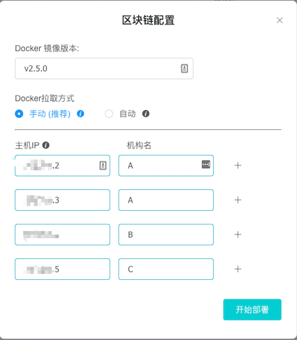
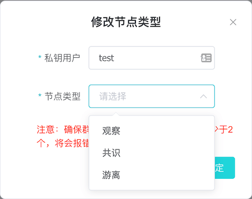

# 可视化部署

可视化部署是指通过 WeBASE 管理平台，在 **多台** 主机上快速部署 **FISCO-BCOS 底层节点和 WeBASE-Front 前置** 以及 对底层节点的扩容操作。

可视化部署，需要先部署依赖服务，包括管理平台（WeBASE-Web）、节点管理子系统（WeBASE-Node-Manager）、签名服务（WeBASE-Sign）。

然后通过 WeBASE 管理平台（WeBASE-Web）的界面在填入的主机中部署节点（FISCO-BCOS 2.0+）和节点前置子系统（WeBASE-Front）。


## 环境准备

在进行可视化部署之前，请按照部署要求，准备相应的部署环境。

### 系统环境

#### 硬件配置
使用可视化部署搭建一个 **至少2 节点** 的区块链服务，WeBASE配置至少1G空闲内存（用于节点管理服务与签名服务，每个WeBASE后台组件至少配置500M内存）、每个节点+前置的镜像配置至少2G空闲内存（节点数与CPU内核数正相关，如4核可配置4节点），在进行可视化部署时会进行主机的可用内存检测。

**注意：**
- 在企业级部署时，为了安全，推荐将签名服务（WeBASE-Sign）放在内网中，与管理平台、管理子系统分开部署。此处为了方便演示，因此将签名服务（WeBASE-Sign）部署在同一台主机。


**具体配置**

| 名称 | 最低配置  |推荐配置  |
|---|---|---|
| CPU  | 2 核  | 4 核 |
| 内存 |  4 G | 8 G |
| 磁盘 |  100G + | 500G + |

#### 操作系统
部署节点的主机操作系统需要满足安装 Docker 服务的最低版本要求；

| 操作系统 | 最低要求 |
| ---- | -------- |
| CentOS / RHEL | CentOS 7.3 |
| Ubuntu | Xenial 16.04 |

<span id="port_open"></span>

#### 端口开放

主机防火墙需要开放以下端口。如果是云服务器，需要配置**云服务器安全组策略**中的端口开放规则。

|  端口 | 描述  |
|------|------|
| 22  | 默认SSH登录端口  |
| 5000  |  WeBASE-Web 节点管理平台的访问端口 |

默认使用22作为SSH登录端口，若需要修改，在[Ansible hosts配置](#ansible_host)中可指定SSH端口

**注**，需要确保**链节点所在主机**之间用到的端口对彼此开放，如**P2P端口**(默认30300)、**节点前置的端口**(默认5002)。

<span id="visual_dependency"></span>

### 系统依赖

配置系统依赖分成**宿主机**（Node-Manager所在主机）与**节点主机**（节点所在主机）两种：（宿主机与节点主机均为统一主机时，则需要两种配置）
- 宿主机：配置Ansible、配置Ansible免密登录节点机
- 节点主机：配置docker及docker用户组、配置Ansible用户的sudo权限、安装FISCO BOCS节点依赖

#### 配置Ansible

在宿主机安装Ansible、配置Ansible host列表，配置Ansible免密登录到节点主机的私钥与登录用户

##### 安装Ansible

Ansible只需要安装在宿主机上，节点机无需安装

CentOS
```
yum install epel-release -y
yum install ansible –y
```

Ubuntu
```
apt-get install software-properties-common
apt-add-repository ppa:ansible/ansible
apt-get update
apt-get install ansible 
```

安装完成后，可以通过`--version`检查是否安装成功
```
$ ansible --version
ansible 2.9.15
  config file = /etc/ansible/ansible.cfg
  configured module search path = [u'/root/.ansible/plugins/modules', u'/usr/share/ansible/plugins/modules']
  ansible python module location = /usr/lib/python2.7/dist-packages/ansible
  executable location = /usr/bin/ansible
  python version = 2.7.17 (default, Sep 30 2020, 13:38:04) [GCC 7.5.0]
```

<span id="ansible_sudo"></span>

##### 配置Ansible sudo账号

首先修改Ansible登录到节点主机的sudo用户名，默认为root。

若使用root则跳过此步骤。需要保证该用户名拥有sudo权限，如何为非root用户设置sudo权限参考[sudo账号免密配置](#sudo_config)
```
vi /etc/ansible/ansible.cfg

# 找到sudo_user选项，
···
sudo_user=root
``` 

*注，可视化部署中需要使用sudo权限执行`script/deploy`目录中的host_init_shell进行依赖安装，host_docker_check在docker未启动情况下启动docker服务*

<span id="ssh"></span>

##### 免密登录配置

在节点管理台进行可视化部署时，节点管理（WeBASE-Node-Manager）服务会为每个节点生成相应的配置文件，然后通过Ansible的免密登录远程操作，在远程的节点主机中执行系统命令来操作节点。

下面介绍配置免密登录的各个步骤

```eval_rst
.. important::
    1. 配置 WeBASE-Node-Manager 主机到其它节点主机的 SSH 免密登录；
    2. 配置Ansible的hosts列表并配置免密登录私钥路径
    3. 注意免密登录的账号sudo权限，否则会造成创建文件目录，Docker 命令执行失败；
    4. 如果免密账号为非 `root` 账号，保证账号有 `sudo` **免密** 权限，即使用 `sudo` 执行命令时，不需要输入密码；参考[sudo账号配置](#sudo_config)
```

**免密登录配置方法**

```eval_rst
.. important::
    1. 如果 WeBASE-Node-Manager 已经生成过秘钥对，建议使用命令 `ssh-keygen -t rsa -m PEM` 重新生成；
```

* 使用 SSH 登录 WeBASE-Node-Manager 所在主机：`ssh root@[IP]`

* 检查 `~/.ssh/` 目录是否已经存在 `id_rsa` 私钥文件和对应的 `id_rsa.pub` 公钥文件。如果存在，备份现有私钥对
    
    ```Bash
    mv ~/.ssh/id_rsa ~/.ssh/id_rsa.bak
    mv ~/.ssh/id_rsa.pub ~/.ssh/id_rsa.pub.bak 
    ```

* 执行命令 `ssh-keygen -t rsa -m PEM`，然后直接两次回车即可生成（提示输入密码时，直接回车）

* 将公钥文件上传到需要免密登录的主机（替换 [IP] 为节点主机的 IP 地址），然后输入远程主机的登录密码

    ssh-copy-id -o StrictHostKeyChecking=no -i ~/.ssh/id_rsa.pub root@[IP]

* 输出结果出现 `Number of key(s) added: 1` 结果，表示免密登录配置成功

* 检查从部署 WeBASE-Node-Manager 服务的主机是否能成功免密登录部署节点的主机（替换 [IP] 为主机的 IP 地址）

    `ssh -o StrictHostKeyChecking=no root@[IP]`
    
此处配置宿主机免密登录到节点主机完成后，记住宿主机中`id_rsa`私钥的路径，下一步进行Ansible中hosts的免密配置

*切记妥善保管免密登录的私钥，否则当前主机与ssh免密登录的主机均会被控制*

<span id="ansible_host"></span>

**配置Ansible Hosts与免密登录**

在`/etc/ansible/hosts`文件中添加IP组webase，并添加节点机的IP、免密登录账号和私钥路径。

若后续需要添加新的主机，需要将新主机的IP添加到此处

添加以下内容，此处假设远端IP为127.0.0.1，免密登录账户为root，且`id_rsa`免密私钥的路径为`/root/.ssh/id_rsa`
```
vi /etc/ansible/hosts

···
[webase]
127.0.0.1 ansible_ssh_private_key_file=/root/.ssh/id_rsa  ansible_ssh_user=root  ansible_ssh_port=22
{your_host_ip} ansible_ssh_private_key_file={ssh_private_key}  ansible_ssh_user={ssh_user}  ansible_ssh_port={ssh_port}
```

##### 测试Ansible

执行ansible的ping命令，检测添加到hosts中各个节点主机IP能否被访问。若出现`IP | SUCCESS`的则代表该IP可连通。

如果出现`FAILED`代表该IP无法连接，需要根据上文的免密登录配置进行`ssh -o StrictHostKeyChecking=no root@[IP]`检测

对ansible中的webase ip组进行ping检测
```
ansible webase -m ping

116.63.161.132 | SUCCESS => {
    "ansible_facts": {
        "discovered_interpreter_python": "/usr/bin/python"
    }, 
    "changed": false, 
    "ping": "pong"
}
116.63.184.110 | SUCCESS => {
    "ansible_facts": {
        "discovered_interpreter_python": "/usr/bin/python"
    }, 
    "changed": false, 
    "ping": "pong"
}

```

#### 配置Docker

配置Docker需要**在每个安装节点的主机上都要执行**，否则将导致节点远程安装失败。包括以下几个步骤
- 安装Docker并启动Docker
- 配置Docker用户组

安装 Docker 服务，请参考下文**常见问题**中：[Docker 安装](#install_docker)

如果使用云服务器，推荐使用**操作系统镜像模板**的方式创建主机，即在一台主机上安装 Docker 后，然后使用安装 Docker 服务后的操作系统做一个镜像模板。通过这个模板镜像来创建主机，这样新创建的主机就自带了 Docker 服务。

<span id="docker_sudo"></span>

#### 配置docker用户组

若执行Docker命令，如`docker ps`必须使用sudo才能运行，则需要按如下修改：

```
# 创建docker用户组
sudo groupadd docker
# 将当前用户添加到docker用户组
sudo usermod -aG docker $USER
# 重启docker服务
sudo systemctl restart docker
# 切换或者退出当前账户，重新登入
exit
```

重新登入后，执行`docker ps`如有输出，未报错Permission Denied则代表配置成功

<span id="pull_image"></span>
##### 拉取 Docker 镜像

**在v1.4.3版本后，可视化部署支持自动从CDN拉取镜像，无需手动拉取**

若需要手动配置镜像，可以通过以下方法配置

可视化部署需要使用`FISCO BCOS + WeBASE-Front`组成的节点与前置Docker镜像，并提供拉取Docker镜像的三种方式（**推荐通过CDN加速服务拉取**）：
- 通过可视化部署自动从CDN拉取镜像压缩包并加载镜像（**推荐**），需要确保wget命令能正常使用
- 通过WeBASE CDN服务下载镜像压缩包后，通过`docker load`命令安装镜像
- 直接通过`docker pull`命令直接从DockerHub拉取镜像

```eval_rst
.. important::
可视化自动部署功能支持自动从 Docker 仓库拉取镜像，仅通过页面点击就可以完成Docker拉取。但是由于DockerHub的网络原因，拉取镜像的速度较慢，耗时过长，容易导致拉取镜像失败，页面的可视化部署操作失败。
因此，为了保证部署过程顺利和快速完成，可在执行可视化部署前，手动拉取镜像，并将镜像上传到每个需要部署节点服务的主机。
```

拉取镜像的方法，请参考下文**常见问题**中：[拉取 Docker 镜像](#pull_image)


## 部署依赖服务
可视化部署需要依赖 WeBASE 的中间件服务，包括**管理平台（WeBASE-Web）、节点管理子系统（WeBASE-Node-Manager）、签名服务（WeBASE-Sign）**。

对于依赖服务的安装，有两种方式（ **一键部署** 和 **手动部署** ），选择其中一种部署方式即可

#### 1. 一键部署依赖服务

适合**同机部署**，快速体验WeBASE的情况使用

具体环境依赖参考[**一键部署-前提条件**](../WeBASE/install.html#id2)。

**拉取部署脚本**

获取部署安装包：
```shell
wget https://github.com/WeBankFinTech/WeBASELargeFiles/releases/download/v1.4.3/webase-deploy.zip
```
解压安装包：
```shell
unzip webase-deploy.zip
```
进入目录：
```shell
cd webase-deploy
```

**注意：**
- 配置可视化部署配置文件时，选择`visual-deploy.properties`进行配置
- 选择部署方式时，选择 **可视化部署** 方式，即执行 `deploy.py` 脚本时，执行 `python3 deploy.py installWeBASE`

修改 `visual-deploy.properties` 文件。
<span id="visual-deploy-config"></span>


```eval_rst
.. important::
    注意： `sign.ip` 配置的 IP 是WeBASE-Sign签名服务对外提供服务访问的 IP 地址，供其他部署节点主机访问。
```

```shell
# WeBASE子系统的最新版本(v1.1.0或以上版本)
webase.web.version=v1.4.3
webase.mgr.version=v1.4.3
webase.sign.version=v1.4.3
fisco.webase.docker.cdn.version=v1.4.3

# 节点管理子系统mysql数据库配置
mysql.ip=127.0.0.1
mysql.port=3306
mysql.user=dbUsername
mysql.password=dbPassword
mysql.database=webasenodemanager

# 签名服务子系统mysql数据库配置
sign.mysql.ip=localhost
sign.mysql.port=3306
sign.mysql.user=dbUsername
sign.mysql.password=dbPassword
sign.mysql.database=webasesign

# WeBASE管理平台服务端口
web.port=5000

# 节点管理子系统服务端口
mgr.port=5001

# 签名服务子系统端口
sign.port=5004

# 是否使用国密（0: standard, 1: guomi）
# 此配置决定可视化部署搭建国密或非国密的链
encrypt.type=0

# WeBASE-Sign 对外提供服务的访问 IP 地址
# 部署在其它主机的节点，需要使用此 IP 访问 WeBASE-Sign 服务
# 不能是 127.0.0.1 或者 localhost
sign.ip=

```

完成配置文件修改后，则执行部署：

**备注：** 

- 部署脚本会拉取相关安装包进行部署，需保持网络畅通。
- 首次部署需要下载编译包和初始化数据库，重复部署时可以根据提示不重复操作
- 部署过程中出现报错时，可根据错误提示进行操作，或根据本文档中的[常见问题](#q&a)进行排查
- 不建议使用sudo执行脚本，例如`sudo python3 deploy.py installWeBASE`（sudo会导致无法获取当前用户的环境变量如JAVA_HOME）


```shell
# 部署并启动可视化部署的所有服务
python3 deploy.py installWeBASE
```

如果遇到docker必须使用sudo运行，报错`Docker....Permission Denied`，可以参考[常见问题-创建docker用户组](#docker_sudo)

部署完成后可以看到`deploy has completed `的日志：

```shell
$ python3 deploy.py installWeBASE
...
============================================================
              _    _     ______  ___  _____ _____ 
             | |  | |    | ___ \/ _ \/  ___|  ___|
             | |  | | ___| |_/ / /_\ \ `--.| |__  
             | |/\| |/ _ | ___ |  _  |`--. |  __| 
             \  /\  |  __| |_/ | | | /\__/ | |___ 
              \/  \/ \___\____/\_| |_\____/\____/  
...
...
============================================================
==============      deploy has completed     ==============
============================================================
==============    webase-web version  v1.4.3        ========
==============    webase-node-mgr version  v1.4.3   ========
==============    webase-sign version  v1.4.3       ========
============================================================
```


* 服务部署后，需要对各服务进行启停操作，可以使用以下命令：

```shell
# 可视化部署
部署并启动可视化部署的所有服务  python3 deploy.py installWeBASE
停止可视化部署的所有服务  python3 deploy.py stopWeBASE
启动可视化部署的所有服务  python3 deploy.py startWeBASE
# 各子服务启停
启动WeBASE-Node-Manager: python3 deploy.py startManager
停止WeBASE-Node-Manager: python3 deploy.py stopManager
启动WeBASE-Web:          python3 deploy.py startWeb
停止WeBASE-Web:          python3 deploy.py stopWeb
启动WeBASE-Sign:        python3 deploy.py startSign
停止WeBASE-Sign:        python3 deploy.py stopSign
```

#### 2. 手动部署依赖服务
适合**多机部署**，企业级的情况使用。

具体步骤如下：

* 签名服务（WeBASE-Sign）
    
    * 参考 [签名服务 WeBASE-Sign 部署文档](../WeBASE-Sign/install.html#id1) 部署 WeBASE-Sign 服务。安装后需要将Sign的外网IP Port配置到下文的WeBASE-Node-Manager中

* 管理平台（WeBASE-Web）

    * 参考 [节点管理平台 WeBASE-Web 部署文档](../WeBASE-Web/install.html#id1) 部署 WeBASE-Web 服务
    
* 节点管理子系统（WeBASE-Node-Manager）
    * 参考 [节点管理服务 WeBASE-Node-Manager 部署文档](../WeBASE-Node-Manager/install.html#id1) 部署 WeBASE-Node-Manager 服务
    * 修改 `WeBASE-Node-Manager/dist/conf/application.yml` 配置文件示例如下：
        * 配置文件中 `deployType` 为 `1`，启用节点管理服务的可视化部署功能
        * 配置文件中 `webaseSignAddress` 的 IP 地址，其余主机需要通过此IP访问签名服务
    
```eval_rst
.. important::
    1. 注意 WeBASE-Node-Manager 服务的 `webaseSignAddress` 配置。WeBASE-Front 节点会使用此地址访问 WeBASE-Sign。所以不能使用 **`127.0.0.1`**，需要填写对外服务的 IP 地址。
```

```yaml
 constant:
  # 1.4.0 visual deploy
  # 部署方式修改为 1，启用可视化部署
  deployType: 1
  
  # WeBASE-Sign 服务的访问地址，前面部署的签名服务的访问地址
  # 注意 IP 地址，WeBASE-Front 会使用此 IP 地址访问签名服务
  # 不能使用 127.0.0.1 
  webaseSignAddress: "xxx.xx.xx.xxx:5004"
  
```


### 可视化部署节点
在部署完依赖服务后，使用浏览器，访问节点管理平台页面：

```Bash
# 默认端口 5000
http://{deployIP}:{webPort}
```
#### 部署节点

可视化部署节点时，后台服务将通过在各个主机安装`FISCO BCOS + WeBASE-Front`的Docker镜像，结合免密远程操作进行自动化部署节点与节点前置的过程。

因此，正如上文步骤中“拉取Docker镜像”的阐述，此操作依赖Docker服务，并默认从CDN拉取Docker镜像

**提示：**
- 在执行部署前，请在节点机中 **手动安装 Docker 服务** 防止由于Docker或网络原因导致部署失败

    - 参考下文 **常见问题** 中的 [安装 Docker](#install_docker)
    
- 如果部署 **国密** 版本，**手动下载 TASSL 库**，防止由于 GitHub 不能访问，导致部署失败
    - 参考下文**常见问题**中的 [手动下载 TASSL](#tassl)，手动下载 TASSL 下载库

- 部署时，默认的链名为`default_chain`


打开节点管理平台页面后，登录后修改密码，默认进入**节点管理页面**：

todo 修改图片
- 添加主机，选中免密登录的ssh账号拥有权限的目录
- 在节点管理中，选择镜像版本、选择镜像拉取模式（推荐CDN拉取）
- 节点管理中添加节点信息，选中节点部署的节点主机。添加节点信息时，将检测节点端口是否被占用（**需要确保节点主机之间的P2P端口与前置端口互通**），所选主机内存与CPU是否满足当前的节点数目。如果检测通过，则出现“检查通过”，否则出现“检测失败”，根据下方状态信息检查主机状态
- 点击**初始化**按钮，进行节点Docker镜像的初始化，直到节点列表中出现“初始化成功”或“初始化失败”（该步骤预计一分钟内完成，若网速过慢，导致初始化超过一分钟后将提示“请求超时”，刷新等待直到初始化状态更新即可），根据下方状态信息检查主机状态
- 如初始化完成，则出现部署按钮，点击**部署**将节点配置发送到各个节点机，并自动启动节点。
- 若提示部署失败，可以点击“重置”按钮，重置当前链，稍后再试。
- 如始终无法部署，可以结合Node-Manager日志排查错误原因，并在github上提交配上日志的issue


* 点击部署，打开部署界面：

具体的配置说明，可以将鼠标移动到配置的**感叹号**上，展示相应的提示信息。


**示例：**


    
* 点击开始部署后，在上面的链信息列，可以查看到当前链的状态已经部署链的进度；

* 部署成功后，如图：
    


<span id="add_node"></span>
#### 新增节点
节点新增，也称作节点扩容，指在已有的区块链服务中，在新的主机上，添加一个新的节点。

**提示：**
- 新主机需要按照[系统依赖](#visual_dependency)中的**节点机**进行配置
    - 参考上文的[ansible账号sudo配置](#ansible_sudo)
    - 参考上文的[ansible host更新](#ansible_host)
    - 参考上文的 [配置 SSH 免密登录](#ssh) 
    - 参考下文**常见问题**中的 [安装 Docker](#install_docker)

- 新增的节点，**默认处于游离状态**，需要手动**变更节点为共识或者观察节点**后，新节点开始从原有节点同步区块数据。

**具体操作：**

* 点击**新增节点**按钮；
* 输入主机 IP 地址和节点相关端口；
* 选择 Docker 拉取方式；
* 点击确认，即可完成增加节点操作；


#### 节点操作
节点操作，包括：

* 节点的启动，停止；
* 节点的类型切换：共识，观察和游离；
* 删除节点；



点击节点列表的操作项操作即可。


**提示**
- 停止操作时，节点必须处于游离状态；
- 变更节点为游离节点时，该群组内，至少有两个共识节点；
- 变更节点类型，需要发送交易，请先在**私钥管理 中 添加私钥账号；**
- 删除节点时，节点必须处于停止状态；

<span id="q&a"></span>
### 常见问题

<span id="install_docker" />

#### 安装 Docker
在 Debian/Ubuntu/CentOS/RHEL，直接执行命令：

```Bash
# 该脚本是 Docker 官方提供的 Linux 自动安装脚本
bash <(curl -s -L get.docker.com)
```

在 CentOS/RHEL 8.x 中，使用上面的自动脚本安装时，会出现下面的错误：

```Bash
Last metadata expiration check: 0:37:43 ago on Sat 22 Feb 2020 07:40:15 PM CST.
Error: 
 Problem: package docker-ce-3:19.03.6-3.el7.x86_64 requires containerd.io >= 1.2.2-3, but none of the providers can be installed
  - cannot install the best candidate for the job
  - package containerd.io-1.2.10-3.2.el7.x86_64 is excluded
  - package containerd.io-1.2.2-3.3.el7.x86_64 is excluded
  - package containerd.io-1.2.2-3.el7.x86_64 is excluded
  - package containerd.io-1.2.4-3.1.el7.x86_64 is excluded
  - package containerd.io-1.2.5-3.1.el7.x86_64 is excluded
  - package containerd.io-1.2.6-3.3.el7.x86_64 is excluded
(try to add '--skip-broken' to skip uninstallable packages or '--nobest' to use not only best candidate packages) 
```

要解决这个问题，需要手动安装 `containerd.io`后，在执行自动安装脚本

```Bash
# 下载最新的 containerd.io 安装包
wget https://download.docker.com/linux/centos/8/x86_64/stable/Packages/containerd.io-1.2.13-3.2.el7.x86_64.rpm 

# 手动安装 containerd.io 
yum localinstall containerd.io-1.2.13-3.2.el7.x86_64.rpm 

```
<span id="pull_image" />

#### 拉取 Docker 镜像

镜像版本：
- v2.7.1

**提示：**
- 最近的镜像版本，请参考：[https://hub.docker.com/r/fiscoorg/fisco-webase/tags](https://hub.docker.com/r/fiscoorg/fisco-webase/tags)

##### 拉取方式

* 检查本地是否已有镜像
    
```Bash
# 检查本地是否有镜像
docker images -a |grep -i "fiscoorg/fisco-webase" | grep -i v2.7.1
    
# 如果有如下输出，表示本地已有镜像；否则表示本地没有镜像
fiscoorg/fisco-webase   v2.7.1     bf4a26d5d389  5 days ago   631MB
```
    
* 如果本地没有镜像（如果本地有镜像，跳过）
    
    * 从 CDN 拉取镜像压缩包
    
    ```Bash
    # 从 CDN 拉取镜像 tar 文件
    # 非国密
    wget https://osp-1257653870.cos.ap-guangzhou.myqcloud.com/WeBASE/releases/download/v1.4.3/docker-fisco-webase.tar
    
    # 解压镜像 tar 文件
    docker load -i docker-fisco-webase.tar
    ```
    
    * 从 Docker 官方拉取镜像

   ```Bash
   # 执行 Docker 拉取命令
   docker pull fiscoorg/fisco-webase:v2.7.1 
   ```
   
* 压缩镜像到 `tar` 文件
    
```Bash
# 压缩镜像为 tar 文件
docker save -o docker-fisco-webase.tar fiscoorg/fisco-webase:v2.7.1
```
    
* 发送镜像 `tar` 文件到部署节点的主机

```Bash
# 发送镜像 tar 文件到需要部署节点的主机
scp docker-fisco-webase.tar root@[IP]:/root/
```
    
* 解压镜像 `tar` 文件
    
```Bash
# 登录需要部署的主机，解压 tar 文件
docker load -i docker-fisco-webase.tar
```
    
* 节点主机检查是否已经成功拉取镜像
    
```Bash
# 检查是否成功拉取镜像
docker images -a |grep -i "fiscoorg/fisco-webase"
    
# 如果有如下输出，表示拉取成功
fiscoorg/fisco-webase   v2.7.1  bf4a26d5d389  5 days ago   631MB
```

#### 手动下载 TASSL 

FISCO BCOS 国密版本需要使用 TASSL 生成国密版本的证书，部署工具会自动从GitHub 下载，解压后放置于 `~/.fisco/tassl`，如果碰到下载失败，请尝试从[https://gitee.com/FISCO-BCOS/LargeFiles/blob/master/tools/tassl.tar.gz](https://gitee.com/FISCO-BCOS/LargeFiles/blob/master/tools/tassl.tar.gz) 下载并解压后，放置于 `~/.fisco/tassl`


    
#### 没有进入可视化部署界面
在登录区块链管理平台后，没有进入可视化部署页面。此时，修改 WeBASE-Node-Manager 服务中的 `dist/conf/application.yml` 文件中的 `deployType` 的值是否为 `1` 后，重启 WeBASE-Node-Manager 服务即可。

#### 新增节点时，提示请手动拉取 Docker 镜像错误

SSH 登录新主机，使用 `docker images -a |grep -i "fiscoorg/fisco-webase"` 命令检查是否有镜像。

* 如果存在，请参考上文： **常见问题** 中的 [拉取 Docker 镜像](#pull_image)

* 如果**不**存在，请检查新主机中 SSH 账号的 `sudo` 免密配置。


#### 部署失败以及区块链重置
如果在部署区块链服务时，出现了部署失败的问题，可以使用重置功能，重置区块链服务，然后进行重新部署。

如果要重置当前区块链，点击**重置**按钮，等待重置完成。

执行重置操作，并 **不会真正物理删除节点的数据**，而是使用 `mv` 命令，将区块链的整个数据移动到临时目录。

- WeBASE-Node-Manager 服务的临时目录
    * `WeBASE-Node-Manager/dist/NODES_ROOT_TMP` 目录中存放了所有重置节点的节点配置文件
    * **不包含**具体的节点数据文件
    * 文件名格式 `default_chain-YYYYMMDD_HHmmSS（删除时间）`：default_chain-20200722_102631
    
- 节点主机中的临时目录
    * `WeBASE-Node-Manager/dist/conf/application.yml` 配置文件中 `rootDirOnHost` 配置目录下的 `deleted-tmp` 目录
    * 包含了**节点的所有文件**配置文件和节点数据文件
    * 文件名格式 `default_chain-YYYYMMDD_HHmmSS（删除时间）`：default_chain-20200722_102631


<span id="docker_sudo"></span>

#### docker必须使用sudo才能运行，但是sudo下系统环境变量失效

答：可以在root用户下配置环境变量如JAVA_HOME等，或者通过下面操作，尝试创建docker用户组

```
# 创建docker用户组
sudo groupadd docker
# 将当前用户添加到docker用户组
sudo usermod -aG docker $USER
# 重启docker服务
sudo systemctl restart docker
# 切换或者退出当前账户，重新登入
exit
```

<span id="sudo_config"></span>

#### sudo账号免密配置
**节点主机 sudo 账号免密配置方法**

```Bash
# 切换到 root 或者有权限账户
vi /etc/sudoers

# 添加下面一行并保存
# 替换 user 为 SSH 免密登录账号
user   ALL=(ALL) NOPASSWD : ALL
```

#### 页面中只能部署或添加“国密”节点或“非国密”节点

答：需要修改Node-Manager的yml中`encryptType`配置项后重启即可（0为非国密，1为国密）。

注：不支持修改已搭建链的类型，若需要修改，则需要重置链后重新进行可视化搭建。


#### 可视化部署如何升级节点版本

答：可视化部署暂未支持节点升级。
