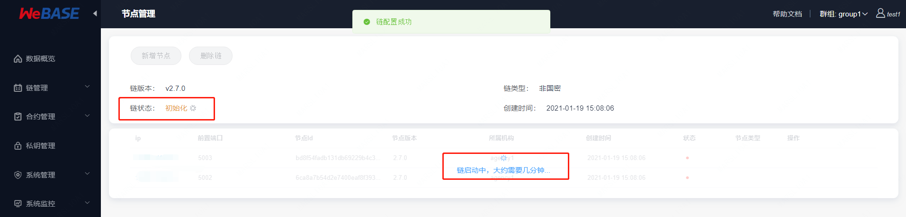

# 可视化部署

可视化部署是指通过 WeBASE 管理平台（WeBASE-Web + WeBASE-Node-Manager），在 **多台** 主机上快速部署 **FISCO-BCOS 底层节点和 WeBASE-Front 前置** 以及 对底层节点的扩容操作。

可视化部署，需要先部署依赖服务，包括管理平台（WeBASE-Web）、节点管理子系统（WeBASE-Node-Manager）、签名服务（WeBASE-Sign）。

然后通过 WeBASE 管理平台（WeBASE-Web）的界面在填入的主机中部署节点（FISCO-BCOS 2.5.0+）和节点前置子系统（WeBASE-Front 1.4.0+）。

<span id="system_require"></span>

## 系统环境

### 硬件配置
使用可视化部署搭建一个 **至少2 节点** 的区块链服务，WeBASE(WeBASE-Node-Manager + WeBASE-Sign)至少配置 **1G** 空闲内存（用于节点管理服务与签名服务）、每个节点+前置的镜像配置至少2G空闲内存（CPU内核数与节点数正相关，如4核可配置4节点），在进行可视化部署时会进行主机的可用内存检测。

**注意：**
- 在企业级部署时，为了安全，推荐将签名服务（WeBASE-Sign）放在内网中，与管理平台、管理子系统分开部署。此处为了方便演示，因此将签名服务（WeBASE-Sign）部署在同一台主机。


**具体配置**

| 名称 | 最低配置  |推荐配置  |
|---|---|---|
| CPU  | 2 核  | 4 核 |
| 内存 |  4 G | 8 G |
| 磁盘 |  100G + | 500G + |

### 操作系统
部署节点的主机操作系统需要满足安装 Docker 服务的最低版本要求；

| 操作系统 | 最低要求 |
| ---- | -------- |
| CentOS / RHEL | CentOS 7.3 |
| Ubuntu | Xenial 16.04 |

<span id="port_open"></span>

### 端口开放

主机防火墙需要开放以下端口。如果是云服务器，需要配置**云服务器安全组策略**中的端口开放规则。

|  端口 | 描述  |
|------|------|
| 22  | 默认SSH登录端口  |
| 5000  |  WeBASE-Web 节点管理平台的访问端口 |

默认使用22作为SSH登录端口，若需要修改，在[Ansible hosts配置](#ansible_host)中可指定SSH端口

**注**，需要确保**链节点**的端口对彼此开放，如**P2P端口**(默认30300)、**节点前置的端口**(默认5002)。

<span id="visual_dependency"></span>

## 系统依赖

配置系统依赖分成**宿主机**（Node-Manager所在主机）与**节点主机**（节点所在主机）两种：
- 宿主机：安装WeBASE-Node-Manager的主机，配置Ansible、配置Ansible免密登录节点机
- 节点主机：用于安装节点的主机，配置docker及docker用户组、配置Ansible用户的sudo权限、安装FISCO BOCS节点依赖

**注：宿主机也需要安装节点时，则需要同时配置**

### 配置Ansible

Ansible配置包括以下三步：
- 宿主机安装Ansible
    - **仅在宿主机安装节点**时，则仅需安装Ansible，无需完成下面两步host与免密配置
- 配置Ansible host列表
- 配置Ansible免密登录到节点主机

#### 安装Ansible

**注**：Ansible只需要安装在宿主机上，节点主机无需安装Ansible，只需配置宿主机到节点主机的免密登录

CentOS
```
yum install epel-release -y
yum install ansible –y
```

Ubuntu
```
apt-get install software-properties-common
apt-add-repository ppa:ansible/ansible
apt-get update
apt-get install ansible 
```

安装完成后，可以通过`--version`检查是否安装成功
```
$ ansible --version
ansible 2.9.15
  config file = /etc/ansible/ansible.cfg
  configured module search path = [u'/root/.ansible/plugins/modules', u'/usr/share/ansible/plugins/modules']
  ansible python module location = /usr/lib/python2.7/dist-packages/ansible
  executable location = /usr/bin/ansible
  python version = 2.7.17 (default, Sep 30 2020, 13:38:04) [GCC 7.5.0]
```

**仅在宿主机安装节点时**，无需操作下文的Ansible host配置和免密配置，直接进入(配置Docker)[#docker]章节，并在部署节点时，添加主机的IP为**127.0.0.1**

<span id="ansible_key_check"></span>

#### 配置Ansible host_key_checking

配置Ansible的Host key checking，将自动确认连接到远程主机
```
vi /etc/ansible/ansible.cfg

# 找到host_key_checking选项
···
host_key_checking = False
``` 

<span id="ssh"></span>

#### 免密登录配置

在节点管理台进行可视化部署时，节点管理（WeBASE-Node-Manager）服务会为每个节点生成相应的配置文件，然后通过Ansible的免密登录远程操作，在远程的节点主机中执行系统命令来操作节点。

下面介绍配置免密登录的各个步骤

```eval_rst
.. important::
    1. 配置 WeBASE-Node-Manager 主机到其它节点主机的 SSH 免密登录；
    2. 配置Ansible的hosts列表并配置免密登录私钥路径
    3. 注意免密登录的账号sudo权限，否则会造成Docker服务启动、检测端口占用失败；
    4. 如果免密账号为非 `root` 账号，保证账号有 `sudo` **免密** 权限，即使用 `sudo` 执行命令时，不需要输入密码；参考[sudo账号配置](#sudo_config)
```

**免密登录配置方法**

```eval_rst
.. important::
    1. 如果 WeBASE-Node-Manager 所在主机已经生成过秘钥对，建议使用命令 `ssh-keygen -t rsa -m PEM` 重新生成；
```

* 登录 WeBASE-Node-Manager 所在主机：
	```Bash
	ssh root@[IP]
	```

* 检查 `~/.ssh/` 目录是否已经存在 `id_rsa` 私钥文件和对应的 `id_rsa.pub` 公钥文件。如果存在，备份现有私钥对
    
    ```Bash
    mv ~/.ssh/id_rsa ~/.ssh/id_rsa.bak
    mv ~/.ssh/id_rsa.pub ~/.ssh/id_rsa.pub.bak 
    ```

* 执行命令 `ssh-keygen -t rsa -m PEM`，然后直接两次回车即可生成（提示输入密码时，直接回车）
	```
	ssh-keygen -t rsa -m PEM
	```

* 将公钥文件上传到需要免密登录的主机（替换 [IP] 为节点主机的 IP 地址），然后输入远程主机的登录密码
	```
	ssh-copy-id -o StrictHostKeyChecking=no -i ~/.ssh/id_rsa.pub root@[IP]
	```

* 输出结果出现 `Number of key(s) added: 1` 结果，表示免密登录配置成功

* 检查从部署 WeBASE-Node-Manager 服务的主机是否能成功免密登录部署节点的主机（替换 [IP] 为主机的 IP 地址）

    ```
    ssh -o StrictHostKeyChecking=no root@[IP]
    ```

*切记妥善保管免密登录的私钥，否则当前主机与ssh免密登录的主机均会被控制*
    
此处配置宿主机免密登录到节点主机完成后，记住宿主机中`id_rsa`私钥的路径，下一步进行Ansible中hosts的免密配置


<span id="ansible_host"></span>

**配置Ansible Hosts与免密登录**

在`/etc/ansible/hosts`文件中添加IP组`webase`，并配置节点主机的IP、免密登录账号和私钥路径、SSH端口。

**注**：若后续需要添加新的主机，需要将新主机的IP添加到此处

添加以下内容：此处假设节点机IP为127.0.0.1，免密登录账户为root，且`id_rsa`免密私钥的路径为`/root/.ssh/id_rsa`，ssh端口使用22端口，添加名为`webase`的IP组
```
vi /etc/ansible/hosts

···
[webase]
127.0.0.1 ansible_ssh_private_key_file=/root/.ssh/id_rsa  ansible_ssh_user=root  ansible_ssh_port=22
{your_host_ip} ansible_ssh_private_key_file={ssh_private_key}  ansible_ssh_user={ssh_user}  ansible_ssh_port={ssh_port}
```

#### 测试Ansible

执行Ansible的`--list-hosts`命令查看是否已添加成功
```
ansible webase --list-hosts
  hosts (2):
    XXX.XXX.XXX.1
    XXX.XXX.XXX.2
```

执行Ansible的`ping`命令，检测添加到hosts中各个节点主机IP能否被访问，免密配置是否已生效
- 若出现`IP | SUCCESS`的则代表该IP可连通
- 如果出现`FAILED`代表该IP无法连接，需要根据上文的免密登录配置进行`ssh -o StrictHostKeyChecking=no root@[IP]`检测

对ansible中的webase ip组进行ping检测
```
ansible webase -m ping

xxx.xxx.xxx.1 | SUCCESS => {
    "ansible_facts": {
        "discovered_interpreter_python": "/usr/bin/python"
    }, 
    "changed": false, 
    "ping": "pong"
}
xxx.xxx.xxx.2 | SUCCESS => {
    "ansible_facts": {
        "discovered_interpreter_python": "/usr/bin/python"
    }, 
    "changed": false, 
    "ping": "pong"
}

```

### 配置Docker

配置Docker需要**在每个安装节点的主机上都要执行**，否则将导致节点远程安装失败。包括以下几个步骤
- 安装Docker并启动Docker
- 配置Docker用户组

#### 安装Docker
安装 Docker 服务，请参考下文**常见问题**中：[Docker 安装](#install_docker)

如果使用云服务器，推荐使用**操作系统镜像模板**的方式创建主机，即在一台主机上安装 Docker 后，然后使用安装 Docker 服务后的操作系统做一个镜像模板。通过这个模板镜像来创建主机，这样新创建的主机就自带了 Docker 服务。

<span id="docker_sudo"></span>

#### 配置docker用户组

若执行Docker命令，如`docker ps`必须使用sudo才能运行，则需要按如下修改：

检测`docker ps`命令
```
docker ps
```

若`docker ps`命令报错Permission Denied则需要配置docker用户组：
```
# 创建docker用户组
sudo groupadd docker
# 将当前用户添加到docker用户组
sudo usermod -aG docker $USER
# 重启docker服务
sudo systemctl restart docker
# 切换或者退出当前账户，重新登入
exit
```

重新登入后，执行`docker ps`如有输出，未报错Permission Denied则代表配置成功

<span id="pull_image"></span>

#### 拉取 Docker 镜像

在WeBASE v1.4.3版本后，可视化部署支持**自动从CDN拉取镜像，无需手动拉取**

若需要**手动配置镜像**，可以通过以下方法配置

可视化部署需要使用`FISCO BCOS + WeBASE-Front`组成的节点与前置Docker镜像，并提供拉取Docker镜像的三种方式（**推荐通过CDN加速服务拉取**）：
- 通过可视化部署页面，自动从CDN拉取镜像压缩包并加载镜像（**推荐**），需要确保wget命令能正常使用
- 在节点主机上手动通过WeBASE CDN服务下载镜像压缩包后，通过`docker load`命令安装镜像
- 在节点主机上手动通过`docker pull`命令直接从DockerHub拉取镜像


```eval_rst
.. important::
	可视化自动部署功能支持自动从 Docker 仓库拉取镜像，仅通过页面点击就可以完成Docker拉取。但是由于DockerHub的网络原因，拉取镜像的速度较慢，耗时过长，容易导致拉取镜像失败，页面的可视化部署操作失败。
	因此，为了保证部署过程顺利和快速完成，可在执行可视化部署前，手动拉取镜像，并将镜像上传到每个需要部署节点服务的主机。
```

拉取镜像的方法，请参考下文**常见问题**中：[拉取 Docker 镜像](#pull_image)


## 部署依赖服务
可视化部署需要依赖 WeBASE 的中间件服务，包括**管理平台（WeBASE-Web）、节点管理子系统（WeBASE-Node-Manager）、签名服务（WeBASE-Sign）**。

对于依赖服务的安装，有两种方式（ **一键部署** 和 **手动部署** ），选择其中一种部署方式即可

<span id="visual-deploy-onclick"></span>

#### 1. 一键部署依赖服务

适合**同机部署**，快速体验WeBASE的情况使用

**一键部署依赖**

具体环境依赖参考[**一键部署-前提条件**](../WeBASE/install.html#id2)。

**拉取部署脚本**

获取部署安装包：
```shell
wget https://github.com/WeBankFinTech/WeBASELargeFiles/releases/download/v1.4.3/webase-deploy.zip
```
解压安装包：
```shell
unzip webase-deploy.zip
```
进入目录：
```shell
cd webase-deploy
```

**注意：**
- 配置可视化部署配置文件时，选择`visual-deploy.properties`进行配置
- 选择部署方式时，选择 **可视化部署** 方式，即执行 `deploy.py` 脚本时，执行 `python3 deploy.py installWeBASE`

修改 `visual-deploy.properties` 文件。
<span id="visual-deploy-config"></span>


```eval_rst
.. important::
    注意： `sign.ip` 配置的 IP 是WeBASE-Sign签名服务对外提供服务访问的 IP 地址，供其他部署节点主机访问。
```

```shell
# WeBASE子系统的最新版本(v1.1.0或以上版本)
webase.web.version=v1.4.3
webase.mgr.version=v1.4.3
webase.sign.version=v1.4.3
fisco.webase.docker.cdn.version=v1.4.3

# 节点管理子系统mysql数据库配置
mysql.ip=127.0.0.1
mysql.port=3306
mysql.user=dbUsername
mysql.password=dbPassword
mysql.database=webasenodemanager

# 签名服务子系统mysql数据库配置
sign.mysql.ip=localhost
sign.mysql.port=3306
sign.mysql.user=dbUsername
sign.mysql.password=dbPassword
sign.mysql.database=webasesign

# WeBASE管理平台服务端口
web.port=5000

# 节点管理子系统服务端口
mgr.port=5001

# 签名服务子系统端口
sign.port=5004

# WeBASE-Sign 对外提供服务的访问 IP 地址
# 部署在其它主机的节点前置，需要使用此 IP 访问 WeBASE-Sign 服务
# 不能是 127.0.0.1 或者 localhost
sign.ip=

# 是否使用国密（0: standard, 1: guomi）
# 此配置决定可视化部署搭建国密或非国密的链
encrypt.type=0

```

完成配置文件修改后，则执行部署：

**备注：** 

- 部署脚本会拉取相关安装包进行部署，需保持网络畅通。
- 首次部署需要下载编译包和初始化数据库，重复部署时可以根据提示不重复操作
- 部署过程中出现报错时，可根据错误提示进行操作，或根据本文档中的[常见问题](#q&a)进行排查
- 不建议使用sudo执行脚本，例如`sudo python3 deploy.py installWeBASE`（sudo会导致无法获取当前用户的环境变量如JAVA_HOME）
- 推荐使用Python 3.6及以上版本


```shell
# 部署并启动可视化部署的所有服务
python3 deploy.py installWeBASE
```

如果遇到docker必须使用sudo运行，报错`Docker....Permission Denied`，可以参考[常见问题-创建docker用户组](#docker_sudo)

部署完成后可以看到`deploy has completed `的日志：

```shell
$ python3 deploy.py installWeBASE
...
============================================================
              _    _     ______  ___  _____ _____ 
             | |  | |    | ___ \/ _ \/  ___|  ___|
             | |  | | ___| |_/ / /_\ \ `--.| |__  
             | |/\| |/ _ | ___ |  _  |`--. |  __| 
             \  /\  |  __| |_/ | | | /\__/ | |___ 
              \/  \/ \___\____/\_| |_\____/\____/  
...
...
============================================================
==============      deploy has completed     ==============
============================================================
==============    webase-web version  v1.4.3        ========
==============    webase-node-mgr version  v1.4.3   ========
==============    webase-sign version  v1.4.3       ========
============================================================
```


* 服务部署后，需要对各服务进行启停操作，可以使用以下命令：

```shell
# 可视化部署
部署并启动可视化部署的所有服务  python3 deploy.py installWeBASE
停止可视化部署的所有服务  python3 deploy.py stopWeBASE
启动可视化部署的所有服务  python3 deploy.py startWeBASE
# 各子服务启停
启动WeBASE-Node-Manager: python3 deploy.py startManager
停止WeBASE-Node-Manager: python3 deploy.py stopManager
启动WeBASE-Web:          python3 deploy.py startWeb
停止WeBASE-Web:          python3 deploy.py stopWeb
启动WeBASE-Sign:        python3 deploy.py startSign
停止WeBASE-Sign:        python3 deploy.py stopSign
```

<span id="visual-deploy-manual"></span>

#### 2. 手动部署依赖服务
适合**多机部署**，企业级的情况使用。

具体步骤如下：

* 签名服务（WeBASE-Sign）
    
    * 参考 [签名服务 WeBASE-Sign 部署文档](../WeBASE-Sign/install.html#id1) 部署 WeBASE-Sign 服务。
	* 安装后需要将Sign的外网IP Port配置到下文的WeBASE-Node-Manager中

* 管理平台（WeBASE-Web）

    * 参考 [节点管理平台 WeBASE-Web 部署文档](../WeBASE-Web/install.html#id1) 部署 WeBASE-Web 服务
    
* 节点管理子系统（WeBASE-Node-Manager）
    * 参考 [节点管理服务 WeBASE-Node-Manager 部署文档](../WeBASE-Node-Manager/install.html#id1) 部署 WeBASE-Node-Manager 服务
    * 修改 `WeBASE-Node-Manager/dist/conf/application.yml` 配置文件示例如下：
        * 配置文件中 `deployType` 为 `1`，启用节点管理服务的可视化部署功能
        * 配置文件中 `webaseSignAddress` 的 IP 地址，其余节点主机需要通过此IP访问签名服务
    
```eval_rst
.. important::
    1. 注意 WeBASE-Node-Manager 服务的 `webaseSignAddress` 配置。WeBASE-Front 节点会使用此地址访问 WeBASE-Sign。所以不能使用 **`127.0.0.1`**，需要填写对外服务的 IP 地址。
```

```yaml
 constant:
  # 1.4.0 visual deploy
  # 部署方式修改为 1，启用可视化部署
  deployType: 1
  
  # WeBASE-Sign 服务的访问地址，前面部署的签名服务的访问地址
  # 注意 IP 地址，WeBASE-Front 会使用此 IP 地址访问签名服务
  # 因此，在可视化部署中，此处不能使用 127.0.0.1或localhost
  webaseSignAddress: "xxx.xx.xx.xxx:5004"
  
```


## 可视化部署节点

在部署完依赖服务后，使用浏览器，访问节点管理平台页面：

```Bash
# 默认端口 5000
http://{deployIP}:{webPort}
```

具体部署步骤，请参考下文进行部署操作
<span id="deploy_chain"></span>

#### 部署节点

可视化部署节点时，后台服务将通过在各个主机安装`FISCO BCOS + WeBASE-Front`的Docker镜像，结合免密远程操作进行自动化部署节点与节点前置的过程。

因此，正如上文步骤中“拉取Docker镜像”的阐述，此操作依赖Docker服务，并默认从CDN自动加载节点与前置的Docker镜像

**提示：**
- 在执行部署前，请提前在节点机中 **手动安装 Docker 服务** 

    - 参考下文 **常见问题** 中的 [安装 Docker](#install_docker)
    
- 如果部署 **国密** 版本
    - 国密链需要将WeBASE-Node-Manager yml中的`encryptType`配置修改为1
- 部署时，默认的链名为`default_chain`，默认机构名为`agency1`
- 部署节点的所有操作将使用[Ansible免密](#ansible_host)的免密SSH账号进行操作，请确保Ansible自检通过


打开节点管理平台页面后，登录后修改密码，默认进入**可视化部署引导页**，点击右上角可以进入主机管理开始部署节点

部署节点主要包含三步：添加并检测节点主机、初始化主机（检查Docker与安装依赖）

首先需要选中镜像拉取方式，推荐使用自动从CDN拉取并加载方式。**离线环境或网络不好**的情况下，推荐使用[手动加载](#pull_image)方式，提前在各个节点主机下载并加载镜像

**（一）添加主机**：


添加主机时，需要填入主机的**IP**与部署节点的**目录**
- 仅在宿主机（即节点管理服务所在主机）部署节点时，则添加主机必须为**127.0.0.1**，否则填写公网IP或内网IP需要(配置Ansible host)[#ansible_host]
- 添加主机时，将检查该IP是否可以连通，同时将检查该主机的路径是否可访问，并自动创建该目录


**（二）添加节点信息**：


节点管理，先点击“新增节点”添加节点信息
- 可以在一台主机中指定**节点数量**
- 添加多个主机的节点，需要确保填入的各个主机间的**P2P端口和前置端口互通**，否则将影响节点正常运行


**（三）检查主机**：


添加节点信息后，将自动检查一下依赖
- 检查主机的**可用内存**是否支持当前的节点数
- 检测机器的**端口**是否已被占用
- 检测**Docker服务**是否已启用，并通过hello-world的镜像进行测试


检测失败的信息将在**操作日志**中显示，只有添加的节点信息全部通过才可以开始下一步“初始化”
- 如果提示内存不足(Free memory too low)，则可以释放主机内存，一节点至少 **1G** 可用内存(Free memory)
- 如果提示端口被占用，可根据提示的端口号，在主机**释放端口**或删除填入的节点信息，修改后重新填入
- 如果提示Docker相关错误，需要到主机确认已[安装Docker并已启用](#install_docker)，是否已[配置Docker组](#docker_sudo)，确保能拉取并运行hello-world镜像


排除错误原因后，可以点击“检测”按钮，再次检测

**（四）初始化主机**：

点击“初始化”按钮进行主机初始化，将自动完成以下操作，初始化成功后才能进行下一步的部署操作，“初始化”按钮将变成“部署”按钮
- 检测并安装相关系统依赖，如`netstat`, `wget`等
- 加载节点镜像：根据选中的镜像加载方式进行加载（若手动加载则检测镜像已存在于节点主机）


- 初始化操作预计在**两到三分钟**内完成，若**网速过慢或不稳定**建议通过[手动加载镜像](#pull_image)方式拉取
若初始化失败，则需要结合**操作日志**排查上述步骤的错误原因，排除主机中存在的问题后，**重新执行检测，初始化**操作

**（五）部署**：

添加的主机状态都为“初始化成功”后，点击“**部署**”按钮后，将自动完成以下操作
- 根据填入的节点信息自动生成链配置与证书
- 通过SCP将节点与前置的配置文件、证书传输到各个主机的指定目录下


- 生成配置与传输配置完成后，将自动进入链初始化页面，届时将自动启动各个主机的节点，此过程**预计需要几分钟时间**，直到链状态为“**运行*”



若出现启动失败，需要结合报错提示，检查节点主机状态正常，各个节点主机间端口互通，网速过慢或网络丢包严重等等，排查后，点击“删除链”重置当前的链后，重新尝试建链
- 如始终无法部署，可以结合Node-Manager日志排查错误原因，并在github上提交配上日志的issue


<span id="add_node"></span>

#### 新增节点
节点新增，也称作节点扩容，指在已有的区块链服务中，在新的主机上，添加一个新的节点。

**提示：**
- 新主机需要按照[系统依赖](#visual_dependency)中的**节点机**进行配置
    - 参考上文的 [配置 SSH 免密登录](#ssh)，配置宿主机到新主机的免密登录
    - 参考上文的[Ansible host更新](#ansible_host)，把新主机的IP加到Ansible的hosts配置中
    - 参考下文**常见问题**中的 [安装 Docker](#install_docker)

- 新增的节点，**默认处于游离状态**，需要手动**变更节点为共识或者观察节点**后，新节点开始从原有节点同步区块数据。


**具体操作：**

新增节点与部署时是同样的三个步骤：添加并检测节点主机、初始化主机（检查Docker与安装依赖）、启动节点并重启链

**添加主机**：

若需要添加新的主机时，填入主机的**IP**与部署节点的**目录**


* 点击**新增节点**按钮


添加主机信息，与部署链时相似的操作
- 选择 Docker 拉取方式，推荐使用CDN拉取，**离线环境或网络不好**的情况下，推荐使用[手动加载](#pull_image)方式，提前在各个节点主机下载并加载镜像
- 选择“新增节点”添加信息，选择主机与节点的端口、节点数量等；
- **注**，若需要添加新的主机，则按文档的[环境要求](#system_require)准备新的主机，并到“主机管理”添加主机

依次执行同[部署链](#deploy_chain)相同的检测、初始化、部署即可


点击“部署”后将生成并传输新的节点的配置文件到目标主机，同时新增节点比部署链会多出以下操作
- 自动在链的其他节点中**添加新节点的P2P连接配置**，并在新节点的P2P配置中添加本次新增节点的IP与已有的非游离节点的IP
- [可选]配置完成后，需要“重启”已有节点才能使新的P2P配置在已有节点中生效，即双向互联；此操作可视具体情况自行操作
- 若新节点启动失败，将新节点删除并重新尝试添加即可


重启完成后，需要创建私钥或使用已有私钥，将新节点**设为共识节点**或观察节点


#### 节点操作
节点操作，包括：节点的启停、节点共识类型切换、删除节点


* 节点的类型切换：共识，观察和游离
    - 在可视化部署中，变更节点为游离节点时，该群组内，至少仍有两个共识节点
    - 变更节点类型，需要发送交易，请先在**私钥管理 中 添加私钥账号；**

修改节点为共识节点


若需要添加私钥：


* 节点的启动，停止
    - 若节点的docker容器被意外删除，通过页面点击“启动”即可完成节点重启
    - 停止或重启操作时，请确保满足链的共识容错要求。设为观察节点可避免影响共识状态
    - 每次启停操作大约需要30秒
* 删除节点
    - 将节点设置为游离节点后，即可安全删除节点，删除后，链将会移除被删节点的P2P配置，并重启链
    - 删除节点时，节点必须处于停止状态


<span id="q&a"></span>
## 常见问题

<span id="install_docker" />

#### 安装 Docker
在 Debian/Ubuntu/CentOS/RHEL，直接执行命令：

```Bash
# 该脚本是 Docker 官方提供的 Linux 自动安装脚本
bash <(curl -s -L get.docker.com)
```

在 CentOS/RHEL 8.x 中，使用上面的自动脚本安装时，会出现下面的错误：

```Bash
Last metadata expiration check: 0:37:43 ago on Sat 22 Feb 2020 07:40:15 PM CST.
Error: 
 Problem: package docker-ce-3:19.03.6-3.el7.x86_64 requires containerd.io >= 1.2.2-3, but none of the providers can be installed
  - cannot install the best candidate for the job
  - package containerd.io-1.2.10-3.2.el7.x86_64 is excluded
  - package containerd.io-1.2.2-3.3.el7.x86_64 is excluded
  - package containerd.io-1.2.2-3.el7.x86_64 is excluded
  - package containerd.io-1.2.4-3.1.el7.x86_64 is excluded
  - package containerd.io-1.2.5-3.1.el7.x86_64 is excluded
  - package containerd.io-1.2.6-3.3.el7.x86_64 is excluded
(try to add '--skip-broken' to skip uninstallable packages or '--nobest' to use not only best candidate packages) 
```

要解决这个问题，需要手动安装 `containerd.io`后，在执行自动安装脚本

```Bash
# 下载最新的 containerd.io 安装包
wget https://download.docker.com/linux/centos/8/x86_64/stable/Packages/containerd.io-1.2.13-3.2.el7.x86_64.rpm 

# 手动安装 containerd.io 
yum localinstall containerd.io-1.2.13-3.2.el7.x86_64.rpm 

```
<span id="pull_image" />

#### 拉取 Docker 镜像

镜像版本：
- v2.7.1

**提示：**
- 最近的镜像版本，请参考：[https://hub.docker.com/r/fiscoorg/fisco-webase/tags](https://hub.docker.com/r/fiscoorg/fisco-webase/tags)

##### 拉取方式

* 检查本地是否已有镜像
    
```Bash
# 检查本地是否有镜像
docker images -a |grep -i "fiscoorg/fisco-webase" | grep -i v2.7.1
    
# 如果有如下输出，表示本地已有镜像；否则表示本地没有镜像
fiscoorg/fisco-webase   v2.7.1     bf4a26d5d389  5 days ago   631MB
```
    
* 如果本地没有镜像（如果本地有镜像，跳过）
    
    * 从 CDN 拉取镜像压缩包
    
    ```Bash
    # 从 CDN 拉取镜像 tar 文件
    # 非国密
    wget https://osp-1257653870.cos.ap-guangzhou.myqcloud.com/WeBASE/releases/download/v1.4.3/docker-fisco-webase.tar
    
    # 解压镜像 tar 文件
    docker load -i docker-fisco-webase.tar
    ```
    
    * 从 Docker 官方拉取镜像

   ```Bash
   # 执行 Docker 拉取命令
   docker pull fiscoorg/fisco-webase:v2.7.1 
   ```
   
* 压缩镜像到 `tar` 文件
    
```Bash
# 压缩镜像为 tar 文件
docker save -o docker-fisco-webase.tar fiscoorg/fisco-webase:v2.7.1
```
    
* 发送镜像 `tar` 文件到部署节点的主机

```Bash
# 发送镜像 tar 文件到需要部署节点的主机
scp docker-fisco-webase.tar root@[IP]:/root/
```
    
* 解压镜像 `tar` 文件
    
```Bash
# 登录需要部署的主机，解压 tar 文件
docker load -i docker-fisco-webase.tar
```
    
* 节点主机检查是否已经成功拉取镜像
    
```Bash
# 检查是否成功拉取镜像
docker images -a |grep -i "fiscoorg/fisco-webase"
    
# 如果有如下输出，表示拉取成功
fiscoorg/fisco-webase   v2.7.1  bf4a26d5d389  5 days ago   631MB
```

<span id="tassl"></span>

#### 手动下载 TASSL 

FISCO BCOS 国密版本需要使用 TASSL 生成国密版本的证书，部署工具会自动从GitHub 下载，解压后放置于 `~/.fisco/tassl`(文件名为tassl)，如果碰到下载失败，请尝试从[https://gitee.com/FISCO-BCOS/LargeFiles/blob/master/tools/tassl.tar.gz](https://gitee.com/FISCO-BCOS/LargeFiles/blob/master/tools/tassl.tar.gz) 下载并解压后，放置于 `~/.fisco/tassl`

    
#### 没有进入可视化部署界面
在登录区块链管理平台后，没有进入可视化部署页面。此时，修改 WeBASE-Node-Manager 服务中的 `dist/conf/application.yml` 文件中的 `deployType` 的值是否为 `1` 后，重启 WeBASE-Node-Manager 服务即可。

#### 新增节点时，提示请手动拉取 Docker 镜像错误

SSH 登录新主机，使用 `docker images -a |grep -i "fiscoorg/fisco-webase"` 命令检查是否有镜像。

* 如果存在，请参考上文： **常见问题** 中的 [拉取 Docker 镜像](#pull_image)

* 如果**不**存在，请检查新主机中 SSH 账号的 `sudo` 免密配置。


#### 部署失败以及区块链重置
如果在部署区块链服务时，出现了部署失败的问题，可以使用重置功能，重置区块链服务，然后进行重新部署。

如果要重置当前区块链，点击**重置**按钮，等待重置完成。

执行重置操作，并 **不会真正物理删除节点的数据**（但会删除WeBASE数据库中链相关数据），而是使用 `mv` 命令，将区块链的整个数据移动到临时目录。

- WeBASE-Node-Manager 服务的临时目录
    * `WeBASE-Node-Manager/dist/NODES_ROOT_TMP` 目录中存放了所有重置节点的节点配置文件
    * **不包含**具体的节点数据文件
    * 文件名格式 `default_chain-YYYYMMDD_HHmmSS（删除时间）`：default_chain-20200722_102631
    
- 节点主机中的临时目录
    * `WeBASE-Node-Manager/dist/conf/application.yml` 配置文件中 `rootDirOnHost` 配置目录下的 `deleted-tmp` 目录
    * 包含了**节点的所有文件**配置文件和节点数据文件
    * 文件名格式 `default_chain-YYYYMMDD_HHmmSS（删除时间）`：default_chain-20200722_102631


<span id="docker_sudo"></span>

#### docker必须使用sudo才能运行，但是sudo下系统环境变量失效

答：可以在root用户下配置环境变量如JAVA_HOME等，或者通过下面操作，尝试创建docker用户组

```
# 创建docker用户组
sudo groupadd docker
# 将当前用户添加到docker用户组
sudo usermod -aG docker $USER
# 重启docker服务
sudo systemctl restart docker
# 切换或者退出当前账户，重新登入
exit
```

<span id="sudo_config"></span>

#### sudo账号免密配置
**节点主机 sudo 账号免密配置方法**

```Bash
# 切换到 root 或者有权限账户
vi /etc/sudoers

# 添加下面一行并保存
# 替换 user 为 SSH 免密登录账号
user   ALL=(ALL) NOPASSWD : ALL
```

*注，可视化部署中需要使用sudo权限执行`script/deploy`目录中的host_init_shell进行依赖安装，host_docker_check在docker未启动情况下启动docker服务，host_check_port通过sudo netstat检查端口占用情况*

#### 页面中只能部署或添加“国密”节点或“非国密”节点

答：需要修改Node-Manager的yml中`encryptType`配置项后重启即可（0为非国密，1为国密）。

注：不支持修改已搭建链的类型，若需要修改，则需要重置链后重新进行可视化搭建。


#### 可视化部署如何升级节点版本

答：可视化部署暂未支持节点升级。

#### 节点主机检测报错可用内存不足(free memory)

答：每个“节点+节点前置”至少需要1G的可用内存，建议增大主机的机器内存，或释放更多的可用内存(Free memory)。

**在root用户下**执行以下操作可以释放available内存转为free内存
```
sync; echo 1 > /proc/sys/vm/drop_caches
sync; echo 2 > /proc/sys/vm/drop_caches
sync; echo 3 > /proc/sys/vm/drop_caches
```
> sync 命令运行 sync 子例程。如果必须停止系统，则运行sync 命令以确保文件系统的完整性。sync 命令将所有未写的系统缓冲区写到磁盘中，包含已修改的 i-node、已延迟的块 I/O 和读写映射文件
> To free pagecache
> use echo 1 > /proc/sys/vm/drop_caches; to free dentries and inodes
> use echo 2 > /proc/sys/vm/drop_caches; to free pagecache, dentries and inodes
> use echo 3 > /proc/sys/vm/drop_caches.

#### 如何进行节点部署的离线安装

答：参考环境依赖，将相关依赖都安装好之后
- 部署时选择手动拉取节点的Docker镜像，并在节点主机手动配置镜像，
- 安装`docker run hello-world`所需的hello-world的docker镜像用于主机检测
- 下载TASSL包解压后放到`~/.fisco/`目录中(文件名为tassl)，可以参考[手动配置TASSL](#tassl)

#### 链部署失败或节点添加失败排查

页面提示**请求超时**，如添加主机、初始化主机等
- 登录主机检查主机是否卡顿或存在异常

若点击**初始化**按钮后，显示“加载Docker镜像”时，初始化主机失败或提示超时
- 检查主机网速，默认的超时时间为60s，如果网速过慢或丢包严重，可以尝试手动下载cdn镜像包查看网速，并建议通过**手动加载镜像**方式，提前下载镜像并加载到节点主机

若出现**部署链或节点**时，需要结合报错提示，通过以下步骤排查：
- 检查节点主机状态正常，如top命令检查CPU或内存使用率正常
- 若在部署或检查过程均频现失败，通过ping命令检查宿主机到节点主机的延迟，延迟过高需要排除问题后再次尝试
- 检查主机硬盘余量是否充足
- 链显示运行中，但是节点异常时，需要确保各个节点主机间端口互通，如节点主机之间的P2P端口互通（保证共识），宿主机到节点主机的Front端口互通（保证WeBASE服务）等

**通过日志排查**：无法根据提示排查错误，可以在webase-node-mgr(即节点管理服务构建生成的的dist)目录中搜索一下日志
- 部署链失败时
```
# 进度显示生成链配置时错误，则搜索此关键字
grep "configChainAndScp" log/WeBASE-Node-Manager.log 
# 进度条显示传输链配置时错误，则搜索此关键字
grep "scpConfigHostList" log/WeBASE-Node-Manager.log 
```
- 新增节点失败时
```
grep "batchAddNode" log/WeBASE-Node-Manager.log
```


