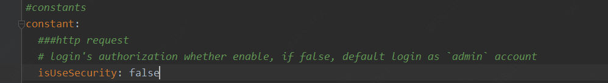
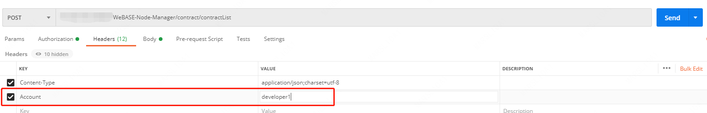

## 附录


### 1. 安装问题

#### 1.1 Java部署

<span id="jdk"></span>
##### CentOS环境安装Java
<span id="centosjava"></span>

**注意：CentOS下OpenJDK无法正常工作，需要安装OracleJDK[下载链接](https://www.oracle.com/technetwork/java/javase/downloads/index.html)。**

```
# 创建新的文件夹，安装Java 8或以上的版本，将下载的jdk放在software目录
# 从Oracle官网(https://www.oracle.com/technetwork/java/javase/downloads/index.html)选择Java 8或以上的版本下载，例如下载jdk-8u201-linux-x64.tar.gz
$ mkdir /software

# 解压jdk
$ tar -zxvf jdk-8u201-linux-x64.tar.gz

# 配置Java环境，编辑/etc/profile文件
$ vim /etc/profile

# 打开以后将下面三句输入到文件里面并保存退出
export JAVA_HOME=/software/jdk-8u201  #这是一个文件目录，非文件
export PATH=$JAVA_HOME/bin:$PATH
export CLASSPATH=.:$JAVA_HOME/lib/dt.jar:$JAVA_HOME/lib/tools.jar

# 生效profile
$ source /etc/profile

# 查询Java版本，出现的版本是自己下载的版本，则安装成功。
java -version
```

##### Ubuntu环境安装Java
<span id="ubuntujava"></span>

```
  # 安装默认Java版本(Java 8或以上)
  sudo apt install -y default-jdk
  # 查询Java版本
  java -version
```

#### 1.2 Gradle部署

此处给出简单步骤，供快速查阅。更详细的步骤，请参考[官网](http://www.gradle.org/downloads)。

（1）从[官网](http://www.gradle.org/downloads)下载对应版本的Gradle安装包，并解压到相应目录

```shell
mkdir /software/
unzip -d /software/ gradleXXX.zip
```

（2）配置环境变量

```shell
export GRADLE_HOME=/software/gradle-4.9
export PATH=$GRADLE_HOME/bin:$PATH
```

（3）查看版本

```
gradle -version
```


### 2. 常见问题及方案
##### 一般问题
* 问：执行shell脚本报下面错误：
```
[app@VM_96_107_centos deployInputParam]$ bash start.sh
start.sh: line 2: $'\r': command not found
start.sh: line 8: $'\r': command not found
start.sh: line 9: $'\r': command not found
start.sh: line 10: $'\r': command not found
```
答：这是编码问题，在脚本的目录下执行转码命令：
```shell
dos2unix *.sh
```


##### 数据库问题
* 问：服务访问数据库抛出异常：
```
The last packet sent successfully to the server was 0 milliseconds ago. The driver has not received any packets from the server.
```
答：检查数据库的网络策略是否开通
```
下面以centos7为例：
查看防火墙是否开放3306端口： firewall-cmd --query-port=3306/tcp
防火墙永久开放3306端口：firewall-cmd --zone=public --add-port=3306/tcp --permanent
重新启动防火墙：firewall-cmd --reload
```

* 问：执行数据库初始化脚本抛出异常：
```
ERROR 2003 (HY000): Can't connect to MySQL server on '127.0.0.1' (110)
```
答：MySQL没有开通该帐号的远程访问权限，登录MySQL，执行如下命令，其中TestUser改为你的帐号
```
GRANT ALL PRIVILEGES ON *.* TO 'TestUser'@'%' IDENTIFIED BY '此处为TestUser的密码’' WITH GRANT OPTION;
```

##### WeBASE-Node-Manager服务搭建问题
* 问：执行构建命令`gradle build -x test`抛出异常：
```
A problem occurred evaluating root project 'WeBASE-Node-Manager'.
Could not find method compileOnly() for arguments [[org.projectlombok:lombok:1.18.2]] on root project 'WeBASE-Node-Manager'.
```
答：
方法1、已安装的Gradle版本过低，升级Gradle版本到4.10以上即可。
方法2、直接使用命令：`./gradlew build -x test`，如果提示gradlew为非可执行文件，执行`chmod +x ./gradlew`再次执行build操作即可。

##### 启动问题

* 问：启动Node-Manager进程后，后台日志显示`not found any front`：

答：此处为正常提示，表示后台没有可访问的节点前置。通过WeBASE-Web连接Node-Manager后台服务后，添加节点前置即可。

##### 节点管理服务忘记密码

登录到WeBASE-Node-Manager中配置的Mysql数据库（默认为webasenodemanager）后，在`tb_account_info`中插入一条新的管理员账号`test`，密码`Abcd1234`

```
INSERT INTO tb_account_info (account,account_pwd,role_id,create_time,modify_time)values('test', '$2a$10$F/aEB1iEx/FvVh0fMn6L/uyy.PkpTy8Kd9EdbqLGo7Bw7eCivpq.m',100000,now(),now());
```

##### 免鉴权调用

在`application.yml`中配置`constant.isUseSecurity`为`false`即可禁用WeBASE-Node-Manager的登录鉴权。



- 免鉴权后，默认使用的是管理员用户admin（管理员用户可以看到所有用户的数据），可以调过登陆直接访问WeBASE-Web节点管理台的主页，如`http://localhost:5000/#/home`。
- 若需要指定用户进行接口调用，可以在请求的`headers`中增加`Account`字段，其值设置为节点管理服务的用户名，如获取开发者用户`developer1`对应数据（开发者用户只能看到自己所创建的数据）。




### 3. 配置文件解析

| 参数 | 默认值    | 描述          |
|------|-------------|-----------|
| server.port  | 5001 | 当前服务端口   |
| server.servlet.context-path  | /WeBASE-Node-Manager | 当前服务访问路径   |
| mybatis.typeAliasesPackage  | com.webank.webase.node.mgr | mapper类扫描路径   |
| mybatis.mapperLocations  | classpath:mapper/*.xml | mybatis的xml路径   |
| spring.datasource.driver-class-name | com.mysql.cj.jdbc.Driver | mysql驱动   |
| spring.datasource.url | jdbc:mysql://127.0.0.1:3306/webasenodemanager | mysql连接地址   |
| spring.datasource.username | defaultAccount |  mysql账号  |
| spring.datasource.password | defaultPassword |  mysql密码  |
| logging.config | classpath:log/log4j2.xml | 日志配置文件目录   |
| logging.level | com.webank.webase.node.mgr: info |  日志扫描目录和级别  |
| constant.isDeleteInfo | true | 是否定时删除数据（区块、交易hash、审计数据）；true-是，false-否   |
| constant.transRetainMax | 10000 |表中交易hash保留的条数（开启constant.isDeleteInfo时有效） |
| constant.deleteInfoCron | "0 0/1 * * * ?" | 定时删除数据的频率，默认一分钟   |
| constant.statisticsTransDailyCron | "0 0/1 * * * ?" | 统计交易记录的执行频率，默认一分钟|
| constant.resetGroupListCycle | 600000 | 刷新群组列表任务执行完后，下一个开始间隔（毫秒）   |
| constant.groupInvalidGrayscaleValue | 1M |  群组失效灰度期长度，灰度期过后，如果还没查到失效状态的群组，就删除（y:年, M:月, d:天, h:小时, m:分钟, n:永远有效）  |
| constant.notSupportFrontIp | localhost | 不支持的前置ip   |
| constant.isBlockPullFromZero | false |  是否从0开始同步区块信息（true-是，false-最新块开始同步）  |
| constant.pullBlockInitCnts | 1000 | 最新块的前1000个块之后开始同步（constant.isBlockPullFromZero=false时有效） |
| constant.pullBlockSleepTime | 200 |  拉完一个区块，睡眠时间（毫秒）  |
| constant.pullBlockTaskFixedDelay | 30000 |  拉区块任务执行完后，间隔多久开始下一次（毫秒）|
| constant.blockRetainMax | 10000 |  表中区块保留的条数（开启constant.isDeleteInfo时有效）  |
| constant.verificationCodeMaxAge | 300 | y验证码有效时长（秒） |
| constant.authTokenMaxAge | 1800 |  登录token有效时长（秒）  |
| constant.isUseSecurity | true | 是否启用登录鉴权，若false则默认使用admin权限免登陆鉴权   |
| constant.aesKey | ERTadb83f9ege39k | aes加密key（16位），建议更改 |
| constant.jwtSecret | S3g4HtJyg7G6Hg0Ln3g4H5Jyg7H6f9dL |  jwt生成时用到的key，建议更改  |
| constant.frontUrl | http://%1s:%2d/WeBASE-Front/%3s | 前置服务的请求路径  |
| constant.httpTimeOut | 5000 | http请求超时时间（毫秒）  |
| constant.contractDeployTimeOut | 30000 | 合约部署超时时间（毫秒）  |
| constant.isPrivateKeyEncrypt | true | 前置私钥接口返回的私钥是否需要加密，true-加密，false-不加密  |
| constant.maxRequestFail | 3 |  请求前置（frot）被允许失败次数，达到配置值后，将会停止往该路径发送请求  |
| constant.sleepWhenHttpMaxFail | 60000 | 请求失败次数过多，熔断时间长度（毫秒） |
| constant.transMonitorTaskFixedRate | 60000  | 交易审计开始执行后，下一个任务开始时间（毫秒）  |
| constant.analysisSleepTime | 200 | 审计完一条交易hash后，睡眠时间（毫秒）  |
| constant.monitorInfoRetainMax | 10000 | 表中审计数据保留的条数（开启constant.isDeleteInfo时有效） |
| constant.isMonitorIgnoreUser | false | 审计逻辑是否忽略私钥用户  |
| constant.isMonitorIgnoreContract | false |  审计逻辑是否忽略合约 |
| constant.monitorUnusualMaxCount | 20 | 审计异常数据被允许最大值，到达后会停止审计  |
| constant.auditMonitorTaskFixedDelay | 300000 | 监控审计数据任务的运行间隔时间，异常时将发送告警邮件（毫秒）（注：此处为检查频率，告警配置中是告警频率）  |
| constant.nodeStatusMonitorTaskFixedDelay | 60000 | 监控节点状态任务的运行间隔时间，异常时将发送告警邮件（毫秒）（注：此处为检查频率，告警配置中是告警频率）  |
| constant.certMonitorTaskFixedDelay | 300000 | 监控证书任务的运行间隔时间，有效期结束7天前时将发送告警邮件（毫秒） （注：此处为检查频率，告警配置中是告警频率） |
| constant.deployType | 0 |  部署方式选择：0-手动添加前置，1-可视化部署 |
| constant.dockerRepository | fiscoorg/fisco-webase |  镜像名 |
| constant.webaseSignAddress | 127.0.0.1:5004 |  WeBASE-Sign 访问地址(不能是localhost) |
| constant.dockerRestartPeriodTime | 30000 |  单位ms，节点Docker容器重启的超时时间，默认30秒  |
| constant.execScpTimeout | 10000 |  单位ms，主机间SCP的超时时间（网络差时需要适当调大） |
| constant.execAddNodeTimeout | 40000 | 单位ms，添加节点的超时时间  |
| constant.execDockerCheckTimeout | 55000 | 单位ms，执行docker检测的超时时间  |
| constant.execHostCheckTimeout | 55000 | 单位ms，执行主机检测的超时时间  |
| constant.execHostCheckPortTimeout | 50000 | 单位ms，执行主机端口检测的超时时间  |
| constant.execHostInitTimeout | 300000 |  单位ms，执行主机初始化的超时时间，默认5min（需要下载镜像包，网速慢需要适当调大） |
| constant.execHostConfigTimeout | 40000 | 单位ms，配置主机的链节点超时时间  |
| constant.execBuildChainTimeout | 40000 | 单位ms，执行建链脚本/生成节点证书脚本的超时时间  |
| constant.execShellTimeout | 600000 | 单位ms，执行脚本的超时实际，默认10min  |
| constant.developerModeEnable | false |  是否启用开发者模式（管理员、用户并增加开发者角色） |
| constant.deployedModifyEnable | true |  是否允许重复部署合约 |
| constant.enableVerificationCode | true |  验证码是否启用随机 |
| constant.verificationCodeValue | "8888" |  当不启用验证码的随机时，设置固定验证码（方便联调） |
| constant.ignoreCheckFront | /account/login,/account/pictureCheckCode,/login,/user/privateKey/**,/config/encrypt,/config/version,/front/refresh,/api/* |  直接访问前置的URI |
| constant.resetGroupListInterval | 15000 |  异步刷新所有群组连接的间隔，默认15s |
| constant.appRequestTimeOut | 300000 | 接入应用的请求间隔（ms）  |
| constant.appStatusCheckCycle | 3000 | 接入应用的状态检查频率（ms）  |
| constant.statBlockRetainMax | 100000 | 区块监控数据的最大存储量  |
| constant.statBlockFixedDelay | 5000 | 区块监控数据的频率（ms）  |
| constant.statBlockPageSize | 10 | 区块监控数据拉取的单次请求量  |
| constant.enableExternalFromBlock | true  | 是否启用全量用户与全量合约采集  |
| sdk.encryptType | 0 |  sdk的加密类型，0：标准，1：国密；需要与链和Front的类型一致  |
| executor |   |  异步拉取区块、刷新群组状态、监控群组数据的线程池配置  |
| executor.corePoolSize | 3 |  异步任务的核心线程数  |
| executor.maxPoolSize | 10 |  异步任务的最大线程数  |
| executor.queueSize | 50 |  异步任务的队列容量  |
| executor.threadNamePrefix | node-mgr-async- |  异步拉取区块、刷新群组状态、监控群组数据的线程名字前缀 |
| scheduler |   |  拉取区块、刷新群组状态、监控群组数据、交易解析、定时删除区块等定时任务的线程池配置  |
| scheduler.poolSize |  50  |  定时任务的线程池大小  |
| scheduler.threadNamePrefix | node-mgr-task-  |  定时任务的线程名字前缀 |
| scheduler.awaitTerminationSeconds | 600  |  定时任务的线程等待超时时长（秒）  |
| scheduler.waitForTasksToCompleteOnShutdown | true  |  定时任务完成后再停止线程  |


