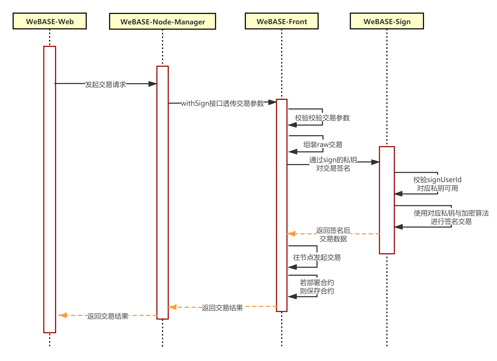

# 升级说明

WeBASE-Node-Manager升级的兼容性说明，请结合[WeBASE-Node-Manager Changelog](https://github.com/WeBankFinTech/WeBASE-Node-Manager)进行阅读

#### v1.4.2
- 新增了合约EventLog查询功能

##### 数据表更新

字段更新：
- `tb_contract`表中`bytecodeBin`的列名修改为`bytecode_bin`，并对应更新了`conf/mapper/ContractMapper.xml`文件


数据表新增：
- 新增合约路径信息表`tb_contract_path`

```SQL
CREATE TABLE IF NOT EXISTS tb_contract_path (
  id int(11) NOT NULL AUTO_INCREMENT COMMENT '合约路径编号',
  contract_path varchar(24) binary NOT NULL COMMENT '合约所在目录',
  group_id int(11) NOT NULL COMMENT '所属群组编号',
  create_time datetime DEFAULT NULL COMMENT '创建时间',
  modify_time datetime DEFAULT NULL COMMENT '修改时间',
  PRIMARY KEY (id),
  UNIQUE KEY uk_group_path_name (group_id,contract_path)
) ENGINE=InnoDB DEFAULT CHARSET=utf8 COMMENT='合约路径表';
```

#### v1.4.1
新增FISCO BCOS v2.5.0及以上版本的基于角色的权限管理功能，新增了开发者模式
- 新的权限管理基于角色，可参考FISCO BCOS[权限控制文档](https://fisco-bcos-documentation.readthedocs.io/zh_CN/latest/docs/manual/permission_control.html)
- 开发者模式：新增了用户角色developer，可进行查询交易，合约部署调用等功能，无法使用管理员的系统管理与监控等功能。

##### 数据表更新

登录 MySQL 后，选择数据库 `use webasenodemanager;` 后，按顺序执行下面的 SQL 语句进行 DB 升级。

**数据表字段新增**
- 新增了`tb_user`, `tb_contract`中的`account`字段，并更新了唯一约束。
- 用户角色表`tb_role`中新增了默认值`developer`
- 合约表`tb_contract`中新增了`deploy_address`和`deploy_user_name`字段，记录部署的私钥用户信息

```SQL
-- tb_user修改
alter table tb_user add column account varchar(50) binary NOT NULL COMMENT '关联账号';
alter table tb_user drop index `unique_name`
alter table tb_user add UNIQUE KEY `unique_name` (group_id,user_name,account);

-- tb_contract修改
alter table tb_contract add column account varchar(50) binary NOT NULL COMMENT '关联账号';
alter table tb_contract drop index `uk_group_path_name`
alter table tb_contract add UNIQUE KEY uk_group_path_name (group_id,contract_path,contract_name,account);
alter table tb_contract add column deploy_address varchar(64) DEFAULT NULL COMMENT '合约部署者地址';
alter table tb_contract add column deploy_user_name varchar(64) DEFAULT NULL COMMENT '合约部署者用戶名';
-- tb_role修改
INSERT INTO `tb_role` (role_name,role_name_zh,create_time,modify_time)VALUES ('developer', '开发者', now(), now());
```

**数据表结构更改**
- 新增了链委员管理投票信息表`tb_govern_vote`
```SQL
CREATE TABLE IF NOT EXISTS tb_govern_vote (
  id int(11) unsigned NOT NULL AUTO_INCREMENT COMMENT '链治理委员投票记录ID',
  group_id int(11) NOT NULL COMMENT '群组ID',
  time_limit bigint DEFAULT NULL COMMENT '投票截止块高',
  from_address varchar(64) NOT NULL COMMENT '管理员地址',
  type tinyint(8) NOT NULL COMMENT '投票类型，1-选举，2-去除，3-修改委员权重，4,-修改阈值',
  to_address varchar(64) DEFAULT NULL COMMENT '选举/去除的地址',
  detail varchar(64) DEFAULT NULL COMMENT '3-修改权重，4-修改阈值时存储具体信息',
  create_time datetime NOT NULL COMMENT '创建时间',
  modify_time datetime NOT NULL COMMENT '最近一次更新时间',
  PRIMARY KEY (id)
) ENGINE=InnoDB DEFAULT CHARSET=utf8mb4 COMMENT='链治理委员投票信息';
```


#### v1.4.0
v1.4.0 新增了可视化部署区块链的功能，同时支持节点的动态管理（扩容、停止、删除等）功能，同时兼容原有的手动搭链添加WeBASE-Front节点前置的模式

**注**：在运行WeBASE-Node-Manager前要选择在下面两种模式中二选一：
1. 添加前置方式
2. 可视化部署方式

**提示**：如果要体验完整的可视化部署，可通过[可视化部署](../WeBASE-Install/visual_deploy.html)的安装指引，通过一键部署或手动部署安装子系统进行搭建

##### 数据库结构变更

- 登录 MySQL 后，选择数据库 `use webasenodemanager;` 后，按顺序执行下面的 SQL 语句进行 DB 升级。

- 合约abi与bin相关字段的类型修改，修改 `text` 类型到 `mediumtext`

```SQL 
ALTER TABLE `tb_abi` MODIFY COLUMN `contract_abi` mediumtext CHARACTER SET utf8 COLLATE utf8_general_ci NOT NULL COMMENT '合约ABI的内容';
ALTER TABLE `tb_abi` MODIFY COLUMN `contract_bin` mediumtext CHARACTER SET utf8 COLLATE utf8_general_ci NOT NULL COMMENT '合约ABI的runtime-bin';

ALTER TABLE `tb_contract` MODIFY COLUMN `contract_abi` mediumtext CHARACTER SET utf8 COLLATE utf8_general_ci NULL COMMENT '编译合约生成的abi文件内容';
ALTER TABLE `tb_contract` MODIFY COLUMN `contract_bin` mediumtext CHARACTER SET utf8 COLLATE utf8_general_ci NULL COMMENT '合约binary';
ALTER TABLE `tb_contract` MODIFY COLUMN `bytecodeBin` mediumtext CHARACTER SET utf8 COLLATE utf8_general_ci NULL COMMENT '合约bin';

ALTER TABLE `tb_front_group_map` MODIFY COLUMN `status` int(11) NOT NULL DEFAULT 1 COMMENT '节点（前置）的群组状态，1-normal，2-invalid';
ALTER TABLE `tb_group` MODIFY COLUMN `group_status` int(1) NULL DEFAULT 1 COMMENT '状态（1-正常 2-异常 3-脏数据冲突 4-创世块冲突）';
```

- 新增字段

```SQL
ALTER TABLE `tb_group` ADD COLUMN `chain_id` int(10) UNSIGNED NULL DEFAULT 0 COMMENT '所属链 ID';

ALTER TABLE `tb_group` ADD COLUMN `chain_name` varchar(64) CHARACTER SET utf8 COLLATE utf8_general_ci NULL DEFAULT '' COMMENT '所属链名称，冗余字段';
ALTER TABLE `tb_group` ADD UNIQUE INDEX `unique_chain_id_group_id`(`chain_id`, `group_id`) USING BTREE;

ALTER TABLE `tb_front` ADD COLUMN `support_version` varchar(32) CHARACTER SET utf8 COLLATE utf8_general_ci NULL DEFAULT NULL COMMENT '节点兼容版本';
ALTER TABLE `tb_front` ADD COLUMN `front_version` varchar(32) CHARACTER SET utf8 COLLATE utf8_general_ci NULL DEFAULT NULL COMMENT '节点前置版本号';
ALTER TABLE `tb_front` ADD COLUMN `sign_version` varchar(32) CHARACTER SET utf8 COLLATE utf8_general_ci NULL DEFAULT NULL COMMENT '节点前置对应签名服务版本号';

ALTER TABLE `tb_front` MODIFY COLUMN `front_port` int(11) NOT NULL COMMENT '前置服务端口';
ALTER TABLE `tb_front` MODIFY COLUMN `status` int(11) NULL DEFAULT 1 COMMENT '前置服务状态：0，初始化；1，运行；2，停止；3，启动；4，添加中；5，添加失败';
ALTER TABLE `tb_front` MODIFY COLUMN `create_time` datetime(0) NOT NULL COMMENT '创建时间';
ALTER TABLE `tb_front` MODIFY COLUMN `modify_time` datetime(0) NOT NULL COMMENT '修改时间';
ALTER TABLE `tb_front` ADD COLUMN `run_type` tinyint(8) UNSIGNED NULL DEFAULT 0 COMMENT '运行方式：0，命令行；1，Docker';
ALTER TABLE `tb_front` ADD COLUMN `agency_id` int(10) UNSIGNED NULL DEFAULT 0 COMMENT '所属机构 ID';
ALTER TABLE `tb_front` ADD COLUMN `agency_name` varchar(64) CHARACTER SET utf8 COLLATE utf8_general_ci NULL DEFAULT '' COMMENT '所属机构名称，冗余字段, 跟 agency 字段相同'
ALTER TABLE `tb_front` ADD COLUMN `host_id` int(10) UNSIGNED NULL DEFAULT 0 COMMENT '所属主机';
ALTER TABLE `tb_front` ADD COLUMN `host_index` int(6) NULL DEFAULT 0 COMMENT '一台主机可能有多个节点。表示在主机中的编号，从 0 开始编号';
ALTER TABLE `tb_front` ADD COLUMN `image_tag` varchar(64) CHARACTER SET utf8 COLLATE utf8_general_ci NULL DEFAULT '' COMMENT '运行的镜像版本标签';
ALTER TABLE `tb_front` ADD COLUMN `container_name` varchar(255) CHARACTER SET utf8 COLLATE utf8_general_ci NULL DEFAULT '' COMMENT 'Docker 启动的容器名称';
ALTER TABLE `tb_front` ADD COLUMN `jsonrpc_port` int(6) NULL DEFAULT 8545 COMMENT 'jsonrpc 端口';
ALTER TABLE `tb_front` ADD COLUMN `p2p_port` int(6) NULL DEFAULT 30303 COMMENT 'p2p 端口';
ALTER TABLE `tb_front` ADD COLUMN `channel_port` int(6) NULL DEFAULT 20200 COMMENT 'channel 端口';
ALTER TABLE `tb_front` ADD COLUMN `chain_id` int(10) UNSIGNED NULL DEFAULT 0 COMMENT '所属链 ID';
ALTER TABLE `tb_front` ADD COLUMN `chain_name` varchar(64) CHARACTER SET utf8 COLLATE utf8_general_ci NULL DEFAULT '' COMMENT '所属链名称，冗余字段';

ALTER TABLE `tb_front` ADD UNIQUE INDEX `unique_agency_id_host_id_front_port`(`agency_id`, `front_ip`, `front_port`) USING BTREE;
```


- 机构信息表`tb_agency`, 链信息表`tb_chain`, 系统配置信息表`tb_config`, 物理主机信息表`tb_host`

```SQL
CREATE TABLE `tb_agency`  (
  `id` int(10) UNSIGNED NOT NULL AUTO_INCREMENT COMMENT '自增长 ID',
  `agency_name` varchar(64) CHARACTER SET utf8mb4 COLLATE utf8mb4_general_ci NOT NULL COMMENT '机构名称',
  `agency_desc` varchar(1024) CHARACTER SET utf8mb4 COLLATE utf8mb4_general_ci NULL DEFAULT '' COMMENT '机构描述信息',
  `chain_id` int(10) UNSIGNED NOT NULL DEFAULT 0 COMMENT '所属链 ID',
  `chain_name` varchar(64) CHARACTER SET utf8mb4 COLLATE utf8mb4_general_ci NULL DEFAULT '' COMMENT '所属链名称，冗余字段',
  `create_time` datetime(0) NOT NULL COMMENT '创建时间',
  `modify_time` datetime(0) NOT NULL COMMENT '最近一次更新时间',
  PRIMARY KEY (`id`) USING BTREE,
  UNIQUE INDEX `uniq_chain_id_agency_name`(`chain_id`, `agency_name`) USING BTREE
) ENGINE = InnoDB CHARACTER SET = utf8mb4 COLLATE = utf8mb4_general_ci COMMENT = '机构信息表' ROW_FORMAT = Dynamic;

CREATE TABLE `tb_chain`  (
  `id` int(10) UNSIGNED NOT NULL AUTO_INCREMENT COMMENT '自增长 ID',
  `chain_name` varchar(64) CHARACTER SET utf8mb4 COLLATE utf8mb4_general_ci NOT NULL COMMENT '链名称',
  `chain_desc` varchar(1024) CHARACTER SET utf8mb4 COLLATE utf8mb4_general_ci NULL DEFAULT NULL COMMENT '链描述信息',
  `version` varchar(64) CHARACTER SET utf8mb4 COLLATE utf8mb4_general_ci NOT NULL DEFAULT '' COMMENT '创建链时选择的镜像版本',
  `encrypt_type` tinyint(8) UNSIGNED NOT NULL DEFAULT 1 COMMENT '加密类型：1，标密；2，国密；默认 1 ',
  `chain_status` tinyint(8) UNSIGNED NOT NULL DEFAULT 0 COMMENT '0: 初始化；1，部署中；2，部署失败；3，运行；4，重启中；5，升级过；6，升级失败',
  `root_dir` varchar(255) CHARACTER SET utf8mb4 COLLATE utf8mb4_general_ci NOT NULL DEFAULT '/opt/fisco-bcos' COMMENT '主机存放节点配置文件的根目录，可能存放多个节点配置',
  `webase_sign_addr` varchar(255) CHARACTER SET utf8mb4 COLLATE utf8mb4_general_ci NOT NULL DEFAULT '127.0.0.1:5004' COMMENT 'WeBASE-Sign 的访问地址',
  `create_time` datetime(0) NOT NULL COMMENT '创建时间',
  `modify_time` datetime(0) NOT NULL COMMENT '最近一次更新时间',
  `run_type` tinyint(8) UNSIGNED NULL DEFAULT 0 COMMENT '运行方式：0，命令行；1，Docker',
  PRIMARY KEY (`id`) USING BTREE,
  UNIQUE INDEX `uniq_chain_name`(`chain_name`) USING BTREE
) ENGINE = InnoDB CHARACTER SET = utf8mb4 COLLATE = utf8mb4_general_ci COMMENT = '链信息表' ROW_FORMAT = Dynamic;

CREATE TABLE `tb_config`  (
  `id` int(10) UNSIGNED NOT NULL AUTO_INCREMENT COMMENT '自增长 ID',
  `config_name` varchar(64) CHARACTER SET utf8mb4 COLLATE utf8mb4_general_ci NOT NULL COMMENT '配置名称',
  `config_type` int(10) NOT NULL DEFAULT 0 COMMENT '配置类型',
  `config_value` varchar(512) CHARACTER SET utf8mb4 COLLATE utf8mb4_general_ci NOT NULL DEFAULT '' COMMENT '配置值',
  `create_time` datetime(0) NOT NULL COMMENT '创建时间',
  `modify_time` datetime(0) NOT NULL COMMENT '最近一次更新时间',
  PRIMARY KEY (`id`) USING BTREE
) ENGINE = InnoDB CHARACTER SET = utf8mb4 COLLATE = utf8mb4_general_ci COMMENT = '系统配置信息表' ROW_FORMAT = Dynamic;

CREATE TABLE `tb_host`  (
  `id` int(10) UNSIGNED NOT NULL AUTO_INCREMENT COMMENT '自增长 ID',
  `agency_id` int(10) UNSIGNED NOT NULL DEFAULT 1 COMMENT '所属机构 ID',
  `agency_name` varchar(64) CHARACTER SET utf8mb4 COLLATE utf8mb4_general_ci NULL DEFAULT NULL COMMENT '所属机构名称，冗余字段',
  `ip` varchar(16) CHARACTER SET utf8mb4 COLLATE utf8mb4_general_ci NOT NULL COMMENT '主机IP',
  `ssh_user` varchar(64) CHARACTER SET utf8mb4 COLLATE utf8mb4_general_ci NOT NULL DEFAULT 'root' COMMENT 'SSH 登录账号',
  `ssh_port` int(10) UNSIGNED NOT NULL DEFAULT 22 COMMENT 'SSH 端口',
  `root_dir` varchar(255) CHARACTER SET utf8mb4 COLLATE utf8mb4_general_ci NOT NULL DEFAULT '/opt/fisco-bcos' COMMENT '主机存放节点配置文件的根目录，可能存放多个节点配置',
  `docker_port` int(10) UNSIGNED NOT NULL DEFAULT 2375 COMMENT 'Docker demon 的端口',
  `status` tinyint(8) UNSIGNED NOT NULL DEFAULT 0 COMMENT '主机状态：0，新建；1，初始化；2，初始化成功；3，初始化失败',
  `remark` varchar(512) CHARACTER SET utf8mb4 COLLATE utf8mb4_general_ci NULL DEFAULT '' COMMENT 'remark',
  `create_time` datetime(0) NOT NULL COMMENT '创建时间',
  `modify_time` datetime(0) NOT NULL COMMENT '最近一次更新时间',
  PRIMARY KEY (`id`) USING BTREE,
  UNIQUE INDEX `unq_agency_id,ip`(`agency_id`, `ip`) USING BTREE
) ENGINE = InnoDB CHARACTER SET = utf8mb4 COLLATE = utf8mb4_general_ci COMMENT = '物理主机信息' ROW_FORMAT = Dynamic;
```

- 插入常量数据

```SQL
INSERT INTO `tb_config`(`config_name`, `config_type`, `config_value`, `create_time`, `modify_time`) VALUES ('docker 镜像版本', 1, 'v2.5.0', '2020-07-22 17:14:23', '2020-07-22 17:14:23');
INSERT INTO `tb_config`(`config_name`, `config_type`, `config_value`, `create_time`, `modify_time`) VALUES ('docker 镜像版本', 1, 'v2.5.0-gm', '2020-07-22 17:14:23', '2020-07-22 17:14:23');

```


#### v1.3.2

##### 移除fastjson
- 移除Fastjson，替换为Jackson 2.11.0。
- 升级web3sdk为2.4.1，并升级springboot等依赖项

#### v1.3.1

v1.3.1主要新增了动态群组接口、导入abi接口、导入私钥接口、定时任务优化等功能，详情升级说明如下：

##### 新增动态群组接口
- 新增动态群组接口，包含生成群组、启动/停止群组、删除/恢复群组、单个/批量查询群组状态等接口

注：节点生成新群组或加入新群组需要对节点进行三步操作：生成群组、启动群组、节点加入群组共识节点/观察节点；如何通过WeBASE页面操作可参考[动态群组管理使用指南](../WeBASE-Console-Suit/index.html#dynamic_group_use)

接口详情可参考[接口文档](./interface.html#dynamic_group_interface)中群组管理模块的动态群组接口说明

##### 新增导入已部署合约Abi功能、合约Abi编码器
- 新增导入合约abi接口，可以导入已部署的合约进行管理

##### 新增导入.p12私钥用户
- 新增导入.p12/.pem/.txt私钥接口；其中.txt与节点前置导出私钥格式一致，.p12/.pem与控制台导出私钥格式一致；


##### 定时任务优化
- 定时任务并行化，可通过yml配置线程池大小，线程阻塞时长等加快拉取区块、拉取交易

##### 数据表的字段修改
- tb_front新增`status`字段，用于记录已添加的节点前置的状态，与节点状态同步，每过7.5秒更新一次；同时每请求一次节点前置会更新前置状态（每次更新至少间隔3秒）
- 新增tb_abi数据表，用于记录导入的合约abi
- tb_group数据表新增字段：
  - `group_status`字段新增两种状态，全部状态包括：`1-normal, 2-maintaining, 3-dirty-data, 4-conflict-genesis`
  - `group_desc`字段修改为`description`，记录群组的描述内容
  - 新增`group_timestamp`记录动态创建群组的创世块时间戳
  - 新增`node_id_list`记录动态创建群组的创世块共识节点列表
- tb_front_group_map数据表新增`status`字段，记录节点前置某一群组的状态（1-可用，2-不可用）

**数据表升级操作**

登陆mysql后，进入到相应database中，以`webasenodemanager`的database为例；
```
mysql -uroot -p123456

// mysql 命令行
mysql> use webasenodemanager;

// tb_front表新增status字段
mysql> alter table tb_front add column status int(11) DEFAULT 1 COMMENT '前置服务状态';

// 新增tb_abi表
mysql> CREATE TABLE IF NOT EXISTS tb_abi (
  abi_id int(11) NOT NULL AUTO_INCREMENT COMMENT '合约ABI的编号',
  group_id int(11) NOT NULL COMMENT '合约ABI所属群组的编号',
  contract_name varchar(120) NOT NULL COMMENT '合约ABI的合约名',
  contract_address varchar(64) NOT NULL COMMENT '合约ABI的合约地址',
  contract_abi text NOT NULL COMMENT '合约ABI的内容',
  contract_bin text NOT NULL COMMENT '合约ABI的runtime-bin',
  create_time datetime DEFAULT NULL COMMENT '合约ABI的创建时间',
  modify_time datetime DEFAULT NULL COMMENT '合约ABI的修改时间',
  PRIMARY KEY (abi_id),
  UNIQUE KEY unique_address (group_id,contract_address),
  UNIQUE KEY unique_name (group_id,contract_name)
) ENGINE=InnoDB DEFAULT CHARSET=utf8 COMMENT='合约ABI表';

// tb_group新增description、group_timestamp、node_id_list字段
mysql> alter table tb_group add column description varchar(1024) COMMENT '群组描述';
mysql> alter table tb_group add column group_timestamp varchar(64) COMMENT '群组创世块时间戳';
mysql> alter table tb_group add column node_id_list text COMMENT '群组成员节点的ID';

// tb_front_group_map新增status字段
mysql> alter table tb_front_group_map add column status int(11) DEFAULT 1 NOT NULL COMMENT '节点（前置）的群组状态';
```


#### v1.3.0

WeBASE-Node-Manager v1.3.0后，将通过WeBASE-Sign来管理私钥和对交易签名，可查看以下升级说明进行修改：
1. 私钥用户数据表`tb_user`新增字段`sign_user_id`和`app_id`
2. 将WeBASE-Node-Manager的私钥数据移植到WeBASE-Sign数据库

生成私钥的流程


交易签名的流程


##### 私钥用户数据表字段新增

- 数据库中的`tb_user`新增了varchar类型的字段`sign_user_id`和`app_id`，其中`signUserId`会在新建私钥时用随机的UUID String赋值并保存；

tb_user表字段的修改：
```
CREATE TABLE IF NOT EXISTS tb_user (
  user_id int(11) NOT NULL AUTO_INCREMENT COMMENT '用户编号',
  user_name varchar(64) binary NOT NULL COMMENT '用户名',
  ...
  sign_user_id varchar(64) NOT NULL COMMENT '签名服务中的user的业务id',
  app_id varchar(64) DEFAULT NULL COMMENT '区块链应用的编号',
  ...
  UNIQUE KEY unique_uuid (sign_user_id)
) ENGINE=InnoDB AUTO_INCREMENT=700001 DEFAULT CHARSET=utf8 COMMENT='用户信息表';
```

**新增字段升级操作说明**

登陆mysql后，进入到相应database中，以`webasenodemanager`的database为例；
```
mysql -uroot -p123456

// mysql 命令行
mysql> use webasenodemanager;

// 在tb_user中添加列
mysql> alter table tb_user add column sign_user_id varchar(64) default null;
mysql> alter table tb_user add column app_id varchar(64) not null;

// 添加sign_user_id的唯一约束
mysql> alter table tb_user add unique key unique_uuid (sign_user_id);

// 生成唯一的sign_user_id和app_id
...
// 为已存在的用户的sign_user_id和app_id赋值
...
```

**注意，WeBASE-Node-Manager赋值的sign_user_id与app_id将在私钥数据迁移时，一同赋值给WeBASE-Sign tb_user表的对应字段**

##### 私钥数据移植到WeBASE-Sign

- WeBASE-Node-Manager的私钥将通过WeBASE-Sign托管（新建私钥、保存私钥和交易签名），不再由WeBASE-Front生成和保存（仅保存公钥与地址）；
- WeBASE-Node-Manager将通过WeBASE-Front的`/trans/handleWithSign`接口和`/contract/deployWithSign`接口进行合约部署与交易

如已安装WeBASE-Sign，则按照[WeBASE-Sign v1.3.0升级文档](../WeBASE-Sign/upgrade.html#v1-3-0)更新其`tb_user`表，再执行私钥数据转移操作；

如未安装WeBASE-Sign，则按照[WeBASE-Sign安装文档](../WeBASE-Sign/install.html)配置环境并运行WeBASE-Sign后（运行WeBASE-Sign服务后会自动创建tb_user表），再执行私钥数据转移操作；

**转移WeBASE-Node-Manager私钥到WeBASE-Sign的操作说明**

用户需要通过以下操作将存于节点服务数据库(如`webasenodemanager`数据库)的私钥数据导出，并导入到WeBASE-Sign数据库(如`webasesign`数据库)中
1. 由于保存到数据库的私钥值是经过AES加密后存储的，因此，需**保证WeBASE-Front和WeBASE-Sign application.yml中的`constant-aesKey`字段的值一样**；
2. 在WeBASE-Node-Manager数据库中的`tb_user`表和`tb_user_key_mapping`表，获取所有WeBASE-Node-Manager的私钥数据，包括`tb_user`表中的`sign_user_id`和`app_id`（前文所插入的值），地址`address`与公钥`publick_key`，还有`tb_user_key_mapping`表中的私钥`private_key`；
3. 在WeBASE-Sign数据库中，将上文获得的所有私钥数据按对应字段，执行insert操作，插入到其`tb_user`表中；


**升级操作说明**

登陆mysql，进入到相应database中，以`webasenodemanager`和`webasesign`的database为例；
```
> mysql -uroot -p123456

// 选择webase-node-manager数据库
mysql> use webasenodemanager;

// 使用left join查询所有私钥数据(address,public_key,sign_user_id,app_id,private_key)
mysql> select a.address,a.public_key,a.sign_user_id,a.app_id,b.private_key from tb_user a left join tb_user_key_mapping b on(a.user_id=b.user_id) where b.map_status=1

// 选择webase-sign数据库进行插入操作
mysql> use webasesign;

// 将上述操作获取的(address,public_key,sign_user_id,app_id,private_key)插入到webase-sign的tb_user表
// 略
```

#### v1.2.2

##### 国密支持说明

国密版FISCO-BCOS与非国密版**不可互通**，同理，WeBASE组件的国密与非国密也不可互通，因此如果需要切换到国密版，需要**重新建链与搭建WeBASE平台**

可根据[WeBASE一键部署](../WeBASE/install.html)重新搭建国密的FISCO BCOS + WeBASE平台

详细子系统的国密参数设置可参考[FISCO-BCOS 国密支持](https://fisco-bcos-documentation.readthedocs.io/zh_CN/latest/docs/manual/guomi_crypto.html)、[WeBASE-Node-Manager 国密支持](README.html#id3)和[WeBASE-Front 国密支持](../WeBASE-Front/README.html#id3)

1. 初始化数据修改：数据表的`tb_method`默认数据需要替换为国密版默认数据，可参考项目中`scripts/gm`中的`webase-dml-gm.sql`中的第5项进行数据初始化；

##### 兼容性说明：中英文支持，优化部分功能

1. 初始化数据修改：数据表`tb_alert_rule`默认数据支持中英文告警，可结合项目中`scripts/webase-dml.sql`第6项进行数据更新；
2. 数据表字段增加：数据表`tb_front`增加一列`client_version`，用于记录节点版本与是否为国密；
3. 数据表字段增加：动态增加的数据表`tb_trans_hash_x`增加一列`trans_number`，用于记录交易数；该更改无法与前一版本兼容；**如需升级v1.2.2，可根据下文将getCountByMinMax()方法替换为原来的getCount()方法**

**升级中英文告警操作说明**

登陆mysql后，进入到相应database中，以`webasenodemanager`的database为例；
```
mysql -uroot -p123456

// mysql 命令行
mysql> use webasenodemanager;
```

可以参考[WeBASE-Node-Manager v1.2.2](https://github.com/WeBankFinTech/WeBASE-Node-Manager/releases/tag/v1.2.2)源码中的webase-dml.sql

- 修改`tb_alert_rule`的默认数据：

```
// 删除原有数据
mysql> delete * from tb_alert_rule where 1=1;

// 插入新的中英文数据
---- add node status alert rule template
INSERT INTO `tb_alert_rule`(`rule_name`,`enable`,`alert_type`,`alert_level`,`alert_interval_seconds`,`alert_content`,`content_param_list`,`create_time`,`modify_time`) VALUES ('节点异常告警/Node Exception', 0, 1, 1, 3600, '{nodeId}节点异常，请到“节点管理”页面查看具体信息 / Node: {nodeIdEn} node status exception，please check out in \"Node Management\"', '[\"{nodeId}\", \"{nodeIdEn}\"]', '2019-10-29 20:02:30', '2019-10-29 20:02:30');
---- add audit alert rule template
INSERT INTO `tb_alert_rule`(`rule_name`,`enable`,`alert_type`,`alert_level`,`alert_interval_seconds`,`alert_content`,`content_param_list`,`create_time`,`modify_time`) VALUES ('审计异常告警/Audit Exception', 0, 2, 1, 3600, '审计异常：{auditType}，请到“交易审计”页面查看具体信息 / Audit alert: {auditTypeEn}，please check out in \"Transaction Audit\"', '[\"{auditType}\", \"{auditTypeEn}\"]', '2019-10-29 20:02:30', '2019-10-29 20:02:30');
-- add cert alert rule template
INSERT INTO `tb_alert_rule`(`rule_name`,`enable`,`alert_type`,`alert_level`,`alert_interval_seconds`,`alert_content`,`content_param_list`,`create_time`,`modify_time`) VALUES ('证书有效期告警/Cert Validity Exception', 0, 3, 1, 3600, '证书将在{time}过期，请到“证书管理”页面查看具体信息 / Cert validity exception：invalid at {timeEn}，please check out in \"Cert Management\"', '[\"{time}\", \"{timeEn}\"]', '2019-10-29 20:02:30', '2019-10-29 20:02:30');
```

**数据表字段增加-tb_front**

- 获取Front的IP与端口，登陆mysql同上操作
```
mysql> select * from tb_front;

+----------+----------------------------------------------------------------------------------------------------------------------------------+------------+------------+--------+---------------------+---------------------+----------------+
| front_id | node_id                                                                                                                          | front_ip   | front_port | agency | create_time         | modify_time         | client_version |
+----------+----------------------------------------------------------------------------------------------------------------------------------+------------+------------+--------+---------------------+---------------------+----------------+
|   500001 | b44c4f713b40b67ed2f9dae2ef208808b7f31112efe1a822de046604fe0bbdffdf46b7c0cf1ca9aa468752d514958cb603670a6d345c78faff6e69d825e851b8 | 127.0.0.1 |       5002 | agency0     | 2019-12-23 17:57:35 | 2019-12-23 17:57:35 | 2.1.0 gm       |
+----------+----------------------------------------------------------------------------------------------------------------------------------+------------+------------+--------+---------------------+---------------------+----------------+
1 row in set (0.00 sec)
```

- 获取相应Front的**节点版本**：通过访问WeBASE-Front的`front_ip:front_port/{groupId}/web3/clientVersion`接口获取节点版本`FISCO-BCOS Version`
```
// 获取clientVersion
curl http://front_ip:front_port/WeBASE-Front/1/web3/clientVersion

// response:
{
    ...
    "Chain Id": "1",
    "FISCO-BCOS Version": "2.1.0 gm",
    ...
}

```

- 在`tb_front`增加`client_version`一列
- 更新其数据值为上面获取的`FISCO-BCOS Version`值，如国密节点`2.1.0 gm`

```
mysql> alter table tb_front add column client_version varchar(32) NOT NULL COMMENT '节点版本（国密/非国密）';
mysql> update tb_front set client_version='2.1.0 gm' where front_id='{front_id}';
```

**数据表字段增加-tb_trans_hash_xx**

- 更新由TableService动态生成的数据表`tb_trans_hash_xx`的字段：该更改无法与前一版本兼容；

**如需升级v1.2.2，可将代码中使用TransHashMapper/getCountByMinMax()方法替换为原来的getCount()方法**
```
package com.webank.webase.node.mgr.transaction;

...
public Integer queryCountOfTranByMinus(int groupId)
        throws NodeMgrException {
    ...
    try{
      ...
      // getCount(String tableName,TransParam transParam);
      Integer count = transHashMapper.getCountByMinMax(tableName); 
      ...
    }
    ...
    }
```

#### v1.2.1

兼容性说明：增加邮件告警功能

1. 数据表修改：增加了`tb_mail_server_config`邮箱服务器配置表（邮箱服务配置），`tb_alert_rule`告警规则表（告警类型配置），`tb_alert_log`告警日志表，可通过项目中`scripts/webase-ddl.sql`进行数据表初始化；
2. 初始化数据修改：邮件告警功能的默认数据需要通过项目中`scripts/webase-dml.sql`的6, 7项进行数据初始化；

**操作说明：**

登陆mysql后，进入到相应database中，以`webasenodemanager`的database为例；
```
mysql -uroot -p123456

// mysql 命令行
mysql> use webasenodemanager;
```

可以参考[WeBASE-Node-Manager v1.2.1](https://github.com/WeBankFinTech/WeBASE-Node-Manager/releases/tag/v1.2.1)源码中的webase-ddl.sql与webase-dml.sql

- 执行`tb_alert_rule`, `tb_mail_server_config`, `tb_alert_log`，建表操作
```
// tb_alert_rule表
mysql> CREATE TABLE IF NOT EXISTS tb_alert_rule (
  rule_id int(11) NOT NULL AUTO_INCREMENT COMMENT '告警规则的ID',
  rule_name varchar(50) NOT NULL COMMENT '告警规则的命名',
  enable tinyint(4) DEFAULT 0 NOT NULL COMMENT '是否启用规则, 0:false, 1:true',
  alert_type tinyint(4) NOT NULL COMMENT '告警规则的类型, 1-节点, 2-审计, 3-证书',
  alert_level tinyint(4) NOT NULL COMMENT '告警规则的级别, 1-高, 2-中, 3-低',
  alert_interval_seconds bigint NOT NULL COMMENT '告警规则的间隔时间(s)',
  alert_content text NOT NULL COMMENT '告警邮件的内容',
  content_param_list text NOT NULL COMMENT '告警邮件内容中的可替代参数，如nodeId',
  description varchar(50) DEFAULT NULL COMMENT '告警规则的描述',
  is_all_user tinyint(4) DEFAULT 0 COMMENT '是否选中所有用户, 0:false, 1:true',
  user_list text DEFAULT NULL COMMENT '告警规则作用的用户列表',
  create_time datetime DEFAULT NULL COMMENT '告警规则的创建时间',
  modify_time datetime DEFAULT NULL COMMENT '告警规则的修改时间',
  less_than varchar(40) DEFAULT NULL COMMENT '告警规则：小于某个值',
  less_and_equal varchar(40) DEFAULT NULL COMMENT '告警规则：小于等于某个值',
  larger_than varchar(40) DEFAULT NULL COMMENT '告警规则：大于某个值',
  larger_and_equal varchar(40) DEFAULT NULL COMMENT '告警规则：大于等于某个值',
  equal varchar(40) DEFAULT NULL COMMENT '告警规则：等于某个值',
  last_alert_time datetime DEFAULT NULL COMMENT '上次告警的时间，与Interval间隔共同作用',
  PRIMARY KEY (rule_id)
) ENGINE=InnoDB DEFAULT CHARSET=utf8 COMMENT='告警规则表';

// tb_mail_server_config表
mysql> CREATE TABLE IF NOT EXISTS tb_mail_server_config (
  server_id int(11) NOT NULL AUTO_INCREMENT COMMENT '邮件服务器配置的ID',
  server_name varchar(40) NOT NULL COMMENT '邮件服务器配置的命名',
  host varchar(30) NOT NULL COMMENT '邮件服务器的主机',
  port int(10) DEFAULT '25' NOT NULL COMMENT '邮件服务器的端口',
  username varchar(40) NOT NULL COMMENT '邮件服务器的邮箱地址',
  password varchar(40) NOT NULL COMMENT '邮件服务器的邮箱授权码',
  protocol varchar(10) NOT NULL COMMENT '邮件服务器的协议',
  default_encoding varchar(10) DEFAULT 'UTF-8' NOT NULL COMMENT '邮件服务器的默认编码(UTF-8)',
  create_time datetime DEFAULT NULL COMMENT '邮件服务器配置的创建时间',
  modify_time datetime DEFAULT NULL COMMENT '邮件服务器配置的修改时间',
  authentication tinyint(4) DEFAULT 1 NOT NULL COMMENT '是否开启验证, 0:false, 1:true',
  starttls_enable tinyint(4) DEFAULT 1 NOT NULL COMMENT '如支持，是否优先选用STARTTLS, 0:false, 1:true',
  starttls_required tinyint(4) DEFAULT 0 COMMENT '是否必须使用STARTTLS, 0:false, 1:true',
  socket_factory_port int(10) DEFAULT 465 COMMENT 'SSL的端口',
  socket_factory_class varchar(150) DEFAULT 'javax.net.ssl.SSLSocketFactory' COMMENT 'SSL选用的JAVA类',
  socket_factory_fallback tinyint(4) DEFAULT 0 COMMENT '是否启用SSL的fallback, 0:false, 1:true',
  enable tinyint(4) DEFAULT 0 NOT NULL COMMENT '邮件服务器是否已配置完成，0初始，1完成',
  connection_timeout int(10) DEFAULT 5000 NOT NULL COMMENT '邮件服务器的连接超时值',
  timeout int(10) DEFAULT 5000 NOT NULL COMMENT '邮件服务器的通用超时值',
  write_timeout int(10) DEFAULT 5000 NOT NULL COMMENT '邮件服务器的写超时值',
  PRIMARY KEY (server_id)
) ENGINE=InnoDB DEFAULT CHARSET=utf8 COMMENT='邮件服务器配置表';

// tb_alert_log表
mysql> CREATE TABLE IF NOT EXISTS tb_alert_log (
  log_id int(11) NOT NULL AUTO_INCREMENT COMMENT '告警日志的编号',
  alert_type tinyint(4) NOT NULL COMMENT '告警日志的类型, 1-节点, 2-审计, 3-证书',
  alert_level tinyint(4) NOT NULL COMMENT '告警日志的告警等级：1-high, 2-middle, 3-low',
  alert_content text NOT NULL COMMENT '告警日志的内容',
  description text DEFAULT NULL COMMENT '告警日志的描述',
  status tinyint(4) NOT NULL DEFAULT '0' COMMENT '告警日志的状态：0-未处理，1-已处理',
  create_time datetime DEFAULT NULL COMMENT '告警日志的创建时间',
  modify_time datetime DEFAULT NULL COMMENT '告警日志的修改时间',
  PRIMARY KEY (log_id)
) ENGINE=InnoDB DEFAULT CHARSET=utf8 COMMENT='告警日志表';

```

- mysql下执行插入，初始化默认数据：

```
---- add node status alert rule template
INSERT INTO `tb_alert_rule`(`rule_name`,`enable`,`alert_type`,`alert_level`,`alert_interval_seconds`,`alert_content`,`content_param_list`,`create_time`,`modify_time`) VALUES ('节点异常告警', 0, 1, 1, 3600, '{nodeId}节点异常，请到“节点管理”页面查看具体信息', '[\"{nodeId}\"]', '2019-10-29 20:02:30', '2019-10-29 20:02:30');
---- add audit alert rule template
INSERT INTO `tb_alert_rule`(`rule_name`,`enable`,`alert_type`,`alert_level`,`alert_interval_seconds`,`alert_content`,`content_param_list`,`create_time`,`modify_time`) VALUES ('审计异常', 0, 2, 1, 3600, '审计异常：{auditType}，请到“交易审计”页面查看具体信息', '[\"{auditType}\"]', '2019-10-29 20:02:30', '2019-10-29 20:02:30');
-- add cert alert rule template
INSERT INTO `tb_alert_rule`(`rule_name`,`enable`,`alert_type`,`alert_level`,`alert_interval_seconds`,`alert_content`,`content_param_list`,`create_time`,`modify_time`) VALUES ('证书有效期告警', 0, 3, 1, 3600, '证书将在{time}过期，请到“证书管理”页面查看具体信息', '[\"{time}\"]', '2019-10-29 20:02:30', '2019-10-29 20:02:30');

-- add mail_server_config template
INSERT INTO `tb_mail_server_config`(`server_name`,`host`,`port`,`username`,`password`,`protocol`,`default_encoding`,`create_time`,`modify_time`,`authentication`,`starttls_enable`,`starttls_required`,`socket_factory_port`,`socket_factory_class`,`socket_factory_fallback`,`enable`) VALUES ('Default config', 'smtp.qq.com', '25', 'yourmail@qq.com', 'yourpassword','smtp', 'UTF-8','2019-10-29 20:02:30', '2019-10-29 20:02:30', 1, 1, 0, 465, 'javax.net.ssl.SSLSocketFactory', 0, 0);
```


#### v1.2.0

兼容性说明：增加证书管理功能

1. 数据表修改：增加证书管理功能：增加了`tb_cert`数据表，可通过项目中`scripts/webase-ddl.sql`进行数据表初始化；；
2. 数据表修改：数据表`tb_method`增加`contract_type字段`，用于判断合约方法method为普通合约或系统合约(precompiled)，同时添加了所有系统合约的method_id；可结合项目中`scripts/webase-dml.sql`第5项进行数据更新；

**操作说明：**

登陆mysql后，进入到相应database中，以`webasenodemanager`的database为例；
```
mysql -uroot -p123456

// mysql 命令行
mysql> use webasenodemanager;
```

- 执行`tb_cert`建表操作，
```
mysql> CREATE TABLE IF NOT EXISTS tb_cert (
  finger_print varchar(120) NOT NULL COMMENT '证书的指纹(唯一标记）',
  cert_name varchar(60) NOT NULL COMMENT '证书id',
  content text NOT NULL COMMENT 'cert(crt证书）的内容',
  cert_type varchar(20) NOT NULL COMMENT '证书类型',
  public_key varchar(150) DEFAULT NULL COMMENT '节点证书的公钥/编号(nodeid)',
  address varchar(50) DEFAULT NULL COMMENT '节点证书的节点地址',
  father varchar(120) NOT NULL COMMENT '父证书对应地址(fingerprint)',
  validity_from datetime NOT NULL COMMENT '有效期开始',
  validity_to datetime NOT NULL COMMENT '有效期截止',
  modify_time datetime DEFAULT NULL COMMENT '修改时间',
  create_time datetime DEFAULT NULL COMMENT '创建时间',
  PRIMARY KEY (finger_print)
) ENGINE=InnoDB DEFAULT CHARSET=utf8 COMMENT='证书信息表';
```

- 在表`tb_method`增加`contract_type`列
```
mysql> alter table tb_method add column contract_type tinyint(4) DEFAULT '0' COMMENT '合约类型(0-普通合约，1-系统合约)';
```

- 在表`tb_method`插入系统合约的默认数据

可以参考[WeBASE-Node-Manager v1.2.0](https://github.com/WeBankFinTech/WeBASE-Node-Manager/releases/tag/v1.2.0)源码中的webase-dml.sql

```
-- (system config info 0x1000) setValueByKey
INSERT INTO `tb_method`(`method_id`, `group_id`, `abi_info`, `method_type`, `contract_type`, `create_time`, `modify_time`) VALUES ('0xbd291aef', 0, '{\"constant\":false,\"inputs\":[{\"name\":\"key\",\"type\":\"string\"},{\"name\":\"value\",\"type\":\"string\"}],\"name\":\"setValueByKey\",\"outputs\":[{\"name\":\"\",\"type\":\"int256\"}],\"payable\":false,\"stateMutability\":\"nonpayable\",\"type\":\"function\"}', 'function', 1, '2019-09-02 16:32:30', '2019-09-02 16:32:30');
-- (table factory 0x1001) createTable
INSERT INTO `tb_method`(`method_id`, `group_id`, `abi_info`, `method_type`, `contract_type`, `create_time`, `modify_time`) VALUES ('0x56004b6a', 0, '{\"constant\":false,\"inputs\":[{\"name\":\"tableName\",\"type\":\"string\"},{\"name\":\"key\",\"type\":\"string\"},{\"name\":\"valueField\",\"type\":\"string\"}],\"name\":\"createTable\",\"outputs\":[{\"name\":\"\",\"type\":\"int256\"}],\"payable\":false,\"stateMutability\":\"nonpayable\",\"type\":\"function\"}', 'function', 1, '2019-09-02 16:32:30', '2019-09-02 16:32:30');
-- (crud info 0x1002) update select remove insert(same as cns's insert)
INSERT INTO `tb_method`(`method_id`, `group_id`, `abi_info`, `method_type`, `contract_type`, `create_time`, `modify_time`) VALUES ('0x2dca76c1', 0, '{\"constant\":false,\"inputs\":[{\"name\":\"tableName\",\"type\":\"string\"},{\"name\":\"key\",\"type\":\"string\"},{\"name\":\"entry\",\"type\":\"string\"},{\"name\":\"condition\",\"type\":\"string\"},{\"name\":\"optional\",\"type\":\"string\"}],\"name\":\"update\",\"outputs\":[{\"name\":\"\",\"type\":\"int256\"}],\"payable\":false,\"stateMutability\":\"nonpayable\",\"type\":\"function\"}', 'function', 1, '2019-09-02 16:32:30', '2019-09-02 16:32:30');
INSERT INTO `tb_method`(`method_id`, `group_id`, `abi_info`, `method_type`, `contract_type`, `create_time`, `modify_time`) VALUES ('0x983c6c4f', 0, '{\"constant\":true,\"inputs\":[{\"name\":\"tableName\",\"type\":\"string\"},{\"name\":\"key\",\"type\":\"string\"},{\"name\":\"condition\",\"type\":\"string\"},{\"name\":\"optional\",\"type\":\"string\"}],\"name\":\"select\",\"outputs\":[{\"name\":\"\",\"type\":\"string\"}],\"payable\":false,\"stateMutability\":\"view\",\"type\":\"function\"}', 'function', 1, '2019-09-02 16:32:30', '2019-09-02 16:32:30');
INSERT INTO `tb_method`(`method_id`, `group_id`, `abi_info`, `method_type`, `contract_type`, `create_time`, `modify_time`) VALUES ('0xa72a1e65', 0, '{\"constant\":false,\"inputs\":[{\"name\":\"tableName\",\"type\":\"string\"},{\"name\":\"key\",\"type\":\"string\"},{\"name\":\"condition\",\"type\":\"string\"},{\"name\":\"optional\",\"type\":\"string\"}],\"name\":\"remove\",\"outputs\":[{\"name\":\"\",\"type\":\"int256\"}],\"payable\":false,\"stateMutability\":\"nonpayable\",\"type\":\"function\"}', 'function', 1, '2019-09-02 16:32:30', '2019-09-02 16:32:30');
INSERT INTO `tb_method`(`method_id`, `group_id`, `abi_info`, `method_type`, `contract_type`, `create_time`, `modify_time`) VALUES ('0xa216464b', 0, '{\"constant\":false,\"inputs\":[{\"name\":\"name\",\"type\":\"string\"},{\"name\":\"version\",\"type\":\"string\"},{\"name\":\"addr\",\"type\":\"string\"},{\"name\":\"abi\",\"type\":\"string\"}],\"name\":\"insert\",\"outputs\":[{\"name\":\"\",\"type\":\"int256\"}],\"payable\":false,\"stateMutability\":\"nonpayable\",\"type\":\"function\"}', 'function', 1, '2019-06-17 20:32:30', '2019-06-17 20:32:30');
-- (consensus info node manage 0x1003) addObserver addSealer remove
INSERT INTO `tb_method`(`method_id`, `group_id`, `abi_info`, `method_type`, `contract_type`, `create_time`, `modify_time`) VALUES ('0x2800efc0', 0, '{\"constant\":false,\"inputs\":[{\"name\":\"nodeID\",\"type\":\"string\"}],\"name\":\"addObserver\",\"outputs\":[{\"name\":\"\",\"type\":\"int256\"}],\"payable\":false,\"stateMutability\":\"nonpayable\",\"type\":\"function\"}', 'function', 1, '2019-09-02 16:32:30', '2019-09-02 16:32:30');
INSERT INTO `tb_method`(`method_id`, `group_id`, `abi_info`, `method_type`, `contract_type`, `create_time`, `modify_time`) VALUES ('0x89152d1f', 0, '{\"constant\":false,\"inputs\":[{\"name\":\"nodeID\",\"type\":\"string\"}],\"name\":\"addSealer\",\"outputs\":[{\"name\":\"\",\"type\":\"int256\"}],\"payable\":false,\"stateMutability\":\"nonpayable\",\"type\":\"function\"}', 'function', 1, '2019-09-02 16:32:30', '2019-09-02 16:32:30');
INSERT INTO `tb_method`(`method_id`, `group_id`, `abi_info`, `method_type`, `contract_type`, `create_time`, `modify_time`) VALUES ('0x80599e4b', 0, '{\"constant\":false,\"inputs\":[{\"name\":\"nodeID\",\"type\":\"string\"}],\"name\":\"remove\",\"outputs\":[{\"name\":\"\",\"type\":\"int256\"}],\"payable\":false,\"stateMutability\":\"nonpayable\",\"type\":\"function\"}', 'function', 1, '2019-09-02 16:32:30', '2019-09-02 16:32:30');
-- (cns info 0x1004) selectByName selectByNameAndVersion // insert(ignored, same as crud's insert method: insert(string,string,string,string)
INSERT INTO `tb_method`(`method_id`, `group_id`, `abi_info`, `method_type`, `contract_type`, `create_time`, `modify_time`) VALUES ('0x819a3d62', 0, '{\"constant\":true,\"inputs\":[{\"name\":\"name\",\"type\":\"string\"}],\"name\":\"selectByName\",\"outputs\":[{\"name\":\"\",\"type\":\"string\"}],\"payable\":false,\"stateMutability\":\"view\",\"type\":\"function\"}', 'function', 1, '2019-06-17 20:32:30', '2019-06-17 20:32:30');
INSERT INTO `tb_method`(`method_id`, `group_id`, `abi_info`, `method_type`, `contract_type`, `create_time`, `modify_time`) VALUES ('0x897f0251', 0, '{\"constant\":true,\"inputs\":[{\"name\":\"name\",\"type\":\"string\"},{\"name\":\"version\",\"type\":\"string\"}],\"name\":\"selectByNameAndVersion\",\"outputs\":[{\"name\":\"\",\"type\":\"string\"}],\"payable\":false,\"stateMutability\":\"view\",\"type\":\"function\"}', 'function', 1, '2019-06-17 20:32:30', '2019-06-17 20:32:30');
-- INSERT INTO `tb_method`(`method_id`, `group_id`, `abi_info`, `method_type`, `contract_type`, `create_time`, `modify_time`) VALUES ('0xa216464b', 0, '{\"constant\":false,\"inputs\":[{\"name\":\"name\",\"type\":\"string\"},{\"name\":\"version\",\"type\":\"string\"},{\"name\":\"addr\",\"type\":\"string\"},{\"name\":\"abi\",\"type\":\"string\"}],\"name\":\"insert\",\"outputs\":[{\"name\":\"\",\"type\":\"int256\"}],\"payable\":false,\"stateMutability\":\"nonpayable\",\"type\":\"function\"}', 'function', 1, '2019-06-17 20:32:30', '2019-06-17 20:32:30');
-- (permission manage 0x1005) insert queryByName remove
INSERT INTO `tb_method`(`method_id`, `group_id`, `abi_info`, `method_type`, `contract_type`, `create_time`, `modify_time`) VALUES ('0x06e63ff8', 0, '{\"constant\":false,\"inputs\":[{\"name\":\"table_name\",\"type\":\"string\"},{\"name\":\"addr\",\"type\":\"string\"}],\"name\":\"insert\",\"outputs\":[{\"name\":\"\",\"type\":\"int256\"}],\"payable\":false,\"stateMutability\":\"nonpayable\",\"type\":\"function\"}', 'function', 1, '2019-09-02 16:32:30', '2019-09-02 16:32:30');
INSERT INTO `tb_method`(`method_id`, `group_id`, `abi_info`, `method_type`, `contract_type`, `create_time`, `modify_time`) VALUES ('0x20586031', 0, '{\"constant\":true,\"inputs\":[{\"name\":\"table_name\",\"type\":\"string\"}],\"name\":\"queryByName\",\"outputs\":[{\"name\":\"\",\"type\":\"string\"}],\"payable\":false,\"stateMutability\":\"view\",\"type\":\"function\"}', 'function', 1, '2019-09-02 16:32:30', '2019-09-02 16:32:30');
INSERT INTO `tb_method`(`method_id`, `group_id`, `abi_info`, `method_type`, `contract_type`, `create_time`, `modify_time`) VALUES ('0x44590a7e', 0, '{\"constant\":false,\"inputs\":[{\"name\":\"table_name\",\"type\":\"string\"},{\"name\":\"addr\",\"type\":\"string\"}],\"name\":\"remove\",\"outputs\":[{\"name\":\"\",\"type\":\"int256\"}],\"payable\":false,\"stateMutability\":\"nonpayable\",\"type\":\"function\"}', 'function', 1, '2019-09-02 16:32:30', '2019-09-02 16:32:30');

```

如果结果为以下则代表插入成功：

```
// 插入成功
Query OK, 1 row affected (0.01 sec)
// 数据已存在
ERROR 1062 (23000): Duplicate entry '0x20586031-0' for key 'PRIMARY'
```
