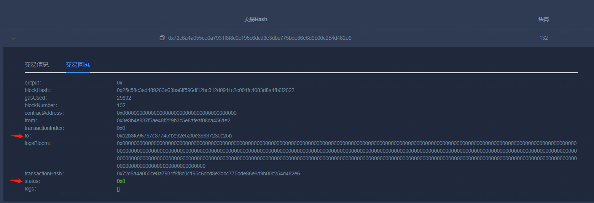

# 实训二：实现积分转账合约

使用Solidity语言编写一个Asset积分合约，合约包含一个address变量记录发行者issuer、一个mapping(address => uint256)变量balances记录各地址的余额、一个issue方法和一个send方法。
1. 构造函数初始化issuer变量为合约部署者
2. 提供issue方法给特定账户地址发行一定数量的积分，且只有部署合约的issuer才能调用isser方法
3. 提供send方法将调用方余额转账给接收方

例：
```js
pragma solidity ^0.4.25;
contract Asset {
    address public issuer;
    mapping (address => uint) public balances;

    constructor() ...
    function issue() public  ...
    function send() public ...
}
```

## 实验步骤：
#### 1）准备好区块链运行环境
使用FISCO BCOS搭建4节点的区块链，也可用系统自带的区块链。

#### 2）编写智能合约
可使用系统自带的智能合约IDE编写智能合约

**提交方式：**
- 提交智能合约源码

#### 3）编译部署智能合约
合约IDE进行编译、部署

**提交方式：**
- 提交合约部署成功后的交易回执截图
- 提交部署成功后的智能合约截图，截图应包含合约地址
- 调用合约，获取合约的issuer变量的值，提交截图
- 调用issue方法，给一个地址如Alice私钥发行100个积分，提交截图
- 调用合约，获取合约的balances变量中Alice的余额值，提交截图


#### 4）向部署的智能合约发送交易
编写一个区块链应用程序，可以通过SDK连接区块链节点，并向智能合约发送交易。

**提交方式：**
- 提交Asset合约Java类截图
- 调用Asset的合约Java类send方法的源代码
- 通过Java调用Asset合约Java类的send方法，向issuer转账1个积分，在控制台输出交易哈希，截图并提交
- 通过Java调用Asset合约Java类，获取issuer的余额，在控制台输出issuer地址和余额值，截图并提交
- 通过合约IDE获取issuer余额，截图并提交

#### 5）通过区块链浏览器查看交易

发送的交易（交易哈希）可通过系统自带的区块链浏览器展示，确认在哪个区块中。

## 参考答案：
#### 1）准备好区块链运行环境
 略
#### 2） 编写智能合约
- 要求constructor设置issuer为合约部署者msg.sender
- 要求issue方法入参包含接收方address类型变量，以及发行数量uint类型
- 要求issue方法中校验该方法调用者msg.sender必须是issuer
- 要求issue方法给mapping变量中的接收方地址增加余额
- 要求send方法入参包含接收方address类型变量，以及发行数量uint类型
- 要求send方法在mapping中扣减发送方余额，且增加接收方余额
- 可选项：要求send方法在扣减发送方余额前，校验发送方余额是否满足

合约源码参考答案（实现方式不唯一）
```js
pragma solidity ^0.4.25;

contract Asset {
    address public issuer;
    mapping (address => uint) public balances;
    constructor() {
        // 设置issuer为部署者
        issuer = msg.sender;
    }
    function issue(address receiver, uint amount) public {
        // 调用者必须是issuer
        if (msg.sender != issuer) return;
        // 增加余额
        balances[receiver] += amount;
    }
    function send(address receiver, uint amount) public {
        if (balances[msg.sender] < amount) return;
        balances[msg.sender] -= amount;
        balances[receiver] += amount;
    }
}
```

#### 3）编译部署智能合约
- 要求提交成功部署合约的截图，截图包含合约的ABI，BIN和部署得到的合约地址

#### 4）向部署的智能合约发送交易
使用其他编程语言实现以上功能也可，需要截图源码与调用截图
- 要求提交Asset合约Java类截图，可参考WeBASE导出Java类或导出Java项目
- 要求提交调用Asset的合约Java类send方法的源代码
- 要求提交调用Asset的send方法，向issuer转账1个积分，并在控制台输出该交易返回的交易回执，提交交易回执截图
- 要求提交调用Asset获取issuer的余额，输出issuer地址和余额值的截图
- 要求提交通过合约IDE获取issuer余额的截图

#### 5）通过区块链浏览器查看交易
根据步骤2可以得到在Java端调用Asset的send方法后，得到的交易哈希。拿到交易哈希后，可以通过区块链浏览器，查看交易哈希对应的交易回执的详情。
- 要求区块链浏览器上查询的交易哈希与上文调用的交易哈希一致、交易的被调用方to为上文部署的合约地址
- 要求交易回执的状态为成功（此处为0x0）

下图以WeBASE-Front为例，查看交易回执



