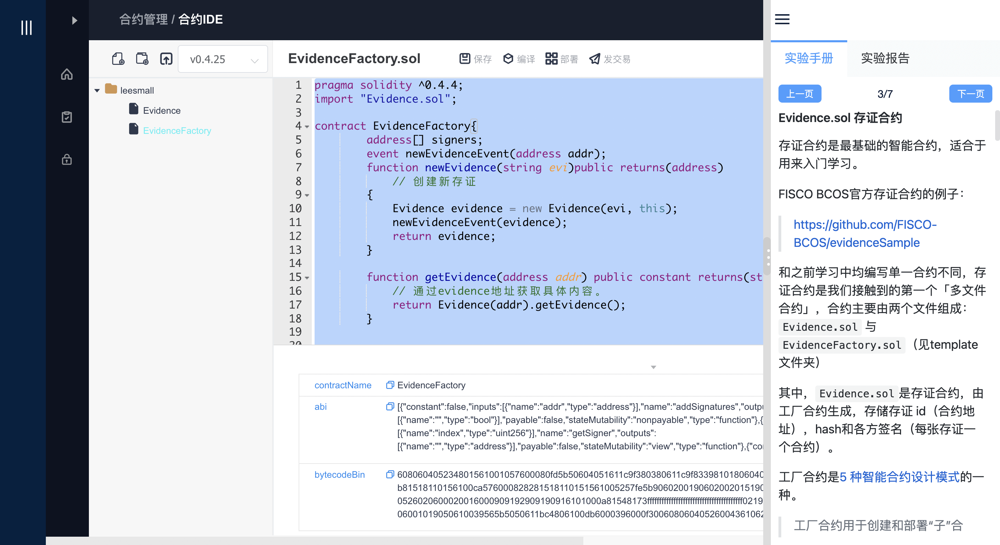

# WeBASE实训插件方案

# 1 背景介绍

2020年7月6日，人社部联合国家市场监管总局、国家统计局向社会发布了第三批新职业名单，“区块链工程技术人员”赫然在列，越来越多的区块链从业者得到了国家层面的承认，对就业、创业的带动作用明显，彰显了区块链行业的巨大价值和就业前景。随着市场对人才的需求和要求迅速增长，区块链技术培训需求加快释放。如何将 WeBASE与区块链课程相结合，以更好的服务开发者？如何将 WeBASE与区块链课程相结合，以更好的服务开发者？应对这一命题，WeBASE团队和FISCO BCOS 教育合作伙伴柏链教育对 WeBASE 功能进行针对性调整，推出WeBASE实训插件方案。

# 2 插件使用形态

WeBASE实训插件方案主要的目的就是讲WeBASE管理台的部分功能作为插件嵌入到具体的实训系统中，辅助实训系统完成其区块链相关的一些实训功能。

​                 其嵌入的形式可以入下图：


# 3 具体改造方案

1. 侧边栏默认收起
2. 陆页面获取参数配置，根据配置判断是否支持iframe嵌入，允许哪些域名嵌入
3. 满足iframe嵌入的条件下，如果是iframe嵌入，则自动登录
4. 自动登录的用户取消使用引导
5. 自动登录的用户隐藏修改密码功能（包括首次登陆、右上角修改密码入口）
6. 自动登录跳转到指定的router

# 4 使用方法和二次开发

## 4.1 安装 WeBASE 环境

使用到的子系统有WeBASE-Front、WeBASE-Node-Manager、WeBASE-Sign、 WeBASE-Web。WeBASE-Web使用dev-sx分支，WeBASE-Front、WeBASE-Node-Manager、WeBASE-Sign 使用v1.5.1及上版本。

##  4.2 WeBASE配置

### 4.2.1 WeBASE-Node-Manager数据库中插入参数设置数据，脚本如下：

```plain
INSERT INTO `tb_config`(`config_name`, `config_type`, `config_value`, `create_time`, `modify_time`) VALUES ('SupportIframe', 2, '1', '2020-09-22 17:14:23', '2020-09-22 17:14:23');
INSERT INTO `tb_config`(`config_name`, `config_type`, `config_value`, `create_time`, `modify_time`) VALUES ('IframeSupportHostList', 3, 'baidu.com|163.com', '2020-09-22 17:14:23', '2020-09-22 17:14:23'); 
```

其中，SupportIframe设置为1，表示开启iframe嵌入支持；IframeSupportHostList为iframe嵌入支持的host白名单列表。

配置访问接口如下：

```
http://127.0.0.1:5001/WeBASE-Node-Manager/config/list?type=2
```


### 4.2.2 WeBASE-Node-Manager配置

修改webase-node-manager/conf/application.yml。

- 4.2.2.1 修改constant.permitUrlArray：


```plain
permitUrlArray:/account/login,/account/pictureCheckCode,/login,/user/privateKey/**,/config/encrypt,/config/version,/front/refresh,/api/*,/config/list
```

- 4.2.2.2 修改constant.verificationCodeMaxAge，设置为与你的系统的session时间一致。
- 修改constant.enableVerificationCode=false，设置为false，用以固定验证constant.verificationCodeValue="8888"，为固定的验证码值，不需要修改
- 修改constant.developerModeEnable，设置为true，开启开发者模式。
- 重启WeBASE-Node-Manager服务。

这些配置主要的作用是：

1. 开发者模式主要是为了做学员间的合约和私钥隔离。
2. 固定校验码为了实现单点登录
3. permitUrlArray配置是为了放开接口访问权限

# 5 实验台中使用

## 5.1  iframe嵌入

在适当的位置使用iframe嵌入，嵌入时直接使用WeBASE-Node-Manager的login页面。
如：

```xml
<iframe
      ref="myFrame"
      src="http://localhost:3006/#/login"
      frameborder="0"
      width="100%"
      height="700"
></iframe>
```
## 5.2 自动登录

向子页面传递参数（router, user, password），实现自动登录。其中，用户的账号及密码，为WeBASE-Node-Manager平台已添加的账户信息，建议账户类型为开发者；router为指定跳转后定位到的页面

```plain
router清单：
/home    首页
/contract   合约IDE
/contractList   合约列表
/cnsManagement    CNS查询
/CRUDServiceManagement    CURD
/privateKeyManagement    私钥管理
```


vue向webase子页面传参示例：

```xml

<script>
export default {
  data() {
    return {};
  },
  created() {},
  mounted() {
    this.iframeInit();
  },
  computed: {},
  methods: {
    iframeInit() {
      let myFrame = this.$refs["myFrame"];
      if (myFrame.attachEvent) {
        //兼容浏览器判断
        myFrame.attachEvent("onload", function () {
          let iframeWin = myFrame.contentWindow;
          iframeWin.postMessage(
            { router: "/contract", user: "admin", password: "123456" },
            "*"
          );
          //data传递的参数   *写成子页面的域名或者是ip
        });
      } else {
        myFrame.onload = function () {
          let iframeWin = myFrame.contentWindow;
          iframeWin.postMessage(
            { router: "/contract", user: "admin", password: "123456" },
            "*"
          );
        };
      }
    },
  },
};
</script>
```