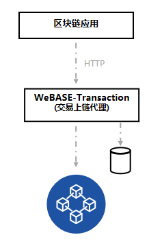

# 概要介绍

## 功能介绍

​        本系统为交易上链代理子系统。主要接收无状态交易请求，缓存到数据库中，再异步上链。本系统可大幅提升吞吐量，解决区块链的tps瓶颈。

主要功能：合约编译；交易请求处理，交易分为合约部署和普通的合约调用请求。

合约编译：上传合约文件zip压缩包（压缩包里的每个合约的文件名要和合约名一致，合约引用需使用“./xxx.sol”），返回合约编译信息。

合约部署：交易服务子系统会将合约部署请求信息缓存到数据库，通过轮询服务向节点发送交易请求，确保合约成功部署。

合约调用：分为无状态交易上链（非constant方法）和交易结果查询（constant方法）。
无状态交易上链是交易服务子系统会将交易请求信息缓存到数据库，通过轮询服务向节点发送交易请求，确保交易成功上链。
交易结果查询是交易服务子系统会同步向节点发送交易请求，返回结果。

交易上链数据签名支持以下三种模式：

- 本地配置私钥签名
- 本地随机私钥签名
- 调用[WeBASE-Sign](https://github.com/WeBankFinTech/WeBASE-Sign)进行签名

本工程支持单机部署，也支持分布式任务多活部署（使用分布式任务的话需部署Zookeeper）。

## 国密支持

WeBASE-Transaction v1.2.2+已支持 [国密版FISCO-BCOS](https://fisco-bcos-documentation.readthedocs.io/zh_CN/latest/docs/manual/guomi_crypto.html)，使用WeBASE v1.2.2及以上版本

具体需要适配国密版FISCO-BCOS的地方有：
- 开启web3sdk的国密开关：修改`application.properties`中的`encryptType`改为`1`；
- 合约编译支持国密版：
    - WeBASE-Transaction编译国密版智能合约，v1.3.1+版本已支持自动切换国密版soclJ jar包；

安装详情可查看下一章节的[WeBASE-Transaction部署说明](../WeBASE-Transaction/install.html)