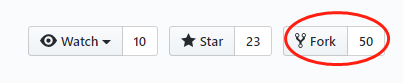
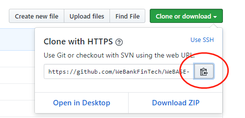
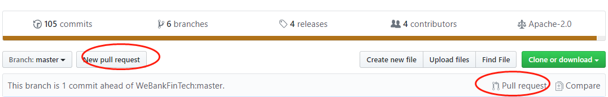
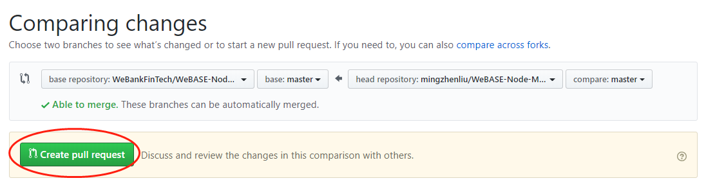

# WeBASE贡献指南

欢迎，提前感谢你的帮助和支持！

如果你是第一次贡献，只需按照以下简单步骤操作即可。我们将以修改WeBASE-Node-Manager为例子给你介绍。

如果你的电脑上尚未安装 git, 请按照这个[ 安装指引 ](https://help.github.com/articles/set-up-git/)进行安装。

## Fork本代码仓库


点击图示中的按钮去 Fork 这个代码仓库。
这个操作会将代码仓库复制到你的账户名下。

## Clone代码仓库



接下来，将复制后的代码仓库克隆到你的电脑上。点击图示中的绿色按钮，接着点击复制到剪切板按钮（将代码仓库地址复制下来）

随后打开命令行窗口，敲入如下 git 命令：

```
git clone "刚才复制的 url 链接"
```
"刚才复制的 url 链接"（去掉双引号）就是复制到你账户名下的代码仓库地址。获取这链接地址的方法请见上一步。

```
git clone https://github.com/"你的 Github 用户名"/WeBASE-Node-Manager.git
```

'你的 Github 用户名' 指的就是你的 Github 用户名。这一步，你将复制你账户名下的 WeBASE-Node-Manager 这个代码仓库克隆到你的本地电脑上。

## 代码修改
```
cd WeBASE-Node-Manager

vim XXX
```

## Commit修改

```
git commit -m "一个伟大改进"
```

## 将改动 Push 到 GitHub

使用 `git push` 命令发布代码
```
git push origin <分支的名称>
```

## 提出 Pull Request 将你的修改供他人审阅

前往 Github 你的代码仓库，你会看到一个 `Compare & pull request` 的按钮。点击该按钮。



接着再点击 `Create pull request` 按钮，正式提交 pull request。



提交的改动经过审核，会合入到仓库。合并后，你会收到电子邮件通知。
