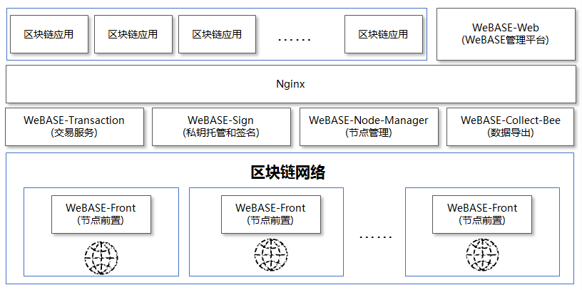

# 什么是WeBASE
WeBASE（WeBank Blockchain Application Software Extension） 是在区块链应用和FISCO-BCOS节点之间搭建的一套通用组件。围绕交易、合约、密钥管理，数据，可视化管理来设计各个模块，开发者可以根据业务所需，选择子系统进行部署。WeBASE屏蔽了区块链底层的复杂度，降低开发者的门槛，大幅提高区块链应用的开发效率，包含节点前置、节点管理、交易链路，数据导出，Web管理平台等子系统。

## 建立区块链应用开发标准
WeBASE将区块链应用开发标准化，按照部署、配置、开发智能合约、开发应用层、在线运维管理五个步骤即可完成一个区块链应用的开发，详细开发流程请参阅 [使用WeBASE开发区块链应用](../WeBASE/quick-start.html)

## 设计原则
**按需部署**
WeBASE抽象应用开发的诸多共性模块，形成各类服务组件，开发者根据需要部署所需组件。

**微服务**
WeBASE采用微服务架构，基于Spring Boot框架，提供RESTful风格接口。

**零耦合**
WeBASE所有子系统独立存在，均可独立部署，独立提供服务。

**可定制**
前端页面往往带有自身的业务属性，因此WeBASE采用前后端分离的技术，便于开发者基于后端接口定制自己的前端页面。

## 整体架构
完整的部署架构如下，其中WeBASE-Front需要和区块链节点同机部署。

## 功能介绍
从可视化，智能合约，交易，数据四个维度设计各个中间件，各模块主要功能如下

## 各子系统简介

- **节点前置服务** 

  集成FISCO BCOS JavaSDK，提供RESTful风格的接口，客户端可以使用http的形式和节点进行交互，内置内存数据库，采集节点健康度数据。内置web控制台，实现节点的可视化操作。

  [Github地址](https://github.com/WeBankFinTech/WeBASE-Front)

  [Gitee地址](https://gitee.com/WeBank/WeBASE-Front)

  [说明文档](https://webasedoc.readthedocs.io/zh_CN/latest/docs/WeBASE-Front/index.html#)

- **节点管理服务** 

  处理前端页面所有web请求，管理各个节点的状态，管理链上所有智能合约，对区块链的数据进行统计、分析，对异常交易的审计，私钥管理等。

  [Github地址](https://github.com/WeBankFinTech/WeBASE-Node-Manager)

  [Gitee地址](https://gitee.com/WeBank/WeBASE-Node-Manager)

  [说明文档](https://webasedoc.readthedocs.io/zh_CN/latest/docs/WeBASE-Node-Manager/index.html#)

- **WeBASE管理平台** 
  可视化操作平台，可基于此平台查看节点信息，开发智能合约等。

  [Github地址](https://github.com/WeBankFinTech/WeBASE-Web)

  [Gitee地址](https://gitee.com/WeBank/WeBASE-Web)

  [说明文档](https://webasedoc.readthedocs.io/zh_CN/latest/docs/WeBASE-Web/index.html#)

- **交易服务** 

  接收交易请求，缓存交易到数据库中，异步上链，可大幅提升吞吐量，解决区块链的tps瓶颈。

  [Github地址](https://github.com/WeBankFinTech/WeBASE-Transcation)

  [Gitee地址](https://gitee.com/WeBank/WeBASE-Transcation)

  [说明文档](https://webasedoc.readthedocs.io/zh_CN/latest/docs/WeBASE-Transcation/index.html#)

- **私钥托管和签名服务** 
  托管用户私钥，提供云端签名。

  [Github地址](https://github.com/WeBankFinTech/WeBASE-Sign)

  [Gitee地址](https://gitee.com/WeBank/WeBASE-Sign)

  [说明文档](https://webasedoc.readthedocs.io/zh_CN/latest/docs/WeBASE-Sign/index.html#)

- **链管理服务子系统** 
  支持管理多条链和动态群组管理功能，支持国密链、非国密链。

  [Github地址](https://github.com/WeBankFinTech/WeBASE-Chain-Manager)

  [Gitee地址](https://gitee.com/WeBank/WeBASE-Chain-Manager)

  [说明文档](https://webasedoc.readthedocs.io/zh_CN/latest/docs/WeBASE-Chain-Manager/index.html#)

- **数据统计服务子系统** 
  以前置为基础，拉取CPU、内存、IO、群组大小、群组gas、群组网络流量的数据，记录数据库。

  [Github地址](https://github.com/WeBankFinTech/WeBASE-Stat)

  [Gitee地址](https://gitee.com/WeBank/WeBASE-Stat)

  [说明文档](https://webasedoc.readthedocs.io/zh_CN/latest/docs/WeBASE-Stat/index.html#)

- **数据监管服务** 
  以前置为基础，导出区块链数据并解析，提供一个可视化的监管视图。可以查询交易属于哪条链，哪个用户，哪个合约，保证链上数据可查可管。

  [Github地址](https://github.com/WeBankFinTech/WeBASE-Data)

  [Gitee地址](https://gitee.com/WeBank/WeBASE-Data)

  [说明文档](https://webasedoc.readthedocs.io/zh_CN/latest/docs/WeBASE-Data/index.html#)

各子系统的技术文档可到[WeBASE子系统文档](https://fintech.webank.com/developer/docs/webase/docs/WeBASE/subsystem.html)中查看